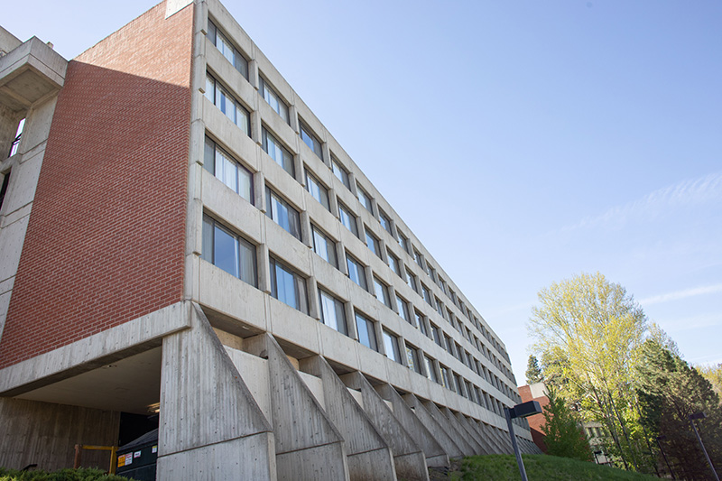
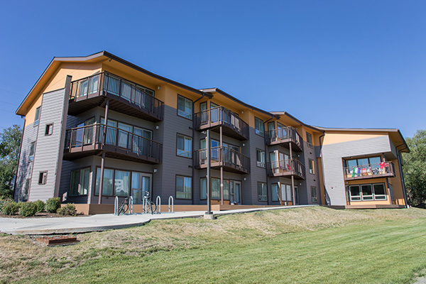
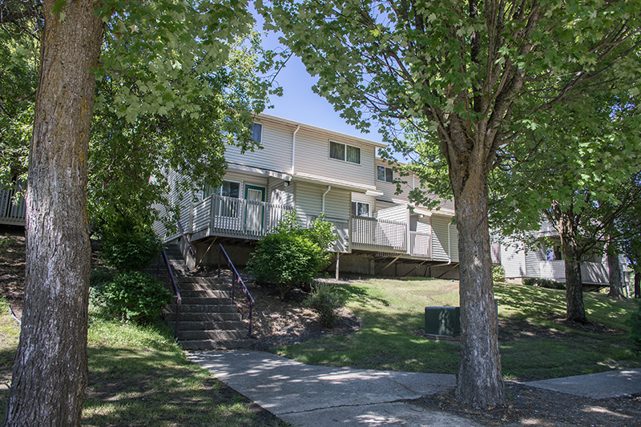
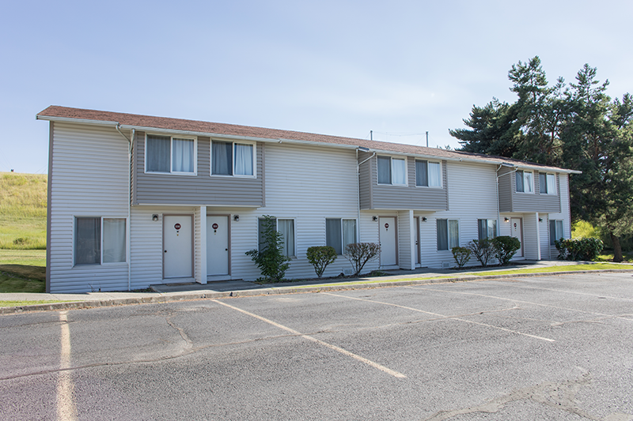

# Page Scan Report

| Field | Value |
|-------|-------|
| URL | https://housing.wsu.edu/prospective-students/transfer-students/ |
| Title | Transfer Students |
| Status | ❌ 0 |
| HTML Size | 66.1 KB |
| Screenshots | 1 (1.1 MB) |
| Images | 6 (2.9 MB) |
| Images Missing Alt | 0 |
| JS Errors | 0 |
| JS Warnings | 0 |
| Auth | none |
| Captured | 2026-02-16T20:40:08.1963867Z |

## Actions

- Screenshot #1: page-loaded (1.1 MB)
- Downloaded 6 images to /images/

## Screenshots

### 1. page-loaded

## Page Images (6)

| # | Image | Alt Text | Size |
|---|-------|----------|------|
| 1 | [mceachern-south.jpg](images/mceachern-south.jpg) | McEachern | 183.0 KB |
| 2 | [orton-exterior.jpg](images/orton-exterior.jpg) | Orton | 254.2 KB |
| 3 | [chief-joseph-exterior.jpg](images/chief-joseph-exterior.jpg) | Chief Joseph | 114.1 KB |
| 4 | [chinook-exterior-3.png](images/chinook-exterior-3.png) | Chinook Village | 764.2 KB |
| 5 | [columbia-exterior-3.png](images/columbia-exterior-3.png) | Columbia Village | 998.7 KB |
| 6 | [nez-perce-6.png](images/nez-perce-6.png) | Nez Perce Village | 675.7 KB |

### Gallery

## Files

- `01-page-loaded.png` — page-loaded (1.1 MB)
- `page.html` — rendered HTML content
- `metadata.json` — machine-readable scan data
- `errors.log` — JavaScript console errors
- `warnings.log` — JavaScript console warnings
- `info.log` — navigation and timing details
- `actions.log` — interactions performed on the page
- `images/` — 6 page images (2.9 MB)
