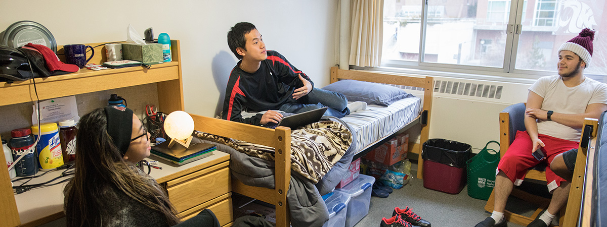

# Page Scan Report

| Field | Value |
|-------|-------|
| URL | https://housing.wsu.edu/prospective-students/what-to-bring/ |
| Title | What to Bring |
| Status | ✅ 200 |
| HTML Size | 58.1 KB |
| Screenshots | 1 (703.7 KB) |
| Images | 1 (258.6 KB) |
| Images Missing Alt | 1 |
| JS Errors | 0 |
| JS Warnings | 0 |
| Auth | none |
| Captured | 2026-02-16T21:01:31.4393100Z |

## Actions

- Screenshot #1: page-loaded (703.7 KB)
- Downloaded 1 images to /images/

## Screenshots

### 1. page-loaded

## Page Images (1)

| # | Image | Alt Text | Size |
|---|-------|----------|------|
| 1 | [gg-student-room-banner-16-6.jpg](images/gg-student-room-banner-16-6.jpg) | *(none)* | 258.6 KB |

### Gallery

### ⚠️ Images Missing Alt Text (1)

- `gg-student-room-banner-16-6.jpg` — https://housing.wsu.edu/media/vfga33v1/gg-student-room-banner-16-6.jpg

## Files

- `01-page-loaded.png` — page-loaded (703.7 KB)
- `page.html` — rendered HTML content
- `metadata.json` — machine-readable scan data
- `errors.log` — JavaScript console errors
- `warnings.log` — JavaScript console warnings
- `info.log` — navigation and timing details
- `actions.log` — interactions performed on the page
- `images/` — 1 page images (258.6 KB)
