# Page Scan Report

| Field | Value |
|-------|-------|
| URL | https://housing.wsu.edu/residence-halls/ |
| Title | Residence Halls |
| Status | ✅ 200 |
| HTML Size | 75.1 KB |
| Screenshots | 1 (1.3 MB) |
| Images | 15 (4.1 MB) |
| Images Missing Alt | 15 |
| JS Errors | 0 |
| JS Warnings | 0 |
| Auth | none |
| Captured | 2026-02-16T20:41:13.4645671Z |

## Actions

- Screenshot #1: page-loaded (1.3 MB)
- Downloaded 15 images to /images/

## Screenshots

### 1. page-loaded

## Page Images (15)

| # | Image | Alt Text | Size |
|---|-------|----------|------|
| 1 | [cdd-exterior-entrance.jpg](images/cdd-exterior-entrance.jpg) | *(none)* | 248.4 KB |
| 2 | [honors-exterior-wide.jpg](images/honors-exterior-wide.jpg) | *(none)* | 243.7 KB |
| 3 | [gg-exterior-side.jpg](images/gg-exterior-side.jpg) | *(none)* | 512.0 KB |
| 4 | [gsh-exterior-winter.jpg](images/gsh-exterior-winter.jpg) | *(none)* | 505.6 KB |
| 5 | [mccroskey-exterior-side.jpg](images/mccroskey-exterior-side.jpg) | *(none)* | 285.1 KB |
| 6 | [mceachern-east-exterior.jpg](images/mceachern-east-exterior.jpg) | *(none)* | 353.0 KB |
| 7 | [northside-exterior-side.jpg](images/northside-exterior-side.jpg) | *(none)* | 174.2 KB |
| 8 | [olympia-exterior.jpg](images/olympia-exterior.jpg) | *(none)* | 217.8 KB |
| 9 | [orton-exterior.jpg](images/orton-exterior.jpg) | *(none)* | 254.2 KB |
| 10 | [regents-exterior.jpg](images/regents-exterior.jpg) | *(none)* | 139.0 KB |
| 11 | [rogers-exterior.jpg](images/rogers-exterior.jpg) | *(none)* | 302.7 KB |
| 12 | [scott-coman-exterior.jpg](images/scott-coman-exterior.jpg) | *(none)* | 182.3 KB |
| 13 | [stephenson-exterior-towers.jpg](images/stephenson-exterior-towers.jpg) | *(none)* | 119.2 KB |
| 14 | [stimson-exterior.png](images/stimson-exterior.png) | *(none)* | 501.3 KB |
| 15 | [streit-perham-exterior.jpg](images/streit-perham-exterior.jpg) | *(none)* | 184.5 KB |

### Gallery

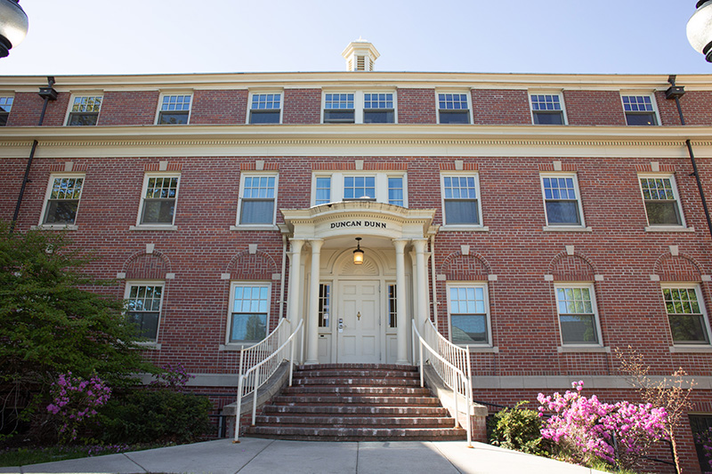

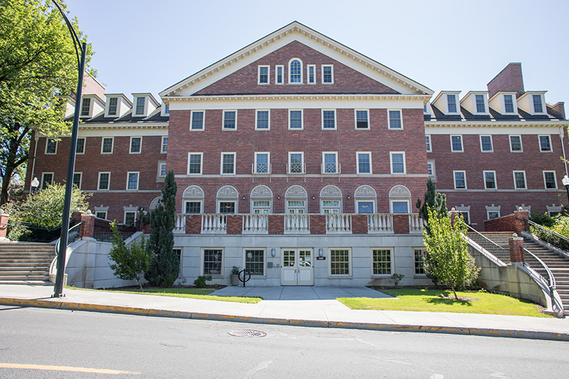

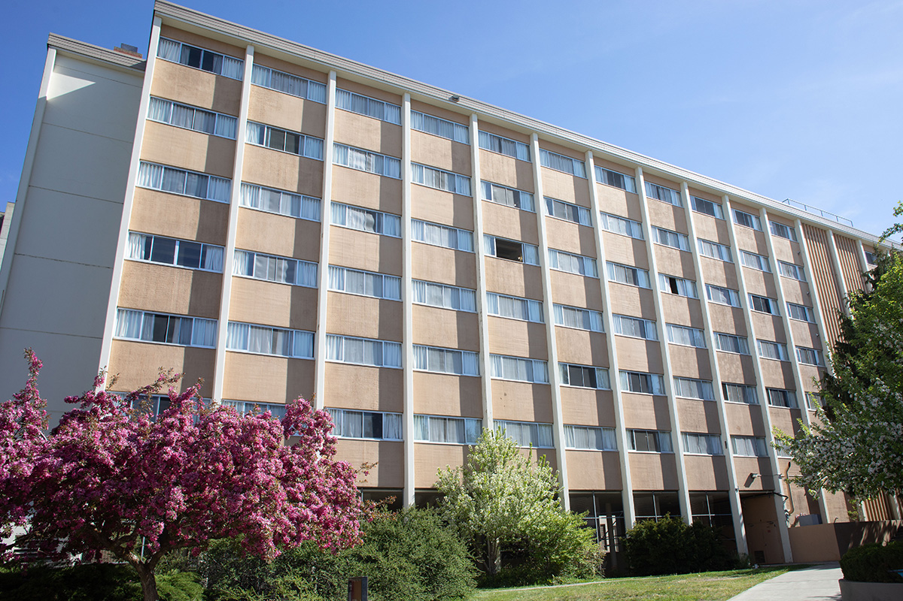

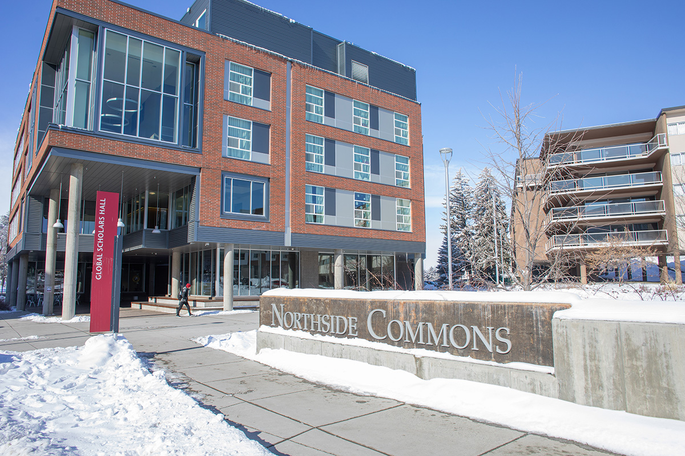

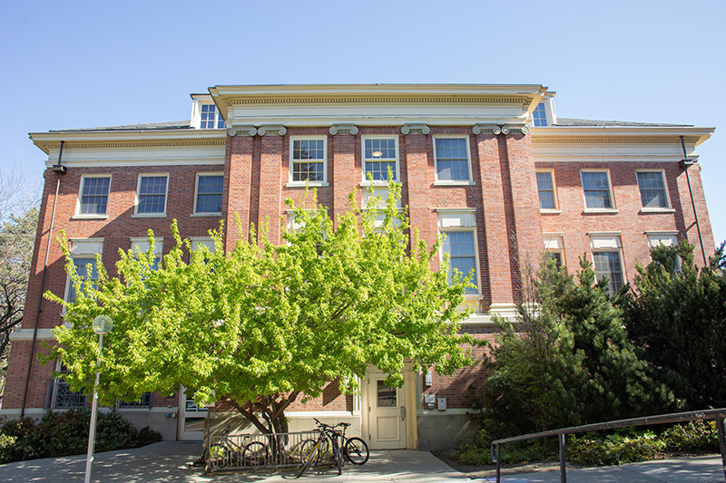

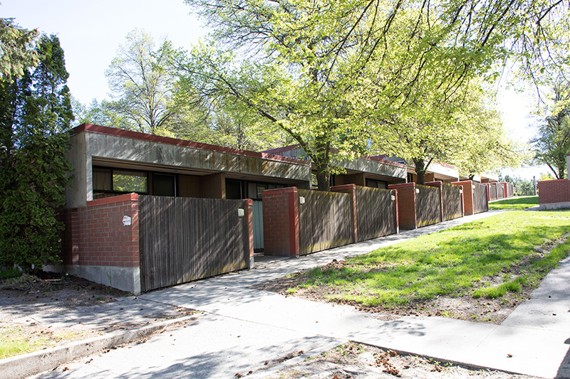

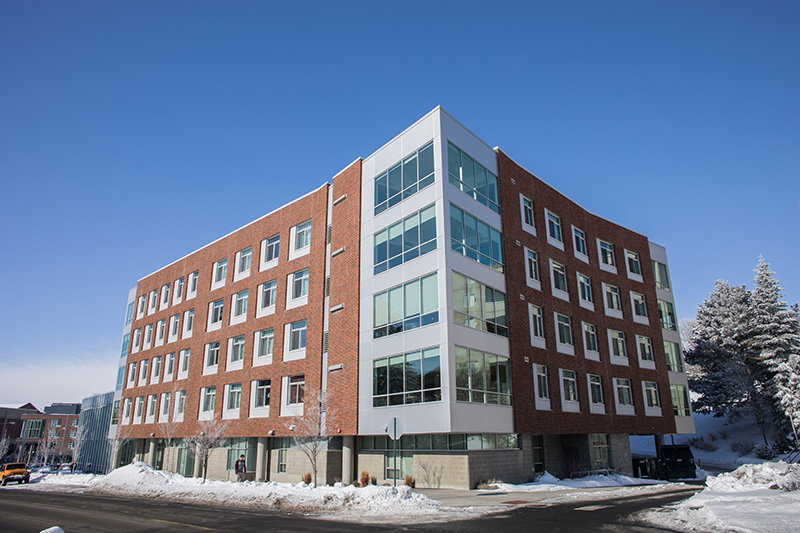

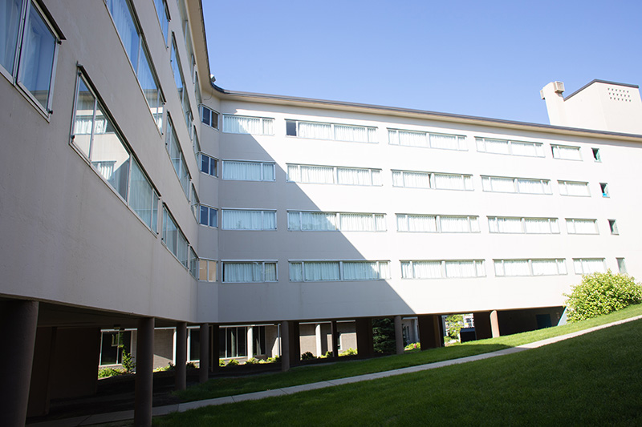

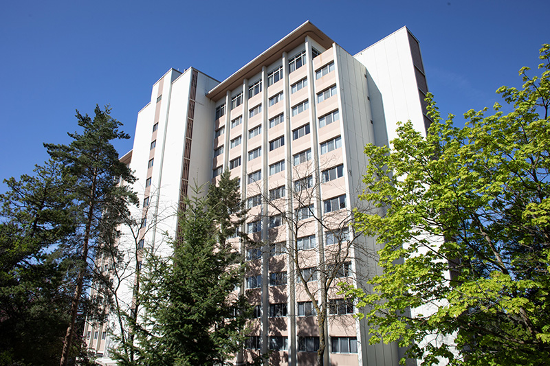

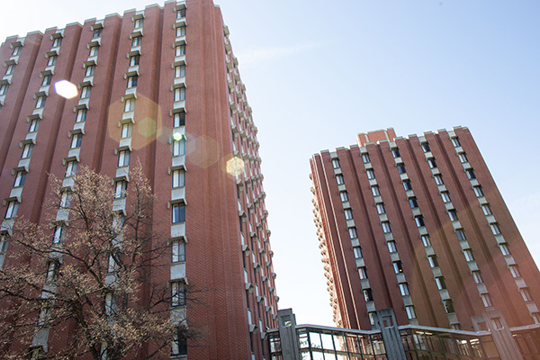

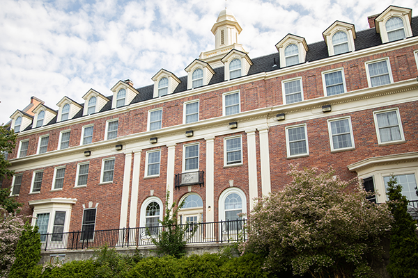

### ⚠️ Images Missing Alt Text (15)

- `cdd-exterior-entrance.jpg` — https://housing.wsu.edu/media/manhwtjc/cdd-exterior-entrance.jpg
- `honors-exterior-wide.jpg` — https://housing.wsu.edu/media/ysmfnp1w/honors-exterior-wide.jpg
- `gg-exterior-side.jpg` — https://housing.wsu.edu/media/elbfi15c/gg-exterior-side.jpg
- `gsh-exterior-winter.jpg` — https://housing.wsu.edu/media/im4dlkjr/gsh-exterior-winter.jpg
- `mccroskey-exterior-side.jpg` — https://housing.wsu.edu/media/2xvhmjnf/mccroskey-exterior-side.jpg
- `mceachern-east-exterior.jpg` — https://housing.wsu.edu/media/l5zdabcg/mceachern-east-exterior.jpg
- `northside-exterior-side.jpg` — https://housing.wsu.edu/media/hzppywll/northside-exterior-side.jpg
- `olympia-exterior.jpg` — https://housing.wsu.edu/media/ukoke1lc/olympia-exterior.jpg
- `orton-exterior.jpg` — https://housing.wsu.edu/media/besfhfhk/orton-exterior.jpg
- `regents-exterior.jpg` — https://housing.wsu.edu/media/ciicewbt/regents-exterior.jpg
- `rogers-exterior.jpg` — https://housing.wsu.edu/media/hdwpzitg/rogers-exterior.jpg
- `scott-coman-exterior.jpg` — https://housing.wsu.edu/media/mo5nab5z/scott-coman-exterior.jpg
- `stephenson-exterior-towers.jpg` — https://housing.wsu.edu/media/55mfxi0f/stephenson-exterior-towers.jpg
- `stimson-exterior.png` — https://housing.wsu.edu/media/3xqf4cuc/stimson-exterior.png
- `streit-perham-exterior.jpg` — https://housing.wsu.edu/media/avzetzyn/streit-perham-exterior.jpg

## Files

- `01-page-loaded.png` — page-loaded (1.3 MB)
- `page.html` — rendered HTML content
- `metadata.json` — machine-readable scan data
- `errors.log` — JavaScript console errors
- `warnings.log` — JavaScript console warnings
- `info.log` — navigation and timing details
- `actions.log` — interactions performed on the page
- `images/` — 15 page images (4.1 MB)
