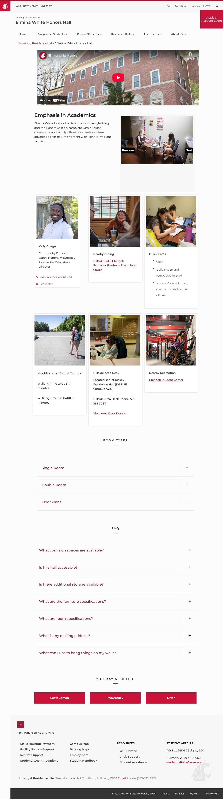

# 📄 Page Scan Report

> **URL:** https://housing.wsu.edu/residence-halls/elmina-white-honors-hall/  
> **Captured:** 2026-02-18 18:38:38 UTC  
> **Status:** ✅ 200  

---

## 📑 Contents

- [Summary](#-summary)
- [Screenshots](#-screenshots)
- [Page Images](#-page-images)
- [JavaScript Errors](#-javascript-errors)
- [Accessibility](#-accessibility)
- [Actions](#-actions)
- [Files](#-files)

---

## 📋 Summary

| Field | Value |
|-------|-------|
| URL | https://housing.wsu.edu/residence-halls/elmina-white-honors-hall/ |
| Title | Elmina White Honors Hall |
| Status | ✅ 200 |
| HTML Size | 105.2 KB |
| Screenshots | 1 (316.3 KB) |
| Images | 18 (referenced by URL) |
| Images Missing Alt | ⚠️ 5 |
| JS Errors | 🔴 4 |
| JS Warnings | 5 |
| A11y Violations | ⚠️ 7 |
| 🔴 Critical | 6 |
| 🟠 Serious | 0 |
| 🟡 Moderate | 1 |
| 🔵 Minor | 0 |
| Tools Run | axe, htmlcheck |
| Auth | none |
| Captured | 2026-02-18T18:38:38.8538579Z |

## 🔴 JavaScript Errors

<details>
<summary><strong>4 error(s) detected</strong></summary>

```
Access to XMLHttpRequest at 'https://cdn-web-wsu.s3-us-west-2.amazonaws.com/designsystem/1.x/build/dist/wsu-design-system.bundle.dist.css' from origin 'https://housing.wsu.edu' has been blocked by COR...
Failed to load resource: net::ERR_FAILED
Access to XMLHttpRequest at 'https://asis.wsu.edu/Styles/asis-wdsv2.css' from origin 'https://housing.wsu.edu' has been blocked by CORS policy: No 'Access-Control-Allow-Origin' header is present on th...
Failed to load resource: net::ERR_FAILED
```

</details>

## 🔧 Actions

<details>
<summary><strong>4 action(s) performed</strong></summary>

- Screenshot #1: page-loaded (316.3 KB)
- Cataloged 18 images by URL (no download)
- axe-core: 6 violations (594ms)
- htmlcheck: 1 violations (0ms)

</details>

## 📸 Screenshots

<table>
<tr>
<td align="center" width="50%">
<a href="01-page-loaded.jpg">

</a>
<br /><strong>1. page-loaded</strong>
<br /><sub>316.3 KB</sub>
</td>
<td></td>
</tr>
</table>

## 🖼️ Page Images (18)

<details open>
<summary><strong>📋 Image Index</strong> — 18 images (referenced by URL)</summary>

| # | Source URL | Alt Text |
|--:|-----------|----------|
| 1 | https://housing.wsu.edu/media/0jvhq4kb/honors-students-lounge.jpg | Honors Students Lounge |
| 2 | https://housing.wsu.edu/media/amypjklv/honors-study-lounge.jpg | Honors Study Lounge |
| 3 | https://housing.wsu.edu/media/xd5d0i3v/honors-bed-desk.jpg | Honors Bed Desk |
| 4 | https://housing.wsu.edu/media/rr4lujl5/honors-double-wide.jpg | Honors Double Wide |
| 5 | https://housing.wsu.edu/media/nmwbcc3l/honors-exterior-side.jpg | Honors Exterior Side |
| 6 | https://housing.wsu.edu/media/egqhadoj/honors-lounge-gaming.jpg | Honors Lounge Gaming |
| 7 | https://housing.wsu.edu/media/kiofpe3g/honors-single.jpg | Honors Single |
| 8 | https://housing.wsu.edu/media/0ufh4jka/honors-student-room.jpg | Honors Student Room |
| 9 | https://housing.wsu.edu/media/zzelvta2/kelly-chege-2.jpg | Kelly Chege |
| 10 | https://housing.wsu.edu/media/dtsc4xhl/hillside-students-eating.png | ⚠️ *(missing)* |
| 11 | https://housing.wsu.edu/media/a0nf0dmz/honors-study-group-square.jpg | ⚠️ *(missing)* |
| 12 | https://housing.wsu.edu/media/em3jqxoh/central-campus-square-mall.jpg | ⚠️ *(missing)* |
| 13 | https://housing.wsu.edu/media/mcbn4kjv/hillside-area-desk.png | ⚠️ *(missing)* |
| 14 | https://housing.wsu.edu/media/t0mj3s12/chinook-student-1.png | ⚠️ *(missing)* |
| 15 | https://housing.wsu.edu/media/iozp01wz/floor-plan-honors-1st-floor.png | Honors first floor plan |
| 16 | https://housing.wsu.edu/media/tcyfwnmf/floor-plan-honors-2nd-floor.png | Honors second floor plan |
| 17 | https://housing.wsu.edu/media/gdka2y1x/floor-plan-honors-3rd-floor.png | Honors third floor plan |
| 18 | https://housing.wsu.edu/media/b2via4fr/floor-plan-honors-4th-floor.png | Honors fourth floor plan |

</details>

<details open>
<summary><strong>🖼️ Gallery</strong></summary>

<table>
<tr>
<td align="center" width="33%">
<a href="https://housing.wsu.edu/media/0jvhq4kb/honors-students-lounge.jpg">

</a>
<br /><sub>https://housing.wsu.edu/media/0jvhq4kb/honors-s...</sub>
</td>
<td align="center" width="33%">
<a href="https://housing.wsu.edu/media/amypjklv/honors-study-lounge.jpg">

</a>
<br /><sub>https://housing.wsu.edu/media/amypjklv/honors-s...</sub>
</td>
<td align="center" width="33%">
<a href="https://housing.wsu.edu/media/xd5d0i3v/honors-bed-desk.jpg">

</a>
<br /><sub>https://housing.wsu.edu/media/xd5d0i3v/honors-b...</sub>
</td>
</tr>
<tr>
<td align="center" width="33%">
<a href="https://housing.wsu.edu/media/rr4lujl5/honors-double-wide.jpg">

</a>
<br /><sub>https://housing.wsu.edu/media/rr4lujl5/honors-d...</sub>
</td>
<td align="center" width="33%">
<a href="https://housing.wsu.edu/media/nmwbcc3l/honors-exterior-side.jpg">

</a>
<br /><sub>https://housing.wsu.edu/media/nmwbcc3l/honors-e...</sub>
</td>
<td align="center" width="33%">
<a href="https://housing.wsu.edu/media/egqhadoj/honors-lounge-gaming.jpg">

</a>
<br /><sub>https://housing.wsu.edu/media/egqhadoj/honors-l...</sub>
</td>
</tr>
<tr>
<td align="center" width="33%">
<a href="https://housing.wsu.edu/media/kiofpe3g/honors-single.jpg">

</a>
<br /><sub>https://housing.wsu.edu/media/kiofpe3g/honors-s...</sub>
</td>
<td align="center" width="33%">
<a href="https://housing.wsu.edu/media/0ufh4jka/honors-student-room.jpg">

</a>
<br /><sub>https://housing.wsu.edu/media/0ufh4jka/honors-s...</sub>
</td>
<td align="center" width="33%">
<a href="https://housing.wsu.edu/media/zzelvta2/kelly-chege-2.jpg">

</a>
<br /><sub>https://housing.wsu.edu/media/zzelvta2/kelly-ch...</sub>
</td>
</tr>
<tr>
<td align="center" width="33%">
<a href="https://housing.wsu.edu/media/dtsc4xhl/hillside-students-eating.png">

</a>
<br /><sub>https://housing.wsu.edu/media/dtsc4xhl/hillside... ⚠️</sub>
</td>
<td align="center" width="33%">
<a href="https://housing.wsu.edu/media/a0nf0dmz/honors-study-group-square.jpg">

</a>
<br /><sub>https://housing.wsu.edu/media/a0nf0dmz/honors-s... ⚠️</sub>
</td>
<td align="center" width="33%">
<a href="https://housing.wsu.edu/media/em3jqxoh/central-campus-square-mall.jpg">

</a>
<br /><sub>https://housing.wsu.edu/media/em3jqxoh/central-... ⚠️</sub>
</td>
</tr>
<tr>
<td align="center" width="33%">
<a href="https://housing.wsu.edu/media/mcbn4kjv/hillside-area-desk.png">

</a>
<br /><sub>https://housing.wsu.edu/media/mcbn4kjv/hillside... ⚠️</sub>
</td>
<td align="center" width="33%">
<a href="https://housing.wsu.edu/media/t0mj3s12/chinook-student-1.png">

</a>
<br /><sub>https://housing.wsu.edu/media/t0mj3s12/chinook-... ⚠️</sub>
</td>
<td align="center" width="33%">
<a href="https://housing.wsu.edu/media/iozp01wz/floor-plan-honors-1st-floor.png">

</a>
<br /><sub>https://housing.wsu.edu/media/iozp01wz/floor-pl...</sub>
</td>
</tr>
<tr>
<td align="center" width="33%">
<a href="https://housing.wsu.edu/media/tcyfwnmf/floor-plan-honors-2nd-floor.png">

</a>
<br /><sub>https://housing.wsu.edu/media/tcyfwnmf/floor-pl...</sub>
</td>
<td align="center" width="33%">
<a href="https://housing.wsu.edu/media/gdka2y1x/floor-plan-honors-3rd-floor.png">

</a>
<br /><sub>https://housing.wsu.edu/media/gdka2y1x/floor-pl...</sub>
</td>
<td align="center" width="33%">
<a href="https://housing.wsu.edu/media/b2via4fr/floor-plan-honors-4th-floor.png">

</a>
<br /><sub>https://housing.wsu.edu/media/b2via4fr/floor-pl...</sub>
</td>
</tr>
</table>

</details>

<details>
<summary>⚠️ <strong>Images Missing Alt Text</strong> (5)</summary>

| # | Source URL |
|--:|-----------|
| 1 | https://housing.wsu.edu/media/dtsc4xhl/hillside-students-eating.png |
| 2 | https://housing.wsu.edu/media/a0nf0dmz/honors-study-group-square.jpg |
| 3 | https://housing.wsu.edu/media/em3jqxoh/central-campus-square-mall.jpg |
| 4 | https://housing.wsu.edu/media/mcbn4kjv/hillside-area-desk.png |
| 5 | https://housing.wsu.edu/media/t0mj3s12/chinook-student-1.png |

</details>

## ♿ Accessibility

### Summary

| Severity | axe | htmlcheck |
|----------|:---:|:---:|
| 🔴 critical | 6 | 0 |
| 🟠 serious | 0 | 0 |
| 🟡 moderate | 0 | 1 |
| 🔵 minor | 0 | 0 |
| **Total** | **6** | **1** |

### Violations by Confidence

<details open>
<summary><strong>3 rule(s) violated</strong></summary>

| # | Rule | Sev | Confidence | axe | htmlcheck | Example |
|--:|------|:---:|:----------:|:---:|:---:|---------|
| 1 | aria-required-parent | 🔴 | 🟡 1/2 | ⚠️ | ✅ | `<a class="foundationMenuLink" href="/prospective-students...` |
| 2 | aria-required-children | 🔴 | 🟡 1/2 | ⚠️ | ✅ | `<ul id="mainNav" class="dropdown menu" aria-label="Main N...` |
| 3 | heading-order | 🟡 | 🟡 1/2 | ✅ | ⚠️ | `<h5>` |

</details>

> **Note:** Automated scanning catches ~30-60% of WCAG issues. Manual keyboard and screen reader testing is still required for full compliance.

## 📁 Files

| File | Description |
|------|-------------|
| `01-page-loaded.jpg` | page-loaded (316.3 KB) |
| `page.html` | Rendered HTML content |
| `metadata.json` | Machine-readable scan data |
| `errors.log` | JavaScript console errors |
| `warnings.log` | JavaScript console warnings |
| `info.log` | Navigation and timing details |
| `actions.log` | Interactions performed |
| `a11y-axe.json` | axe accessibility results |
| `a11y-htmlcheck.json` | htmlcheck accessibility results |
| `a11y-summary.json` | Merged cross-tool accessibility summary |

---

*Generated by AccessibilityScanner (FreeTools) v1.0*
