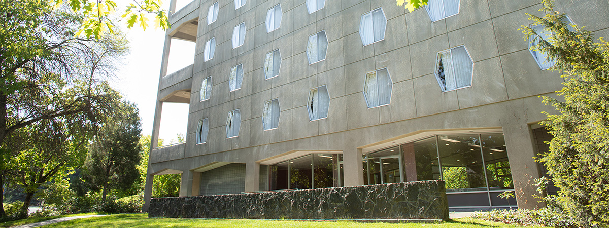
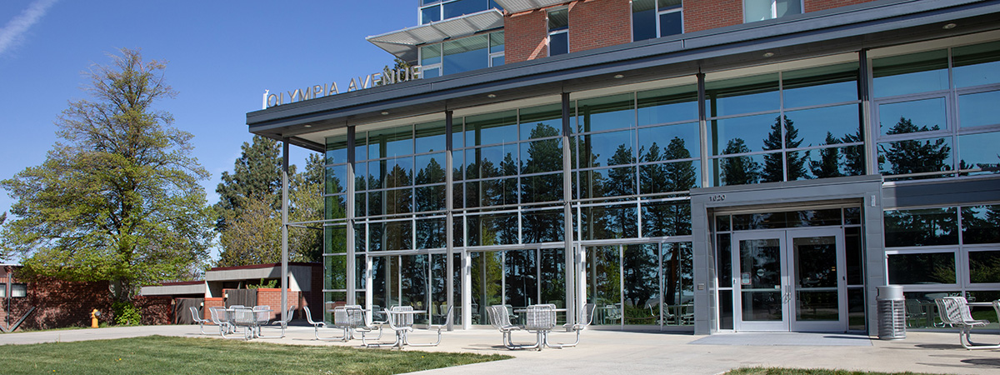
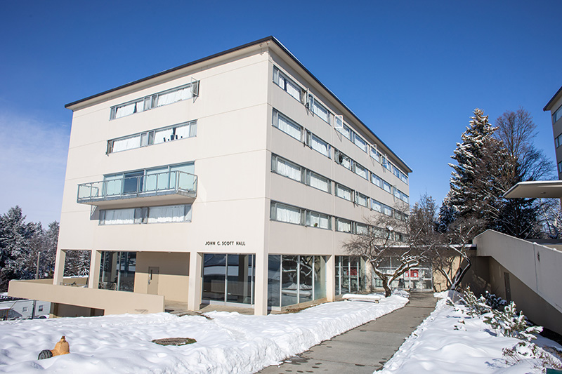
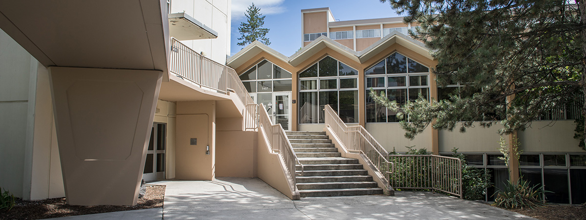

# 📄 Page Scan Report

> **URL:** https://housing.wsu.edu/residence-halls/learning-living-communities/  
> **Captured:** 2026-02-16 22:19:32 UTC  
> **Status:** ✅ 200  

---

## 📑 Contents

- [Summary](#-summary)
- [Screenshots](#-screenshots)
- [Page Images](#-page-images)
- [Actions](#-actions)
- [Files](#-files)

---

## 📋 Summary

| Field | Value |
|-------|-------|
| URL | https://housing.wsu.edu/residence-halls/learning-living-communities/ |
| Title | Learning Living Communities |
| Status | ✅ 200 |
| HTML Size | 63.2 KB |
| Screenshots | 1 (155.0 KB) |
| Images | 5 (1.4 MB) |
| Images Missing Alt | ✅ 0 |
| JS Errors | ✅ 0 |
| JS Warnings | 0 |
| Auth | none |
| Captured | 2026-02-16T22:19:32.1931465Z |

## 🔧 Actions

<strong>2 action(s) performed</strong>

- Screenshot #1: page-loaded (155.0 KB)
- Downloaded 5 images to /images/

## 📸 Screenshots

<table>
<tr>
<td align="center" width="50%">

 <strong>1. page-loaded</strong>
 155.0 KB
</td>
<td></td>
</tr>
</table>

## 🖼️ Page Images (5)

<strong>📋 Image Index</strong> — 5 images, 1.4 MB

| # | Image | Alt Text | Size |
|--:|-------|----------|-----:|
| 1 | [streit-perham-exterior-banner.jpg](images/streit-perham-exterior-banner.jpg) | exterior of Streit Perham residence hall | 402.3 KB |
| 2 | [olympia-exterior-banner.jpg](images/olympia-exterior-banner.jpg) | Olympia residence hall front exterior | 321.4 KB |
| 3 | [mccroskey-exterior-side.jpg](images/mccroskey-exterior-side.jpg) | McCroskey Residence Hall | 285.1 KB |
| 4 | [scott-coman-exterior.jpg](images/scott-coman-exterior.jpg) | Scott Coman Residence Hall | 182.3 KB |
| 5 | [gg-exterior-banner.jpg](images/gg-exterior-banner.jpg) | exterior of Gannon Goldsworthy reside... | 242.1 KB |

<strong>🖼️ Gallery</strong>

<table>
<tr>
<td align="center" width="33%">

 streit-perham-exterior-banner.jpg
</td>
<td align="center" width="33%">

 olympia-exterior-banner.jpg
</td>
<td align="center" width="33%">

 mccroskey-exterior-side.jpg
</td>
</tr>
<tr>
<td align="center" width="33%">

 scott-coman-exterior.jpg
</td>
<td align="center" width="33%">

 gg-exterior-banner.jpg
</td>
<td></td>
</tr>
</table>

## 📁 Files

| File | Description |
|------|-------------|
| `01-page-loaded.png` | page-loaded (155.0 KB) |
| `page.html` | Rendered HTML content |
| `metadata.json` | Machine-readable scan data |
| `errors.log` | JavaScript console errors |
| `warnings.log` | JavaScript console warnings |
| `info.log` | Navigation and timing details |
| `actions.log` | Interactions performed |
| `images/` | 5 page images (1.4 MB) |

---

*Generated by AccessibilityScanner (FreeTools) v1.0*
