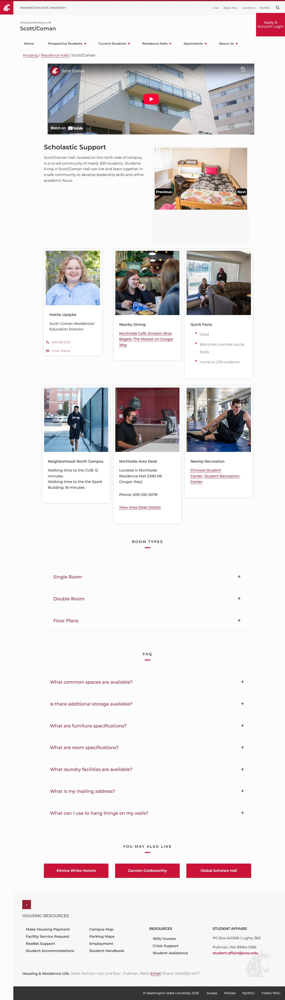

# 📄 Page Scan Report

> **URL:** https://housing.wsu.edu/residence-halls/scottcoman/  
> **Captured:** 2026-02-18 18:39:58 UTC  
> **Status:** ✅ 200  

---

## 📑 Contents

- [Summary](#-summary)
- [Screenshots](#-screenshots)
- [Page Images](#-page-images)
- [JavaScript Errors](#-javascript-errors)
- [Accessibility](#-accessibility)
- [Actions](#-actions)
- [Files](#-files)

---

## 📋 Summary

| Field | Value |
|-------|-------|
| URL | https://housing.wsu.edu/residence-halls/scottcoman/ |
| Title | Scott/Coman |
| Status | ✅ 200 |
| HTML Size | 98.8 KB |
| Screenshots | 1 (294.4 KB) |
| Images | 14 (referenced by URL) |
| Images Missing Alt | ✅ 0 |
| JS Errors | 🔴 4 |
| JS Warnings | 5 |
| A11y Violations | ⚠️ 6 |
| 🔴 Critical | 6 |
| 🟠 Serious | 0 |
| 🟡 Moderate | 0 |
| 🔵 Minor | 0 |
| Tools Run | axe, htmlcheck |
| Auth | none |
| Captured | 2026-02-18T18:39:58.1277218Z |

## 🔴 JavaScript Errors

<details>
<summary><strong>4 error(s) detected</strong></summary>

```
Access to XMLHttpRequest at 'https://cdn-web-wsu.s3-us-west-2.amazonaws.com/designsystem/1.x/build/dist/wsu-design-system.bundle.dist.css' from origin 'https://housing.wsu.edu' has been blocked by COR...
Failed to load resource: net::ERR_FAILED
Access to XMLHttpRequest at 'https://asis.wsu.edu/Styles/asis-wdsv2.css' from origin 'https://housing.wsu.edu' has been blocked by CORS policy: No 'Access-Control-Allow-Origin' header is present on th...
Failed to load resource: net::ERR_FAILED
```

</details>

## 🔧 Actions

<details>
<summary><strong>4 action(s) performed</strong></summary>

- Screenshot #1: page-loaded (294.4 KB)
- Cataloged 14 images by URL (no download)
- axe-core: 6 violations (591ms)
- htmlcheck: 0 violations (0ms)

</details>

## 📸 Screenshots

<table>
<tr>
<td align="center" width="50%">
<a href="01-page-loaded.jpg">

</a>
<br /><strong>1. page-loaded</strong>
<br /><sub>294.4 KB</sub>
</td>
<td></td>
</tr>
</table>

## 🖼️ Page Images (14)

<details open>
<summary><strong>📋 Image Index</strong> — 14 images (referenced by URL)</summary>

| # | Source URL | Alt Text |
|--:|-----------|----------|
| 1 | https://housing.wsu.edu/media/uyzgonlb/scottcoman-kitchen.jpg | Scottcoman Kitchen |
| 2 | https://housing.wsu.edu/media/xy3k0240/scottcoman-single.jpg | Scottcoman Single |
| 3 | https://housing.wsu.edu/media/sgslnnni/scott-coman-double.jpg | Scott Coman Double |
| 4 | https://housing.wsu.edu/media/mo5nab5z/scott-coman-exterior.jpg | Scott Coman Exterior |
| 5 | https://housing.wsu.edu/media/db3ezivs/scottcoman-couch.jpg | Scottcoman Couch |
| 6 | https://housing.wsu.edu/media/5xbhwgfw/mattie-updyke.jpg | Mattie Updyke |
| 7 | https://housing.wsu.edu/media/uupbqfmg/northside-students-eating-3.png | Nearby Dining |
| 8 | https://housing.wsu.edu/media/xgpenuwu/student-on-north-campus.png | Neighborhood: North Campus |
| 9 | https://housing.wsu.edu/media/buudcqh3/northside-area-desk-student.png | Northside Area Desk |
| 10 | https://housing.wsu.edu/media/u1yiog0l/src-student-1.png | Nearby Recreation |
| 11 | https://housing.wsu.edu/media/1sgdvnqr/floor-plan-scott-1st-floor.png | Scott first floor plan |
| 12 | https://housing.wsu.edu/media/x0lf4zmn/floor-plan-scott-2nd-floor.png | Scott Coman second floor plan |
| 13 | https://housing.wsu.edu/media/llqe2vde/floor-plan-scott-3rd-floor.png | scott third floor plan |
| 14 | https://housing.wsu.edu/media/0lah3c5l/floor-plan-scott-4th-floor.png | scott fourth floor plan |

</details>

<details open>
<summary><strong>🖼️ Gallery</strong></summary>

<table>
<tr>
<td align="center" width="33%">
<a href="https://housing.wsu.edu/media/uyzgonlb/scottcoman-kitchen.jpg">

</a>
<br /><sub>https://housing.wsu.edu/media/uyzgonlb/scottcom...</sub>
</td>
<td align="center" width="33%">
<a href="https://housing.wsu.edu/media/xy3k0240/scottcoman-single.jpg">

</a>
<br /><sub>https://housing.wsu.edu/media/xy3k0240/scottcom...</sub>
</td>
<td align="center" width="33%">
<a href="https://housing.wsu.edu/media/sgslnnni/scott-coman-double.jpg">

</a>
<br /><sub>https://housing.wsu.edu/media/sgslnnni/scott-co...</sub>
</td>
</tr>
<tr>
<td align="center" width="33%">
<a href="https://housing.wsu.edu/media/mo5nab5z/scott-coman-exterior.jpg">

</a>
<br /><sub>https://housing.wsu.edu/media/mo5nab5z/scott-co...</sub>
</td>
<td align="center" width="33%">
<a href="https://housing.wsu.edu/media/db3ezivs/scottcoman-couch.jpg">

</a>
<br /><sub>https://housing.wsu.edu/media/db3ezivs/scottcom...</sub>
</td>
<td align="center" width="33%">
<a href="https://housing.wsu.edu/media/5xbhwgfw/mattie-updyke.jpg">

</a>
<br /><sub>https://housing.wsu.edu/media/5xbhwgfw/mattie-u...</sub>
</td>
</tr>
<tr>
<td align="center" width="33%">
<a href="https://housing.wsu.edu/media/uupbqfmg/northside-students-eating-3.png">

</a>
<br /><sub>https://housing.wsu.edu/media/uupbqfmg/northsid...</sub>
</td>
<td align="center" width="33%">
<a href="https://housing.wsu.edu/media/xgpenuwu/student-on-north-campus.png">

</a>
<br /><sub>https://housing.wsu.edu/media/xgpenuwu/student-...</sub>
</td>
<td align="center" width="33%">
<a href="https://housing.wsu.edu/media/buudcqh3/northside-area-desk-student.png">

</a>
<br /><sub>https://housing.wsu.edu/media/buudcqh3/northsid...</sub>
</td>
</tr>
<tr>
<td align="center" width="33%">
<a href="https://housing.wsu.edu/media/u1yiog0l/src-student-1.png">

</a>
<br /><sub>https://housing.wsu.edu/media/u1yiog0l/src-stud...</sub>
</td>
<td align="center" width="33%">
<a href="https://housing.wsu.edu/media/1sgdvnqr/floor-plan-scott-1st-floor.png">

</a>
<br /><sub>https://housing.wsu.edu/media/1sgdvnqr/floor-pl...</sub>
</td>
<td align="center" width="33%">
<a href="https://housing.wsu.edu/media/x0lf4zmn/floor-plan-scott-2nd-floor.png">

</a>
<br /><sub>https://housing.wsu.edu/media/x0lf4zmn/floor-pl...</sub>
</td>
</tr>
<tr>
<td align="center" width="33%">
<a href="https://housing.wsu.edu/media/llqe2vde/floor-plan-scott-3rd-floor.png">

</a>
<br /><sub>https://housing.wsu.edu/media/llqe2vde/floor-pl...</sub>
</td>
<td align="center" width="33%">
<a href="https://housing.wsu.edu/media/0lah3c5l/floor-plan-scott-4th-floor.png">

</a>
<br /><sub>https://housing.wsu.edu/media/0lah3c5l/floor-pl...</sub>
</td>
<td></td>
</tr>
</table>

</details>

## ♿ Accessibility

### Summary

| Severity | axe | htmlcheck |
|----------|:---:|:---:|
| 🔴 critical | 6 | 0 |
| 🟠 serious | 0 | 0 |
| 🟡 moderate | 0 | 0 |
| 🔵 minor | 0 | 0 |
| **Total** | **6** | **0** |

### Violations by Confidence

<details open>
<summary><strong>2 rule(s) violated</strong></summary>

| # | Rule | Sev | Confidence | axe | htmlcheck | Example |
|--:|------|:---:|:----------:|:---:|:---:|---------|
| 1 | aria-required-parent | 🔴 | 🟡 1/2 | ⚠️ | ✅ | `<a class="foundationMenuLink" href="/prospective-students...` |
| 2 | aria-required-children | 🔴 | 🟡 1/2 | ⚠️ | ✅ | `<ul id="mainNav" class="dropdown menu" aria-label="Main N...` |

</details>

> **Note:** Automated scanning catches ~30-60% of WCAG issues. Manual keyboard and screen reader testing is still required for full compliance.

## 📁 Files

| File | Description |
|------|-------------|
| `01-page-loaded.jpg` | page-loaded (294.4 KB) |
| `page.html` | Rendered HTML content |
| `metadata.json` | Machine-readable scan data |
| `errors.log` | JavaScript console errors |
| `warnings.log` | JavaScript console warnings |
| `info.log` | Navigation and timing details |
| `actions.log` | Interactions performed |
| `a11y-axe.json` | axe accessibility results |
| `a11y-htmlcheck.json` | htmlcheck accessibility results |
| `a11y-summary.json` | Merged cross-tool accessibility summary |

---

*Generated by AccessibilityScanner (FreeTools) v1.0*
