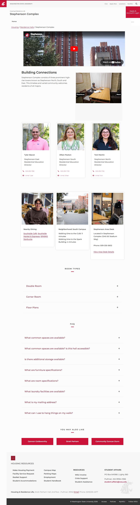

# 📄 Page Scan Report

> **URL:** https://housing.wsu.edu/residence-halls/stephenson-complex/  
> **Captured:** 2026-02-19 02:16:15 UTC  
> **Status:** ✅ 200  

---

## 📑 Contents

- [Summary](#-summary)
- [Screenshots](#-screenshots)
- [Page Images](#-page-images)
- [JavaScript Errors](#-javascript-errors)
- [Accessibility](#-accessibility)
- [Actions](#-actions)
- [Files](#-files)

---

## 📋 Summary

| Field | Value |
|-------|-------|
| URL | https://housing.wsu.edu/residence-halls/stephenson-complex/ |
| Title | Stephenson Complex |
| Status | ✅ 200 |
| HTML Size | 100.5 KB |
| Screenshots | 1 (297.3 KB) |
| Images | 16 (referenced by URL) |
| Images Missing Alt | ✅ 0 |
| JS Errors | 🔴 4 |
| JS Warnings | 5 |
| A11y Violations | ✅ 0 |
| Auth | none |
| Captured | 2026-02-19T02:16:15.4535950Z |

## 🔴 JavaScript Errors

<details>
<summary><strong>4 error(s) detected</strong></summary>

```
Access to XMLHttpRequest at 'https://cdn-web-wsu.s3-us-west-2.amazonaws.com/designsystem/1.x/build/dist/wsu-design-system.bundle.dist.css' from origin 'https://housing.wsu.edu' has been blocked by COR...
Failed to load resource: net::ERR_FAILED
Access to XMLHttpRequest at 'https://asis.wsu.edu/Styles/asis-wdsv2.css' from origin 'https://housing.wsu.edu' has been blocked by CORS policy: No 'Access-Control-Allow-Origin' header is present on th...
Failed to load resource: net::ERR_FAILED
```

</details>

## 🔧 Actions

<details>
<summary><strong>4 action(s) performed</strong></summary>

- Screenshot #1: page-loaded (297.3 KB)
- Cataloged 16 images by URL (no download)
- axe-core: 0 violations (589ms)
- htmlcheck: 0 violations (0ms)

</details>

## 📸 Screenshots

<table>
<tr>
<td align="center" width="50%">
<a href="01-page-loaded.jpg">

</a>
<br /><strong>1. page-loaded</strong>
<br /><sub>297.3 KB</sub>
</td>
<td></td>
</tr>
</table>

## 🖼️ Page Images (16)

<details open>
<summary><strong>📋 Image Index</strong> — 16 images (referenced by URL)</summary>

| # | Source URL | Alt Text |
|--:|-----------|----------|
| 1 | https://housing.wsu.edu/media/s5kpvdly/stephenson-room-side.jpg | Stephenson Room Side |
| 2 | https://housing.wsu.edu/media/4wnkqcgv/streit-perham-study-lounge.jpg | Streit Perham Study Lounge |
| 3 | https://housing.wsu.edu/media/ovwj4cal/stephenson-double.jpg | Stephenson Double |
| 4 | https://housing.wsu.edu/media/wslmqdtf/stephenson-double-closets.jpg | Stephenson Double Closets |
| 5 | https://housing.wsu.edu/media/1mweluq2/tyler-bacon.jpg | Tyler Bacon |
| 6 | https://housing.wsu.edu/media/4ohi4vxe/jillian-paxton.jpg | Jillian Paxton |
| 7 | https://housing.wsu.edu/media/5wriim04/toni-martin.jpg | Toni Martin |
| 8 | https://housing.wsu.edu/media/2a5be03o/southside-students-eating-2.png | Nearby Dining |
| 9 | https://housing.wsu.edu/media/z3qpqm1m/south-central-campus.png | Neighborhood: South Campus |
| 10 | https://housing.wsu.edu/media/eriljyeq/stephenson.png | Stephenson Area Desk |
| 11 | https://housing.wsu.edu/media/0qifw5wq/floor-plan-east-2nd-floor.png | Stephenson east second floor plan |
| 12 | https://housing.wsu.edu/media/rjvnqjux/floor-plan-east-3rd-13th-floor.png | Stephenson east floors 3 through 13 f... |
| 13 | https://housing.wsu.edu/media/0xibpog5/floor-plan-north-2nd-floor.png | stephenson north second floor plan |
| 14 | https://housing.wsu.edu/media/lttlzljn/floor-plan-north-3rd-13th-floor.png | stephenson north 3 through 13 |
| 15 | https://housing.wsu.edu/media/tmeddmlg/floor-plan-south-2nd-floor.png | stephenson south floor plan |
| 16 | https://housing.wsu.edu/media/jbzlvj4k/floor-plan-south-3rd-13th-floor.png | stephenson south 3 through 13 |

</details>

<details open>
<summary><strong>🖼️ Gallery</strong></summary>

<table>
<tr>
<td align="center" width="33%">
<a href="https://housing.wsu.edu/media/s5kpvdly/stephenson-room-side.jpg">

</a>
<br /><sub>https://housing.wsu.edu/media/s5kpvdly/stephens...</sub>
</td>
<td align="center" width="33%">
<a href="https://housing.wsu.edu/media/4wnkqcgv/streit-perham-study-lounge.jpg">

</a>
<br /><sub>https://housing.wsu.edu/media/4wnkqcgv/streit-p...</sub>
</td>
<td align="center" width="33%">
<a href="https://housing.wsu.edu/media/ovwj4cal/stephenson-double.jpg">

</a>
<br /><sub>https://housing.wsu.edu/media/ovwj4cal/stephens...</sub>
</td>
</tr>
<tr>
<td align="center" width="33%">
<a href="https://housing.wsu.edu/media/wslmqdtf/stephenson-double-closets.jpg">

</a>
<br /><sub>https://housing.wsu.edu/media/wslmqdtf/stephens...</sub>
</td>
<td align="center" width="33%">
<a href="https://housing.wsu.edu/media/1mweluq2/tyler-bacon.jpg">

</a>
<br /><sub>https://housing.wsu.edu/media/1mweluq2/tyler-ba...</sub>
</td>
<td align="center" width="33%">
<a href="https://housing.wsu.edu/media/4ohi4vxe/jillian-paxton.jpg">

</a>
<br /><sub>https://housing.wsu.edu/media/4ohi4vxe/jillian-...</sub>
</td>
</tr>
<tr>
<td align="center" width="33%">
<a href="https://housing.wsu.edu/media/5wriim04/toni-martin.jpg">

</a>
<br /><sub>https://housing.wsu.edu/media/5wriim04/toni-mar...</sub>
</td>
<td align="center" width="33%">
<a href="https://housing.wsu.edu/media/2a5be03o/southside-students-eating-2.png">

</a>
<br /><sub>https://housing.wsu.edu/media/2a5be03o/southsid...</sub>
</td>
<td align="center" width="33%">
<a href="https://housing.wsu.edu/media/z3qpqm1m/south-central-campus.png">

</a>
<br /><sub>https://housing.wsu.edu/media/z3qpqm1m/south-ce...</sub>
</td>
</tr>
<tr>
<td align="center" width="33%">
<a href="https://housing.wsu.edu/media/eriljyeq/stephenson.png">

</a>
<br /><sub>https://housing.wsu.edu/media/eriljyeq/stephens...</sub>
</td>
<td align="center" width="33%">
<a href="https://housing.wsu.edu/media/0qifw5wq/floor-plan-east-2nd-floor.png">

</a>
<br /><sub>https://housing.wsu.edu/media/0qifw5wq/floor-pl...</sub>
</td>
<td align="center" width="33%">
<a href="https://housing.wsu.edu/media/rjvnqjux/floor-plan-east-3rd-13th-floor.png">

</a>
<br /><sub>https://housing.wsu.edu/media/rjvnqjux/floor-pl...</sub>
</td>
</tr>
<tr>
<td align="center" width="33%">
<a href="https://housing.wsu.edu/media/0xibpog5/floor-plan-north-2nd-floor.png">

</a>
<br /><sub>https://housing.wsu.edu/media/0xibpog5/floor-pl...</sub>
</td>
<td align="center" width="33%">
<a href="https://housing.wsu.edu/media/lttlzljn/floor-plan-north-3rd-13th-floor.png">

</a>
<br /><sub>https://housing.wsu.edu/media/lttlzljn/floor-pl...</sub>
</td>
<td align="center" width="33%">
<a href="https://housing.wsu.edu/media/tmeddmlg/floor-plan-south-2nd-floor.png">

</a>
<br /><sub>https://housing.wsu.edu/media/tmeddmlg/floor-pl...</sub>
</td>
</tr>
<tr>
<td align="center" width="33%">
<a href="https://housing.wsu.edu/media/jbzlvj4k/floor-plan-south-3rd-13th-floor.png">

</a>
<br /><sub>https://housing.wsu.edu/media/jbzlvj4k/floor-pl...</sub>
</td>
<td></td>
<td></td>
</tr>
</table>

</details>

## ♿ Accessibility

✅ No violations detected by 2 tool(s).

## 📁 Files

| File | Description |
|------|-------------|
| `01-page-loaded.jpg` | page-loaded (297.3 KB) |
| `page.html` | Rendered HTML content |
| `metadata.json` | Machine-readable scan data |
| `errors.log` | JavaScript console errors |
| `warnings.log` | JavaScript console warnings |
| `info.log` | Navigation and timing details |
| `actions.log` | Interactions performed |
| `a11y-axe.json` | axe accessibility results |
| `a11y-htmlcheck.json` | htmlcheck accessibility results |
| `a11y-summary.json` | Merged cross-tool accessibility summary |

---

*Generated by AccessibilityScanner (FreeTools) v1.0*
