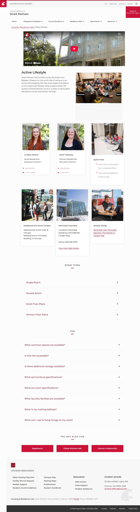

# 📄 Page Scan Report

> **URL:** https://housing.wsu.edu/residence-halls/streit-perham/  
> **Captured:** 2026-02-19 02:16:31 UTC  
> **Status:** ✅ 200  

---

## 📑 Contents

- [Summary](#-summary)
- [Screenshots](#-screenshots)
- [Page Images](#-page-images)
- [JavaScript Errors](#-javascript-errors)
- [Accessibility](#-accessibility)
- [Actions](#-actions)
- [Files](#-files)

---

## 📋 Summary

| Field | Value |
|-------|-------|
| URL | https://housing.wsu.edu/residence-halls/streit-perham/ |
| Title | Streit Perham |
| Status | ✅ 200 |
| HTML Size | 100.2 KB |
| Screenshots | 1 (319.8 KB) |
| Images | 21 (referenced by URL) |
| Images Missing Alt | ✅ 0 |
| JS Errors | 🔴 4 |
| JS Warnings | 5 |
| A11y Violations | ⚠️ 6 |
| 🔴 Critical | 6 |
| 🟠 Serious | 0 |
| 🟡 Moderate | 0 |
| 🔵 Minor | 0 |
| Tools Run | axe, htmlcheck |
| Auth | none |
| Captured | 2026-02-19T02:16:31.9147994Z |

## 🔴 JavaScript Errors

<details>
<summary><strong>4 error(s) detected</strong></summary>

```
Access to XMLHttpRequest at 'https://cdn-web-wsu.s3-us-west-2.amazonaws.com/designsystem/1.x/build/dist/wsu-design-system.bundle.dist.css' from origin 'https://housing.wsu.edu' has been blocked by COR...
Failed to load resource: net::ERR_FAILED
Access to XMLHttpRequest at 'https://asis.wsu.edu/Styles/asis-wdsv2.css' from origin 'https://housing.wsu.edu' has been blocked by CORS policy: No 'Access-Control-Allow-Origin' header is present on th...
Failed to load resource: net::ERR_FAILED
```

</details>

## 🔧 Actions

<details>
<summary><strong>4 action(s) performed</strong></summary>

- Screenshot #1: page-loaded (319.8 KB)
- Cataloged 21 images by URL (no download)
- axe-core: 6 violations (599ms)
- htmlcheck: 0 violations (0ms)

</details>

## 📸 Screenshots

<table>
<tr>
<td align="center" width="50%">
<a href="01-page-loaded.jpg">

</a>
<br /><strong>1. page-loaded</strong>
<br /><sub>319.8 KB</sub>
</td>
<td></td>
</tr>
</table>

## 🖼️ Page Images (21)

<details open>
<summary><strong>📋 Image Index</strong> — 21 images (referenced by URL)</summary>

| # | Source URL | Alt Text |
|--:|-----------|----------|
| 1 | https://housing.wsu.edu/media/1jknnkfe/streit-perham-students.jpg | Streit Perham Students |
| 2 | https://housing.wsu.edu/media/1pvpyfuz/streit-perham-lounge.jpg | Streit Perham Lounge |
| 3 | https://housing.wsu.edu/media/x2nmn21m/streit-perham-single.jpg | Streit Perham Single |
| 4 | https://housing.wsu.edu/media/qgedotf2/lindseyweaver.jpg | Lindsey Weaver |
| 5 | https://housing.wsu.edu/media/htfb32ta/sarah-hadaway.jpg | Sarah Hadaway |
| 6 | https://housing.wsu.edu/media/tucfb5yy/streit-perham-lounge-study.jpg | Quick Facts |
| 7 | https://housing.wsu.edu/media/iqqjssqx/north-campus-bus.png | Neighborhood: North Campus |
| 8 | https://housing.wsu.edu/media/4bol5w3e/northside-desk-square.png | Northside Area Desk |
| 9 | https://housing.wsu.edu/media/evabojsj/northside-students-eating-4.png | Nearby Dining |
| 10 | https://housing.wsu.edu/media/eqkh22fn/floor-plan-streit-1st-floor.png | Streit first floor plan |
| 11 | https://housing.wsu.edu/media/tsgbkzdy/floor-plan-streit-2nd-floor.png | Streit second floor plan |
| 12 | https://housing.wsu.edu/media/zlth20jp/floor-plan-streit-3rd-floor.png | Streit third floor plan |
| 13 | https://housing.wsu.edu/media/uwpdeuks/floor-plan-streit-4th-floor.png | Streit fourth floor plan |
| 14 | https://housing.wsu.edu/media/dkhljg3z/floor-plan-streit-5th-floor.png | Streit Fifth floor plan |
| 15 | https://housing.wsu.edu/media/40mhm3m1/floor-plan-streit-6th-floor.png | Streit sixth floor plan |
| 16 | https://housing.wsu.edu/media/h3uju1p5/floor-plan-perham-1st-floor.png | Perham first floor plan |
| 17 | https://housing.wsu.edu/media/mchnawkz/floor-plan-perham-2nd-floor.png | Perham second floor plan |
| 18 | https://housing.wsu.edu/media/m0xpx5yt/floor-plan-perham-3rd-floor.png | Perham third floor plan |
| 19 | https://housing.wsu.edu/media/h35lq1vh/floor-plan-perham-4th-floor.png | Perham fourth floor plan |
| 20 | https://housing.wsu.edu/media/3fkpubti/floor-plan-perham-5th-floor.png | Perham fifth floor plan |
| 21 | https://housing.wsu.edu/media/t55f3dss/floor-plan-perham-6th-floor.png | Perham sixth floor plan |

</details>

<details open>
<summary><strong>🖼️ Gallery</strong></summary>

<table>
<tr>
<td align="center" width="33%">
<a href="https://housing.wsu.edu/media/1jknnkfe/streit-perham-students.jpg">

</a>
<br /><sub>https://housing.wsu.edu/media/1jknnkfe/streit-p...</sub>
</td>
<td align="center" width="33%">
<a href="https://housing.wsu.edu/media/1pvpyfuz/streit-perham-lounge.jpg">

</a>
<br /><sub>https://housing.wsu.edu/media/1pvpyfuz/streit-p...</sub>
</td>
<td align="center" width="33%">
<a href="https://housing.wsu.edu/media/x2nmn21m/streit-perham-single.jpg">

</a>
<br /><sub>https://housing.wsu.edu/media/x2nmn21m/streit-p...</sub>
</td>
</tr>
<tr>
<td align="center" width="33%">
<a href="https://housing.wsu.edu/media/qgedotf2/lindseyweaver.jpg">

</a>
<br /><sub>https://housing.wsu.edu/media/qgedotf2/lindseyw...</sub>
</td>
<td align="center" width="33%">
<a href="https://housing.wsu.edu/media/htfb32ta/sarah-hadaway.jpg">

</a>
<br /><sub>https://housing.wsu.edu/media/htfb32ta/sarah-ha...</sub>
</td>
<td align="center" width="33%">
<a href="https://housing.wsu.edu/media/tucfb5yy/streit-perham-lounge-study.jpg">

</a>
<br /><sub>https://housing.wsu.edu/media/tucfb5yy/streit-p...</sub>
</td>
</tr>
<tr>
<td align="center" width="33%">
<a href="https://housing.wsu.edu/media/iqqjssqx/north-campus-bus.png">

</a>
<br /><sub>https://housing.wsu.edu/media/iqqjssqx/north-ca...</sub>
</td>
<td align="center" width="33%">
<a href="https://housing.wsu.edu/media/4bol5w3e/northside-desk-square.png">

</a>
<br /><sub>https://housing.wsu.edu/media/4bol5w3e/northsid...</sub>
</td>
<td align="center" width="33%">
<a href="https://housing.wsu.edu/media/evabojsj/northside-students-eating-4.png">

</a>
<br /><sub>https://housing.wsu.edu/media/evabojsj/northsid...</sub>
</td>
</tr>
<tr>
<td align="center" width="33%">
<a href="https://housing.wsu.edu/media/eqkh22fn/floor-plan-streit-1st-floor.png">

</a>
<br /><sub>https://housing.wsu.edu/media/eqkh22fn/floor-pl...</sub>
</td>
<td align="center" width="33%">
<a href="https://housing.wsu.edu/media/tsgbkzdy/floor-plan-streit-2nd-floor.png">

</a>
<br /><sub>https://housing.wsu.edu/media/tsgbkzdy/floor-pl...</sub>
</td>
<td align="center" width="33%">
<a href="https://housing.wsu.edu/media/zlth20jp/floor-plan-streit-3rd-floor.png">

</a>
<br /><sub>https://housing.wsu.edu/media/zlth20jp/floor-pl...</sub>
</td>
</tr>
<tr>
<td align="center" width="33%">
<a href="https://housing.wsu.edu/media/uwpdeuks/floor-plan-streit-4th-floor.png">

</a>
<br /><sub>https://housing.wsu.edu/media/uwpdeuks/floor-pl...</sub>
</td>
<td align="center" width="33%">
<a href="https://housing.wsu.edu/media/dkhljg3z/floor-plan-streit-5th-floor.png">

</a>
<br /><sub>https://housing.wsu.edu/media/dkhljg3z/floor-pl...</sub>
</td>
<td align="center" width="33%">
<a href="https://housing.wsu.edu/media/40mhm3m1/floor-plan-streit-6th-floor.png">

</a>
<br /><sub>https://housing.wsu.edu/media/40mhm3m1/floor-pl...</sub>
</td>
</tr>
<tr>
<td align="center" width="33%">
<a href="https://housing.wsu.edu/media/h3uju1p5/floor-plan-perham-1st-floor.png">

</a>
<br /><sub>https://housing.wsu.edu/media/h3uju1p5/floor-pl...</sub>
</td>
<td align="center" width="33%">
<a href="https://housing.wsu.edu/media/mchnawkz/floor-plan-perham-2nd-floor.png">

</a>
<br /><sub>https://housing.wsu.edu/media/mchnawkz/floor-pl...</sub>
</td>
<td align="center" width="33%">
<a href="https://housing.wsu.edu/media/m0xpx5yt/floor-plan-perham-3rd-floor.png">

</a>
<br /><sub>https://housing.wsu.edu/media/m0xpx5yt/floor-pl...</sub>
</td>
</tr>
<tr>
<td align="center" width="33%">
<a href="https://housing.wsu.edu/media/h35lq1vh/floor-plan-perham-4th-floor.png">

</a>
<br /><sub>https://housing.wsu.edu/media/h35lq1vh/floor-pl...</sub>
</td>
<td align="center" width="33%">
<a href="https://housing.wsu.edu/media/3fkpubti/floor-plan-perham-5th-floor.png">

</a>
<br /><sub>https://housing.wsu.edu/media/3fkpubti/floor-pl...</sub>
</td>
<td align="center" width="33%">
<a href="https://housing.wsu.edu/media/t55f3dss/floor-plan-perham-6th-floor.png">

</a>
<br /><sub>https://housing.wsu.edu/media/t55f3dss/floor-pl...</sub>
</td>
</tr>
</table>

</details>

## ♿ Accessibility

### Summary

| Severity | axe | htmlcheck |
|----------|:---:|:---:|
| 🔴 critical | 6 | 0 |
| 🟠 serious | 0 | 0 |
| 🟡 moderate | 0 | 0 |
| 🔵 minor | 0 | 0 |
| **Total** | **6** | **0** |

### Violations by Confidence

<details open>
<summary><strong>2 rule(s) violated</strong></summary>

| # | Rule | Sev | Confidence | axe | htmlcheck | Example |
|--:|------|:---:|:----------:|:---:|:---:|---------|
| 1 | [aria-required-parent](../../a11y-rules.md#aria-required-parent) | 🔴 | 🟡 1/2 | ⚠️ | ✅ | `<a class="foundationMenuLink" href="/prospective-students...` |
| 2 | [aria-required-children](../../a11y-rules.md#aria-required-children) | 🔴 | 🟡 1/2 | ⚠️ | ✅ | `<ul id="mainNav" class="dropdown menu" aria-label="Main N...` |

</details>

> **Note:** Automated scanning catches ~30-60% of WCAG issues. Manual keyboard and screen reader testing is still required for full compliance.

## 📁 Files

| File | Description |
|------|-------------|
| `01-page-loaded.jpg` | page-loaded (319.8 KB) |
| `page.html` | Rendered HTML content |
| `metadata.json` | Machine-readable scan data |
| `errors.log` | JavaScript console errors |
| `warnings.log` | JavaScript console warnings |
| `info.log` | Navigation and timing details |
| `actions.log` | Interactions performed |
| `a11y-axe.json` | axe accessibility results |
| `a11y-htmlcheck.json` | htmlcheck accessibility results |
| `a11y-summary.json` | Merged cross-tool accessibility summary |

---

*Generated by AccessibilityScanner (FreeTools) v1.0*
