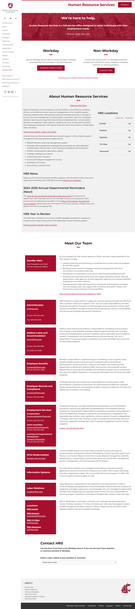

# Page Scan Report

| Field | Value |
|-------|-------|
| URL | https://hrs.wsu.edu/contact/ |
| Title | Contact HRS – Human Resource Services, Washington State University |
| Status | ❌ 0 |
| HTML Size | 132.2 KB |
| Screenshots | 1 (1.4 MB) |
| Images | 2 (1.2 MB) |
| Images Missing Alt | 2 |
| JS Errors | 0 |
| JS Warnings | 0 |
| Auth | none |
| Captured | 2026-02-16T21:01:03.1920490Z |

## Actions

- Screenshot #1: page-loaded (1.4 MB)
- Downloaded 2 images to /images/

## Screenshots

### 1. page-loaded

## Page Images (2)

| # | Image | Alt Text | Size |
|---|-------|----------|------|
| 1 | [wsu-letters.jpg](images/wsu-letters.jpg) | *(none)* | 179.7 KB |
| 2 | [wsu-gray-1920x1080-1.png](images/wsu-gray-1920x1080-1.png) | *(none)* | 1.0 MB |

### Gallery

### ⚠️ Images Missing Alt Text (2)

- `wsu-letters.jpg` — https://hrs.wsu.edu/wp-content/uploads/2020/05/wsu-letters.jpg
- `wsu-gray-1920x1080-1.png` — https://hrs.wsu.edu/wp-content/uploads/2023/08/wsu-gray-1920x1080-1.png

## Files

- `01-page-loaded.png` — page-loaded (1.4 MB)
- `page.html` — rendered HTML content
- `metadata.json` — machine-readable scan data
- `errors.log` — JavaScript console errors
- `warnings.log` — JavaScript console warnings
- `info.log` — navigation and timing details
- `actions.log` — interactions performed on the page
- `images/` — 2 page images (1.2 MB)
