# 🌐 Site Report: https://hrs.wsu.edu/

> **Status:** ⚠️ 19/20 pages OK  
> **Folder:** `hrs-wsu-edu/`  

---

## 📋 Summary

```
Success Rate:  [████████████████████████████░░] 95%
```

| Metric | Value |
|--------|-------|
| Pages Scanned | 20 |
| Pages Passed | ✅ 19 |
| Pages Failed | ❌ 1 |
| Total JS Errors | 🔴 41 |
| Total JS Warnings | 26 |
| Total Images | 51 (by URL) |
| Images Missing Alt | ⚠️ 31 |
| A11y Violations | ⚠️ 111 |
| 🔴 Critical | 0 |
| 🟠 Serious | 108 |
| 🟡 Moderate | 3 |
| 🔵 Minor | 0 |
| Total HTML | 1.7 MB |
| Total Screenshots | 5.1 MB |

## 🔒 SSL Certificate

| Field | Value |
|-------|-------|
| Subject | `CN=hrs.wsu.edu, O=Washington State University, S=Washington, C=US` |
| Issuer | `CN=InCommon RSA Server CA 2, O=Internet2, C=US` |
| Valid From | 2025-05-18 |
| Expires | 🟡 2026-05-19 (89 days) |
| Algorithm | sha384RSA |
| Key Size | 2048 bits |
| Thumbprint | `BD04C7CC761FC1E71951F630557F9DCA48283954` |
| SANs | 15 domain(s) |

<details>
<summary><strong>Subject Alternative Names (15)</strong></summary>

| Domain | Type |
|--------|------|
| `cmsdev.hrs.wsu.edu` | 🏫 WSU |
| `employee-recognition.wsu.edu` | 🏫 WSU |
| `er.hrs.wsu.edu` | 🏫 WSU |
| `files.ba.wsu.edu` | 🏫 WSU |
| `files.hrs.wsu.edu` | 🏫 WSU |
| `hrs.wsu.edu` | 🏫 WSU |
| `hrscms.hrs.wsu.edu` | 🏫 WSU |
| `hrsdev.hrs.wsu.edu` | 🏫 WSU |
| `ihr.hrs.wsu.edu` | 🏫 WSU |
| `intranet.hrs.wsu.edu` | 🏫 WSU |
| `training.hrs.wsu.edu` | 🏫 WSU |
| `www.employee-recognition.wsu.edu` | 🏫 WSU |
| `www.hrs.wsu.edu` | 🏫 WSU |
| `www.ihr.hrs.wsu.edu` | 🏫 WSU |
| `www.intranet.hrs.wsu.edu` | 🏫 WSU |

</details>

## 📑 Pages

| Status | Page | HTTP | Title | 🔴 | 🟠 | 🟡 | 🔵 | A11y |
|:------:|------|:----:|-------|:--:|:--:|:--:|:--:|:----:|
| ✅ | [/](_root/report.md) | 200 | Human Resource Services, Washington S... |  | 4 | 1 |  | ⚠️ 5 |
| ✅ | [/benefits/](benefits/report.md) | 200 | Benefits – Human Resource Services, W... |  | 4 |  |  | ⚠️ 4 |
| ✅ | [/careers/](careers/report.md) | 200 | Careers – Human Resource Services, Wa... |  | 4 | 1 |  | ⚠️ 5 |
| ✅ | [/contact/](contact/report.md) | 200 | Contact HRS – Human Resource Services... |  | 6 |  |  | ⚠️ 6 |
| ✅ | [/employees/](employees/report.md) | 200 | Employees – Human Resource Services, ... |  | 4 |  |  | ⚠️ 4 |
| ✅ | [/employees/benefits/](employees_benefits/report.md) | 200 | Benefits – Human Resource Services, W... |  | 4 |  |  | ⚠️ 4 |
| ✅ | [/employees/benefits/benefit-details/](employees_benefits_benefit-details/report.md) | 200 | Benefit Details – Human Resource Serv... |  | 4 |  |  | ⚠️ 4 |
| ✅ | [/employees/benefits/benefit-forms/](employees_benefits_benefit-forms/report.md) | 200 | Benefit Forms – Human Resource Servic... |  | 4 |  |  | ⚠️ 4 |
| ✅ | [/employees/benefits/new-employee-information/](employees_benefits_new-employee-information/report.md) | 200 | New Employee Information – Human Reso... |  | 4 |  |  | ⚠️ 4 |
| ✅ | [/employees/benefits/retirement-information/](employees_benefits_retirement-information/report.md) | 200 | Retirement Information – Human Resour... |  | 4 |  |  | ⚠️ 4 |
| ✅ | [/employees/benefits/separating-employee-information/](employees_benefits_separating-employee-information/report.md) | 200 | Benefits Information for Separating E... |  | 4 |  |  | ⚠️ 4 |
| ❌ | [/employees/disability-services/pregnancy-parental-leave/](employees_disability-services_pregnancy-parental-leave/report.md) | 404 | Page not found – Human Resource Servi... |  | 5 |  |  | ⚠️ 5 |
| ✅ | [/employees/employee-handbooks/](employees_employee-handbooks/report.md) | 200 | Employee Handbooks – Human Resource S... |  | 4 |  |  | ⚠️ 4 |
| ✅ | [/everett/](everett/report.md) | 200 | Everett Campus – Human Resource Servi... |  | 14 |  |  | ⚠️ 14 |
| ✅ | [/jobs/](jobs/report.md) | 200 | Careers – Human Resource Services, Wa... |  | 4 | 1 |  | ⚠️ 5 |
| ✅ | [/news/](news/report.md) | 200 | News – Human Resource Services, Washi... |  | 4 |  |  | ⚠️ 4 |
| ✅ | [/policies/](policies/report.md) | 200 | Policies and Resources – Human Resour... |  | 4 |  |  | ⚠️ 4 |
| ✅ | [/resources/general-salary-increase/](resources_general-salary-increase/report.md) | 200 | General Salary Increase Information –... |  | 4 |  |  | ⚠️ 4 |
| ✅ | [/training/](training/report.md) | 200 | Learning & Organizational Development... |  | 9 |  |  | ⚠️ 9 |
| ✅ | [/tricities/](tricities/report.md) | 200 | Tri-Cities Campus – Human Resource Se... |  | 14 |  |  | ⚠️ 14 |

## 📸 Page Screenshots

Click any thumbnail to view the full page report.

<table>
<tr>
<td align="center" width="33%">
<a href="_root/report.md">

</a>
<br />✅ <code>/</code>
</td>
<td align="center" width="33%">
<a href="benefits/report.md">

</a>
<br />✅ <code>/benefits/</code>
</td>
<td align="center" width="33%">
<a href="careers/report.md">
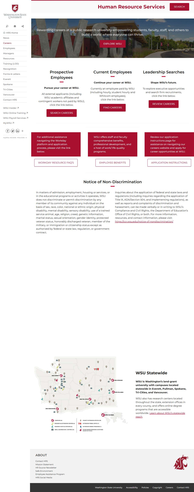
</a>
<br />✅ <code>/careers/</code>
</td>
</tr>
<tr>
<td align="center" width="33%">
<a href="contact/report.md">
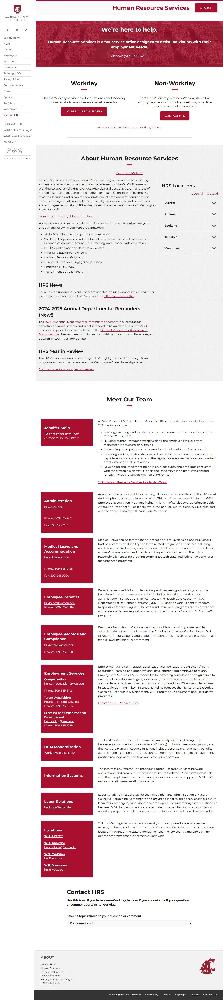
</a>
<br />✅ <code>/contact/</code>
</td>
<td align="center" width="33%">
<a href="employees/report.md">
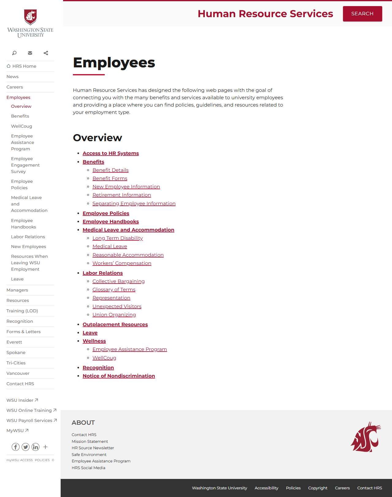
</a>
<br />✅ <code>/employees/</code>
</td>
<td align="center" width="33%">
<a href="employees_benefits/report.md">

</a>
<br />✅ <code>/employees/benefits/</code>
</td>
</tr>
<tr>
<td align="center" width="33%">
<a href="employees_benefits_benefit-details/report.md">
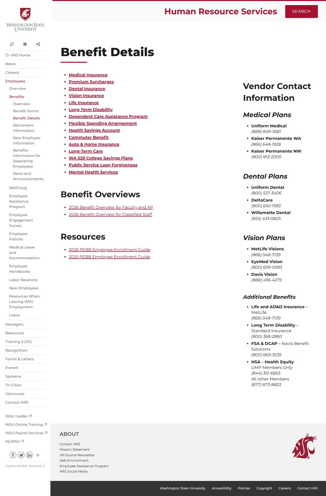
</a>
<br />✅ <code>/employees/benefits/benefit-details/</code>
</td>
<td align="center" width="33%">
<a href="employees_benefits_benefit-forms/report.md">
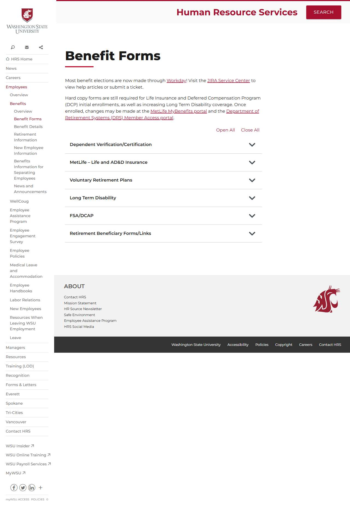
</a>
<br />✅ <code>/employees/benefits/benefit-forms/</code>
</td>
<td align="center" width="33%">
<a href="employees_benefits_new-employee-information/report.md">
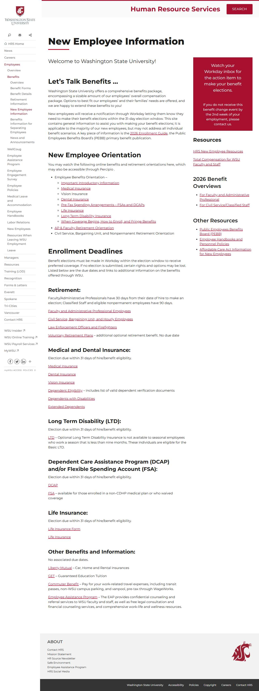
</a>
<br />✅ <code>/employees/benefits/new-employee-information/</code>
</td>
</tr>
<tr>
<td align="center" width="33%">
<a href="employees_benefits_retirement-information/report.md">
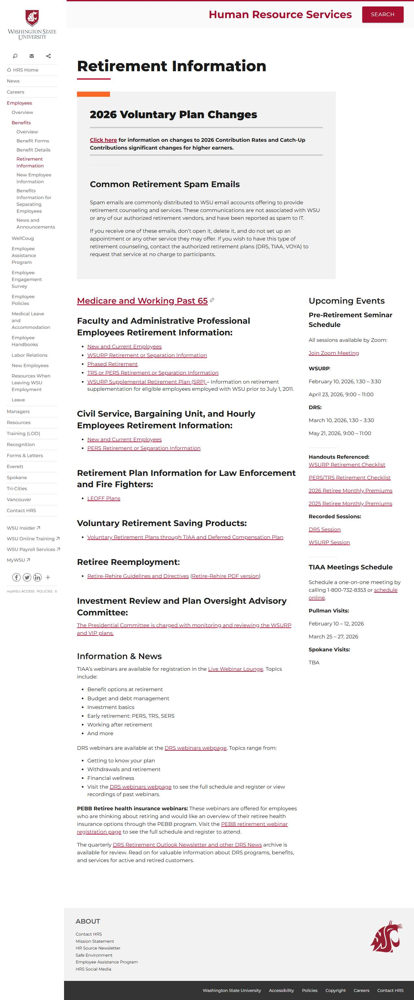
</a>
<br />✅ <code>/employees/benefits/retirement-information/</code>
</td>
<td align="center" width="33%">
<a href="employees_benefits_separating-employee-information/report.md">
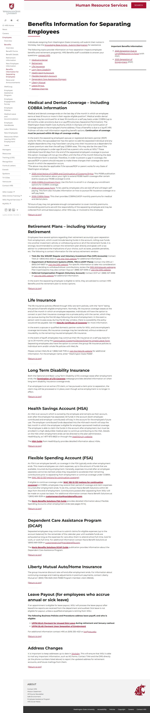
</a>
<br />✅ <code>/employees/benefits/separating-employee-information/</code>
</td>
<td align="center" width="33%">
<a href="employees_disability-services_pregnancy-parental-leave/report.md">
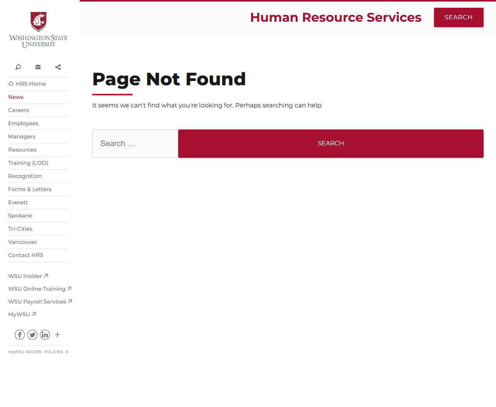
</a>
<br />❌ <code>/employees/disability-services/pregnancy-parental-leave/</code>
</td>
</tr>
<tr>
<td align="center" width="33%">
<a href="employees_employee-handbooks/report.md">

</a>
<br />✅ <code>/employees/employee-handbooks/</code>
</td>
<td align="center" width="33%">
<a href="everett/report.md">
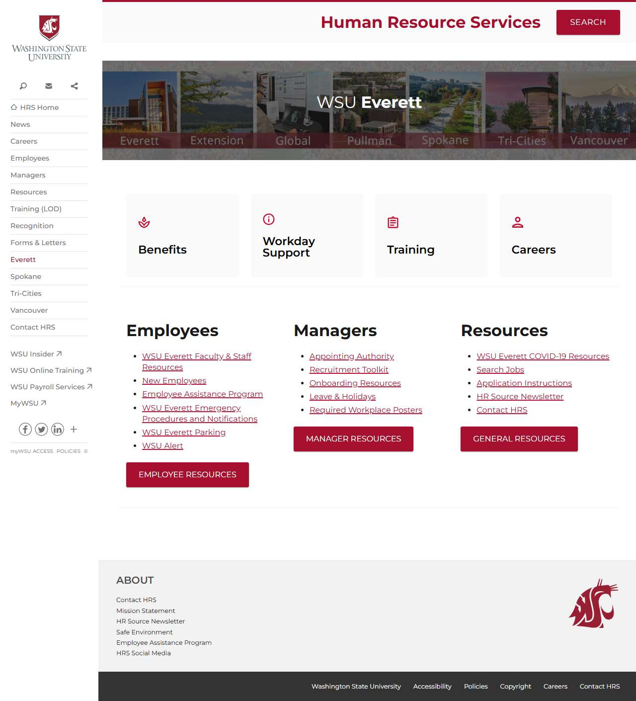
</a>
<br />✅ <code>/everett/</code>
</td>
<td align="center" width="33%">
<a href="jobs/report.md">
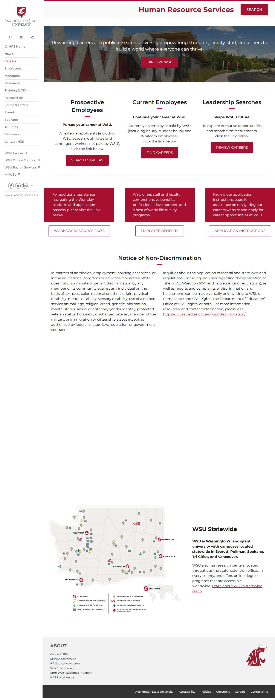
</a>
<br />✅ <code>/jobs/</code>
</td>
</tr>
<tr>
<td align="center" width="33%">
<a href="news/report.md">

</a>
<br />✅ <code>/news/</code>
</td>
<td align="center" width="33%">
<a href="policies/report.md">
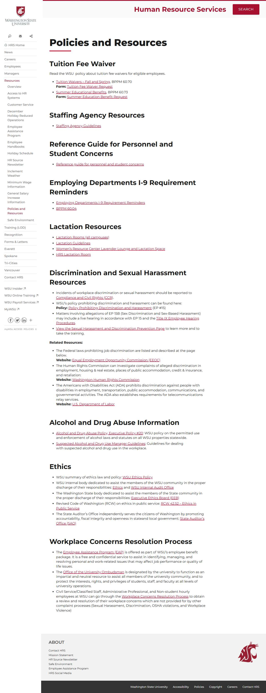
</a>
<br />✅ <code>/policies/</code>
</td>
<td align="center" width="33%">
<a href="resources_general-salary-increase/report.md">
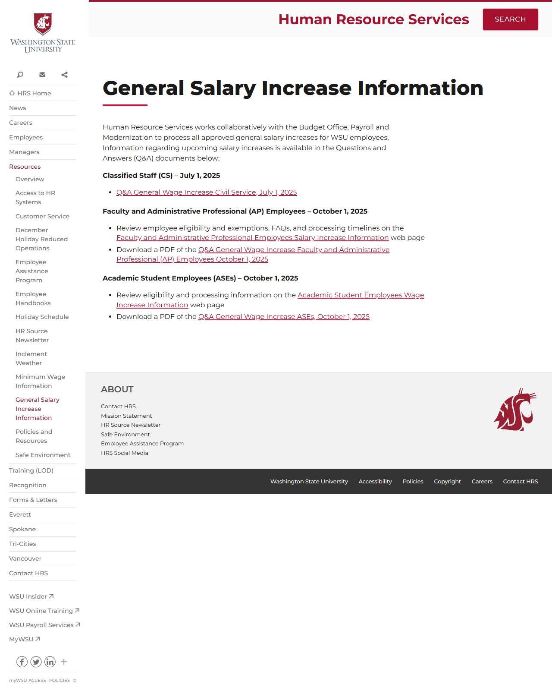
</a>
<br />✅ <code>/resources/general-salary-increase/</code>
</td>
</tr>
<tr>
<td align="center" width="33%">
<a href="training/report.md">
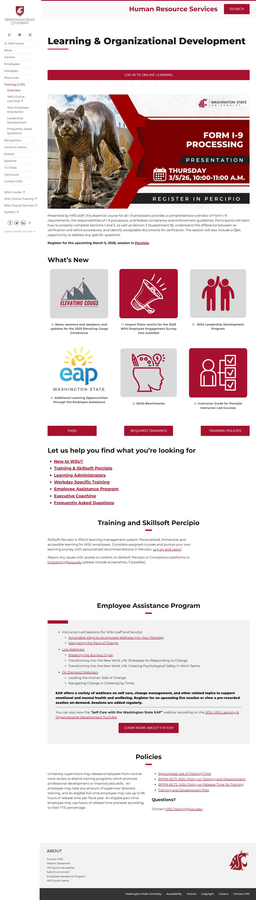
</a>
<br />✅ <code>/training/</code>
</td>
<td align="center" width="33%">
<a href="tricities/report.md">
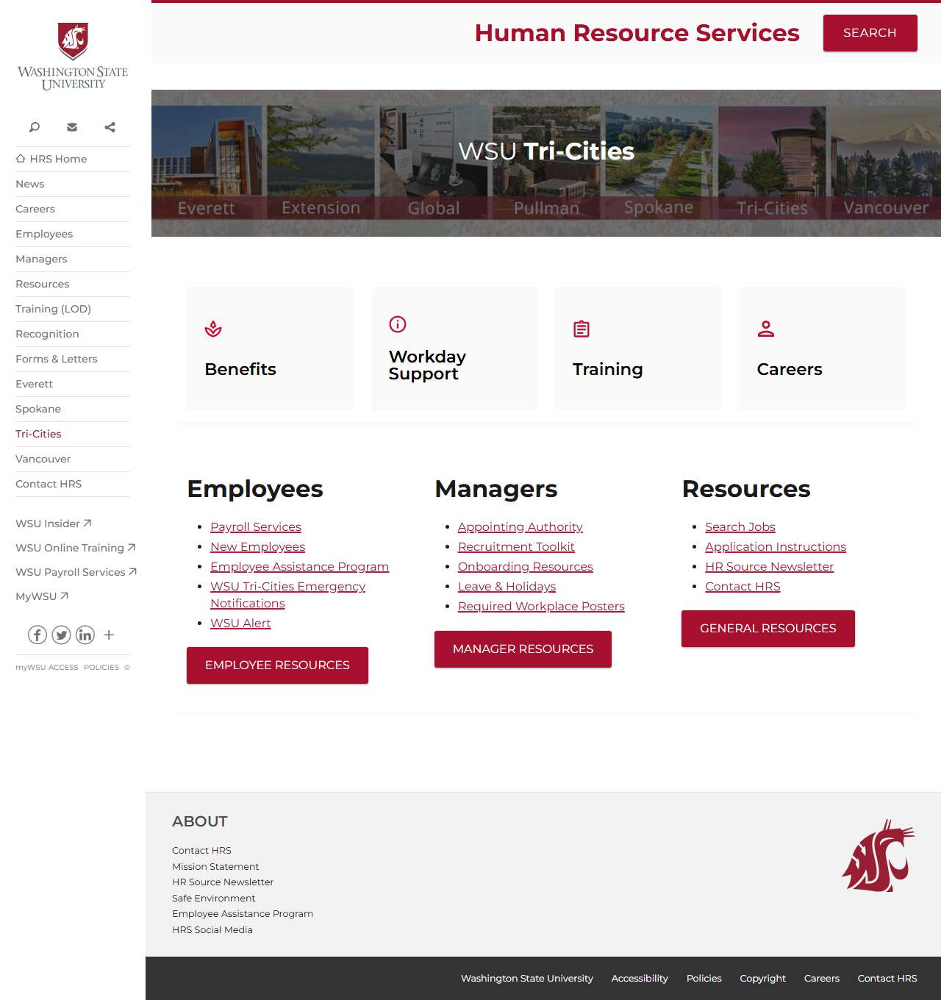
</a>
<br />✅ <code>/tricities/</code>
</td>
<td></td>
</tr>
</table>

## ❌ Failed Pages

<details open>
<summary><strong>1 page(s) failed</strong></summary>

| Page | HTTP | Error |
|------|:----:|-------|
| [/employees/disability-services/pregnancy-parental-leave/](employees_disability-services_pregnancy-parental-leave/report.md) | 404 | — |

</details>

## 🔴 JavaScript Errors

<details>
<summary><strong>41 error(s) across 20 page(s)</strong></summary>

**/employees/disability-services/pregnancy-parental-leave/** (3 errors)

```
Failed to load resource: the server responded with a status of 404 ()
Access to XMLHttpRequest at 'https://repo.wsu.edu/spine/2/spine.min.css?ver=2.0.3' from origin 'https://hrs.wsu.edu' has been blocked by CORS policy: No 'Access-Control-Allow-Origin' header is present...
Failed to load resource: net::ERR_FAILED
```

**/** (2 errors)

```
Access to XMLHttpRequest at 'https://repo.wsu.edu/spine/2/spine.min.css?ver=2.0.3' from origin 'https://hrs.wsu.edu' has been blocked by CORS policy: No 'Access-Control-Allow-Origin' header is present...
Failed to load resource: net::ERR_FAILED
```

**/benefits/** (2 errors)

```
Access to XMLHttpRequest at 'https://repo.wsu.edu/spine/2/spine.min.css?ver=2.0.3' from origin 'https://hrs.wsu.edu' has been blocked by CORS policy: No 'Access-Control-Allow-Origin' header is present...
Failed to load resource: net::ERR_FAILED
```

**/careers/** (2 errors)

```
Access to XMLHttpRequest at 'https://repo.wsu.edu/spine/2/spine.min.css?ver=2.0.3' from origin 'https://hrs.wsu.edu' has been blocked by CORS policy: No 'Access-Control-Allow-Origin' header is present...
Failed to load resource: net::ERR_FAILED
```

**/contact/** (2 errors)

```
Access to XMLHttpRequest at 'https://repo.wsu.edu/spine/2/spine.min.css?ver=2.0.3' from origin 'https://hrs.wsu.edu' has been blocked by CORS policy: No 'Access-Control-Allow-Origin' header is present...
Failed to load resource: net::ERR_FAILED
```

**/employees/** (2 errors)

```
Access to XMLHttpRequest at 'https://repo.wsu.edu/spine/2/spine.min.css?ver=2.0.3' from origin 'https://hrs.wsu.edu' has been blocked by CORS policy: No 'Access-Control-Allow-Origin' header is present...
Failed to load resource: net::ERR_FAILED
```

**/employees/benefits/** (2 errors)

```
Access to XMLHttpRequest at 'https://repo.wsu.edu/spine/2/spine.min.css?ver=2.0.3' from origin 'https://hrs.wsu.edu' has been blocked by CORS policy: No 'Access-Control-Allow-Origin' header is present...
Failed to load resource: net::ERR_FAILED
```

**/employees/benefits/benefit-details/** (2 errors)

```
Access to XMLHttpRequest at 'https://repo.wsu.edu/spine/2/spine.min.css?ver=2.0.3' from origin 'https://hrs.wsu.edu' has been blocked by CORS policy: No 'Access-Control-Allow-Origin' header is present...
Failed to load resource: net::ERR_FAILED
```

**/employees/benefits/benefit-forms/** (2 errors)

```
Access to XMLHttpRequest at 'https://repo.wsu.edu/spine/2/spine.min.css?ver=2.0.3' from origin 'https://hrs.wsu.edu' has been blocked by CORS policy: No 'Access-Control-Allow-Origin' header is present...
Failed to load resource: net::ERR_FAILED
```

**/employees/benefits/new-employee-information/** (2 errors)

```
Access to XMLHttpRequest at 'https://repo.wsu.edu/spine/2/spine.min.css?ver=2.0.3' from origin 'https://hrs.wsu.edu' has been blocked by CORS policy: No 'Access-Control-Allow-Origin' header is present...
Failed to load resource: net::ERR_FAILED
```

**/employees/benefits/retirement-information/** (2 errors)

```
Access to XMLHttpRequest at 'https://repo.wsu.edu/spine/2/spine.min.css?ver=2.0.3' from origin 'https://hrs.wsu.edu' has been blocked by CORS policy: No 'Access-Control-Allow-Origin' header is present...
Failed to load resource: net::ERR_FAILED
```

**/employees/benefits/separating-employee-information/** (2 errors)

```
Access to XMLHttpRequest at 'https://repo.wsu.edu/spine/2/spine.min.css?ver=2.0.3' from origin 'https://hrs.wsu.edu' has been blocked by CORS policy: No 'Access-Control-Allow-Origin' header is present...
Failed to load resource: net::ERR_FAILED
```

**/employees/employee-handbooks/** (2 errors)

```
Access to XMLHttpRequest at 'https://repo.wsu.edu/spine/2/spine.min.css?ver=2.0.3' from origin 'https://hrs.wsu.edu' has been blocked by CORS policy: No 'Access-Control-Allow-Origin' header is present...
Failed to load resource: net::ERR_FAILED
```

**/everett/** (2 errors)

```
Access to XMLHttpRequest at 'https://repo.wsu.edu/spine/2/spine.min.css?ver=2.0.3' from origin 'https://hrs.wsu.edu' has been blocked by CORS policy: No 'Access-Control-Allow-Origin' header is present...
Failed to load resource: net::ERR_FAILED
```

**/jobs/** (2 errors)

```
Access to XMLHttpRequest at 'https://repo.wsu.edu/spine/2/spine.min.css?ver=2.0.3' from origin 'https://hrs.wsu.edu' has been blocked by CORS policy: No 'Access-Control-Allow-Origin' header is present...
Failed to load resource: net::ERR_FAILED
```

**/news/** (2 errors)

```
Access to XMLHttpRequest at 'https://repo.wsu.edu/spine/2/spine.min.css?ver=2.0.3' from origin 'https://hrs.wsu.edu' has been blocked by CORS policy: No 'Access-Control-Allow-Origin' header is present...
Failed to load resource: net::ERR_FAILED
```

**/policies/** (2 errors)

```
Access to XMLHttpRequest at 'https://repo.wsu.edu/spine/2/spine.min.css?ver=2.0.3' from origin 'https://hrs.wsu.edu' has been blocked by CORS policy: No 'Access-Control-Allow-Origin' header is present...
Failed to load resource: net::ERR_FAILED
```

**/resources/general-salary-increase/** (2 errors)

```
Access to XMLHttpRequest at 'https://repo.wsu.edu/spine/2/spine.min.css?ver=2.0.3' from origin 'https://hrs.wsu.edu' has been blocked by CORS policy: No 'Access-Control-Allow-Origin' header is present...
Failed to load resource: net::ERR_FAILED
```

**/training/** (2 errors)

```
Access to XMLHttpRequest at 'https://repo.wsu.edu/spine/2/spine.min.css?ver=2.0.3' from origin 'https://hrs.wsu.edu' has been blocked by CORS policy: No 'Access-Control-Allow-Origin' header is present...
Failed to load resource: net::ERR_FAILED
```

**/tricities/** (2 errors)

```
Access to XMLHttpRequest at 'https://repo.wsu.edu/spine/2/spine.min.css?ver=2.0.3' from origin 'https://hrs.wsu.edu' has been blocked by CORS policy: No 'Access-Control-Allow-Origin' header is present...
Failed to load resource: net::ERR_FAILED
```

</details>

## ♿ Accessibility Summary

| Metric | Value |
|--------|-------|
| Pages with violations | 20/20 |
| Total violations | 111 |
| 🔴 Critical | 0 |
| 🟠 Serious | 108 |
| 🟡 Moderate | 3 |
| 🔵 Minor | 0 |

### Top 4 Issues

| # | Rule | Sev | Pages | Instances |
|--:|------|:---:|:-----:|:---------:|
| 1 | link-name | 🟠 | 4/20 | 27 |
| 2 | image-alt | 🟠 | 20/20 | 60 |
| 3 | label | 🟠 | 20/20 | 21 |
| 4 | heading-order | 🟡 | 3/20 | 3 |

---

*Generated by AccessibilityScanner (FreeTools) v1.0*
