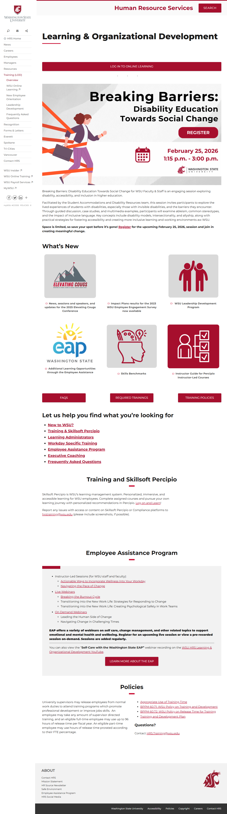
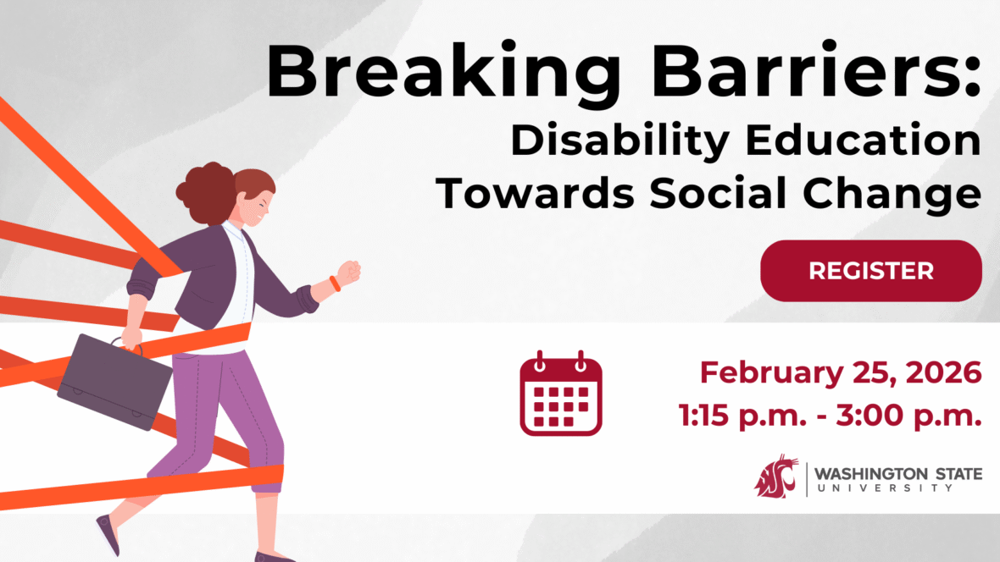
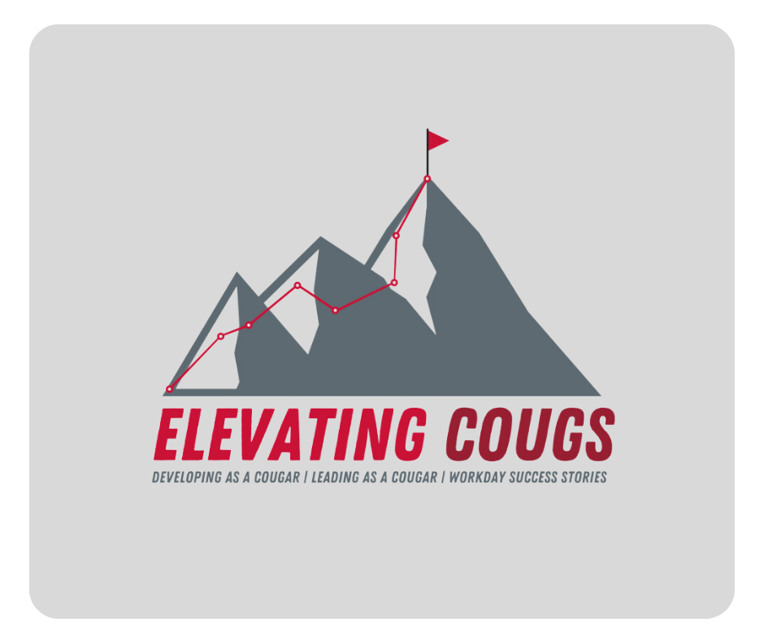
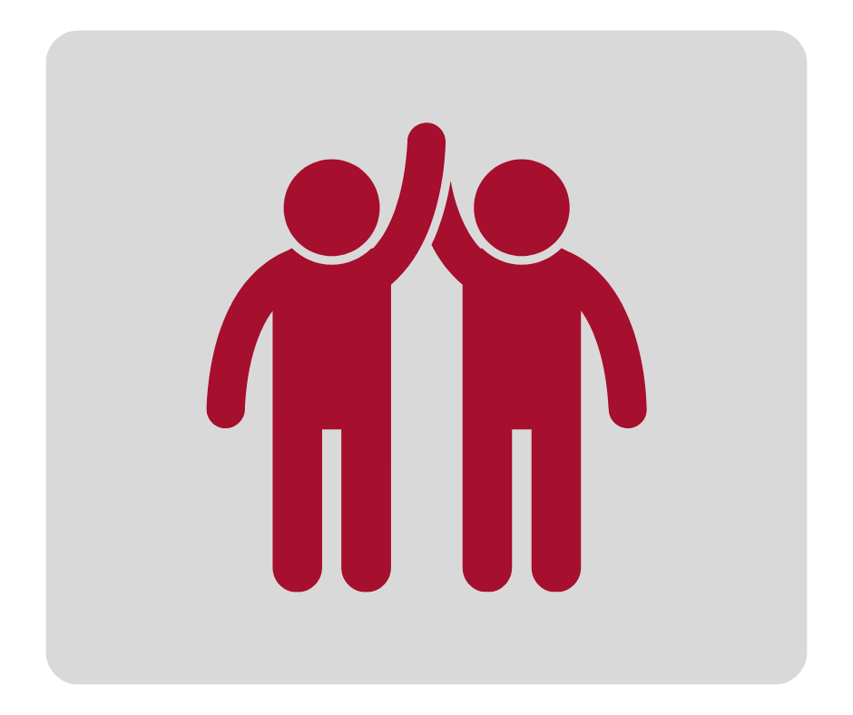
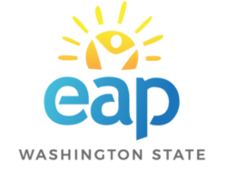
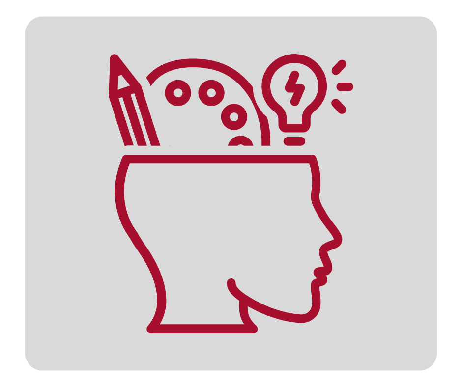
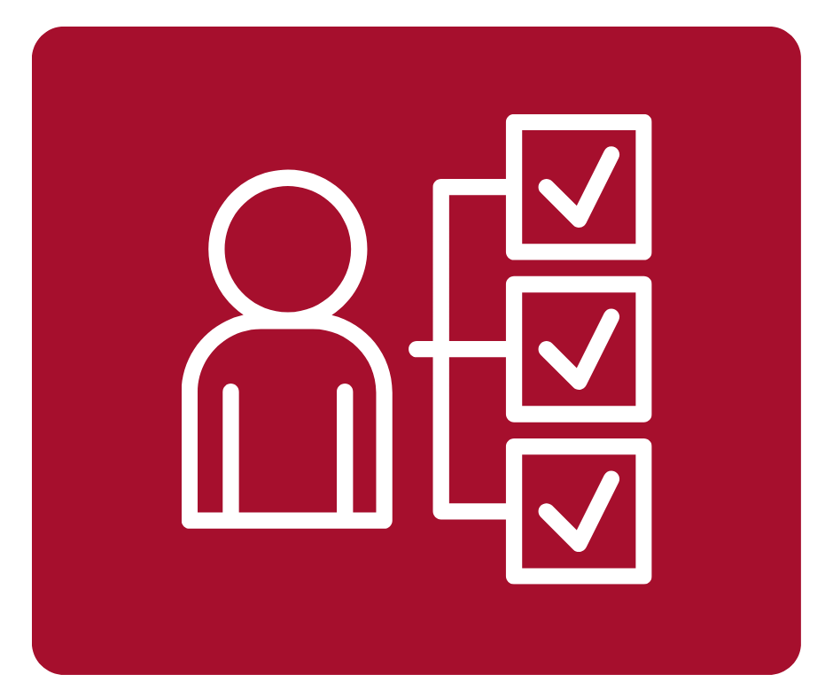

# Page Scan Report

| Field | Value |
|-------|-------|
| URL | https://hrs.wsu.edu/training/ |
| Title | Learning & Organizational Development – Human Resource Services, Washington State University |
| Status | ❌ 0 |
| HTML Size | 90.8 KB |
| Screenshots | 1 (823.1 KB) |
| Images | 7 (415.2 KB) |
| Images Missing Alt | 6 |
| JS Errors | 0 |
| JS Warnings | 0 |
| Auth | none |
| Captured | 2026-02-16T21:00:40.5449562Z |

## Actions

- Screenshot #1: page-loaded (823.1 KB)
- Downloaded 7 images to /images/

## Screenshots

### 1. page-loaded

## Page Images (7)

| # | Image | Alt Text | Size |
|---|-------|----------|------|
| 1 | [Breaking-Barriers-1180x664.png](images/Breaking-Barriers-1180x664.png) | *(none)* | 134.5 KB |
| 2 | [ECC-2024-LOD-Landing-pg.png](images/ECC-2024-LOD-Landing-pg.png) | *(none)* | 115.2 KB |
| 3 | [Impact-plans-resluts-2024-LOD-landing-pg.png](images/Impact-plans-resluts-2024-LOD-landing-pg.png) | *(none)* | 52.2 KB |
| 4 | [image-4.png](images/image-4.png) | WSU staff mentoring. | 25.8 KB |
| 5 | [EAP-Logo-e1599250958200-LOD-landing-pg.png](images/EAP-Logo-e1599250958200-LOD-landing-pg.png) | *(none)* | 15.9 KB |
| 6 | [skills-benchmarks-LOD-landing-pg.png](images/skills-benchmarks-LOD-landing-pg.png) | *(none)* | 44.5 KB |
| 7 | [NEO-on-demand-LOD-landing-pg.png](images/NEO-on-demand-LOD-landing-pg.png) | *(none)* | 27.2 KB |

### Gallery

### ⚠️ Images Missing Alt Text (6)

- `Breaking-Barriers-1180x664.png` — https://hrs.wsu.edu/wp-content/uploads/2026/02/Breaking-Barriers-1180x664.png
- `ECC-2024-LOD-Landing-pg.png` — https://hrs.wsu.edu/wp-content/uploads/2024/04/ECC-2024-LOD-Landing-pg.png
- `Impact-plans-resluts-2024-LOD-landing-pg.png` — https://hrs.wsu.edu/wp-content/uploads/2024/04/Impact-plans-resluts-2024-LOD-landing-pg.png
- `EAP-Logo-e1599250958200-LOD-landing-pg.png` — https://hrs.wsu.edu/wp-content/uploads/2024/04/EAP-Logo-e1599250958200-LOD-landing-pg.png
- `skills-benchmarks-LOD-landing-pg.png` — https://hrs.wsu.edu/wp-content/uploads/2024/04/skills-benchmarks-LOD-landing-pg.png
- `NEO-on-demand-LOD-landing-pg.png` — https://hrs.wsu.edu/wp-content/uploads/2024/04/NEO-on-demand-LOD-landing-pg.png

## Files

- `01-page-loaded.png` — page-loaded (823.1 KB)
- `page.html` — rendered HTML content
- `metadata.json` — machine-readable scan data
- `errors.log` — JavaScript console errors
- `warnings.log` — JavaScript console warnings
- `info.log` — navigation and timing details
- `actions.log` — interactions performed on the page
- `images/` — 7 page images (415.2 KB)
