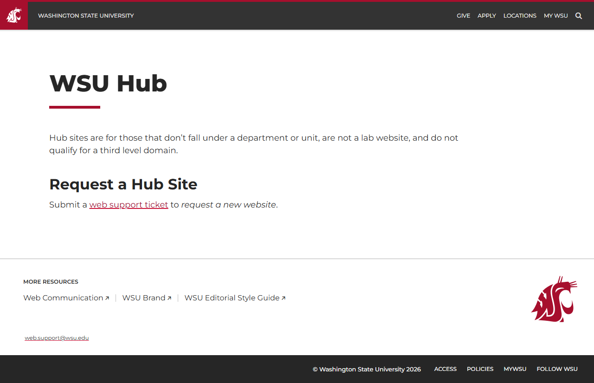
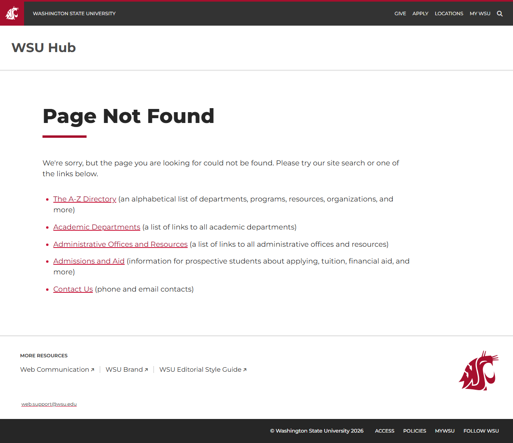

# Site Report: https://hub.wsu.edu/

| Metric | Value |
|--------|-------|
| Status | ⚠️ 0/5 pages OK |
| Pages Scanned | 5 |
| Pages Passed | 0 |
| Pages Failed | 5 |
| Total JS Errors | 7 |
| Total JS Warnings | 1 |
| Total HTML | 174.3 KB |
| Total Screenshots | 325.3 KB |
| Total Images | 0 (0 bytes) |
| Images Missing Alt | 0 |
| Folder | `hub-wsu-edu/` |

## Pages

| Status | Page | HTTP | Title | JS Errors | Images | Missing Alt |
|--------|------|------|-------|-----------|--------|-------------|
| ❌ | [/](_root/report.md) | 0 | WSU Hub \| Washington State University | 3 | 0 | 0 |
| ❌ | [/events/](events/report.md) | 0 | Human Verification | 1 | 0 | 0 |
| ❌ | [/leadership/](leadership/report.md) | 0 | Page not found \| WSU Hub \| Washingt... | 1 | 0 | 0 |
| ❌ | [/organizations/](organizations/report.md) | 0 | Page not found \| WSU Hub \| Washingt... | 1 | 0 | 0 |
| ❌ | [/resources/](resources/report.md) | 0 | Page not found \| WSU Hub \| Washingt... | 1 | 0 | 0 |

## Page Screenshots

### [/](_root/report.md)

### [/events/](events/report.md)

### [/leadership/](leadership/report.md)

### [/organizations/](organizations/report.md)

### [/resources/](resources/report.md)

## Failed Pages

### /

- **URL:** https://hub.wsu.edu/
- **Status:** 0

### /organizations/

- **URL:** https://hub.wsu.edu/organizations/
- **Status:** 0

### /events/

- **URL:** https://hub.wsu.edu/events/
- **Status:** 0

### /resources/

- **URL:** https://hub.wsu.edu/resources/
- **Status:** 0

### /leadership/

- **URL:** https://hub.wsu.edu/leadership/
- **Status:** 0

## Pages with JavaScript Errors

### / (3 errors)

- `Failed to load resource: net::ERR_SOCKET_NOT_CONNECTED`
- `Failed to load resource: net::ERR_SOCKET_NOT_CONNECTED`
- `Failed to load resource: net::ERR_SOCKET_NOT_CONNECTED`

### /organizations/ (1 errors)

- `Failed to load resource: the server responded with a status of 404 ()`

### /events/ (1 errors)

- `Failed to load resource: the server responded with a status of 405 ()`

### /resources/ (1 errors)

- `Failed to load resource: the server responded with a status of 404 ()`

### /leadership/ (1 errors)

- `Failed to load resource: the server responded with a status of 404 ()`

---

*Generated by AccessibilityScanner (FreeTools) v1.0*
