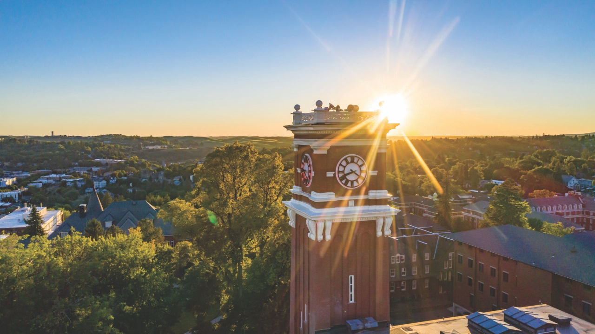

# 📄 Page Scan Report

> **URL:** https://ip.wsu.edu/  
> **Captured:** 2026-02-16 22:18:41 UTC  
> **Status:** ✅ 200  

---

## 📑 Contents

- [Summary](#-summary)
- [Screenshots](#-screenshots)
- [Page Images](#-page-images)
- [JavaScript Errors](#-javascript-errors)
- [Actions](#-actions)
- [Files](#-files)

---

## 📋 Summary

| Field | Value |
|-------|-------|
| URL | https://ip.wsu.edu/ |
| Title | WSU International | Washington State University |
| Status | ✅ 200 |
| HTML Size | 312.3 KB |
| Screenshots | 1 (1.5 MB) |
| Images | 5 (1.3 MB) |
| Images Missing Alt | ✅ 0 |
| JS Errors | 🔴 4 |
| JS Warnings | 0 |
| Auth | none |
| Captured | 2026-02-16T22:18:41.8541850Z |

## 🔴 JavaScript Errors

<details>
<summary><strong>4 error(s) detected</strong></summary>

```
Failed to load resource: the server responded with a status of 405 ()
Failed to load resource: the server responded with a status of 405 ()
Failed to load resource: the server responded with a status of 405 ()
Failed to load resource: the server responded with a status of 405 ()
```

</details>

## 🔧 Actions

<details>
<summary><strong>2 action(s) performed</strong></summary>

- Screenshot #1: page-loaded (1.5 MB)
- Downloaded 5 images to /images/

</details>

## 📸 Screenshots

<table>
<tr>
<td align="center" width="50%">
<a href="01-page-loaded.png">

</a>
<br /><strong>1. page-loaded</strong>
<br /><sub>1.5 MB</sub>
</td>
<td></td>
</tr>
</table>

## 🖼️ Page Images (5)

<details open>
<summary><strong>📋 Image Index</strong> — 5 images, 1.3 MB</summary>

| # | Image | Alt Text | Size |
|--:|-------|----------|-----:|
| 1 | [Summer2020DroneAerial_0913Tower.jpeg](images/Summer2020DroneAerial_0913Tower.jpeg) | Bryan clocktower with sun glinting in... | 634.0 KB |
| 2 | [Butch-w-FB-Crowdcr.jpeg](images/Butch-w-FB-Crowdcr.jpeg) | alt="" | 207.4 KB |
| 3 | [Spark-classroom.jpg](images/Spark-classroom.jpg) | alt="" | 272.2 KB |
| 4 | [sunglasses.jpeg](images/sunglasses.jpeg) | alt="" | 94.0 KB |
| 5 | [Cougs-Give-IP-Icon-BW-2025.png](images/Cougs-Give-IP-Icon-BW-2025.png) | "" | 88.5 KB |

</details>

<details open>
<summary><strong>🖼️ Gallery</strong></summary>

<table>
<tr>
<td align="center" width="33%">
<a href="images/Summer2020DroneAerial_0913Tower.jpeg">

</a>
<br /><sub>Summer2020DroneAerial_0913Tower.jpeg</sub>
</td>
<td align="center" width="33%">
<a href="images/Butch-w-FB-Crowdcr.jpeg">

</a>
<br /><sub>Butch-w-FB-Crowdcr.jpeg</sub>
</td>
<td align="center" width="33%">
<a href="images/Spark-classroom.jpg">

</a>
<br /><sub>Spark-classroom.jpg</sub>
</td>
</tr>
<tr>
<td align="center" width="33%">
<a href="images/sunglasses.jpeg">

</a>
<br /><sub>sunglasses.jpeg</sub>
</td>
<td align="center" width="33%">
<a href="images/Cougs-Give-IP-Icon-BW-2025.png">

</a>
<br /><sub>Cougs-Give-IP-Icon-BW-2025.png</sub>
</td>
<td></td>
</tr>
</table>

</details>

## 📁 Files

| File | Description |
|------|-------------|
| `01-page-loaded.png` | page-loaded (1.5 MB) |
| `page.html` | Rendered HTML content |
| `metadata.json` | Machine-readable scan data |
| `errors.log` | JavaScript console errors |
| `warnings.log` | JavaScript console warnings |
| `info.log` | Navigation and timing details |
| `actions.log` | Interactions performed |
| `images/` | 5 page images (1.3 MB) |

---

*Generated by AccessibilityScanner (FreeTools) v1.0*
