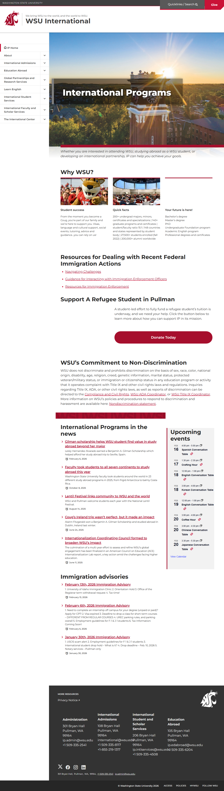
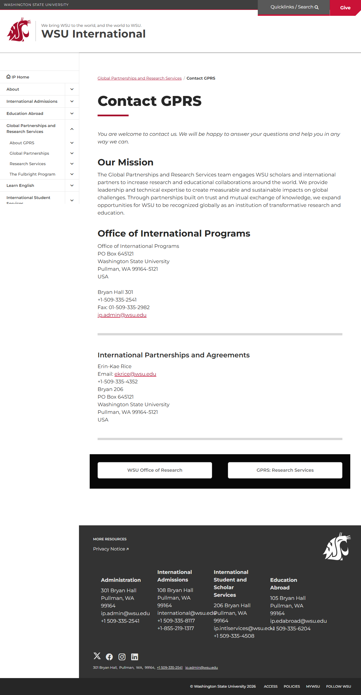
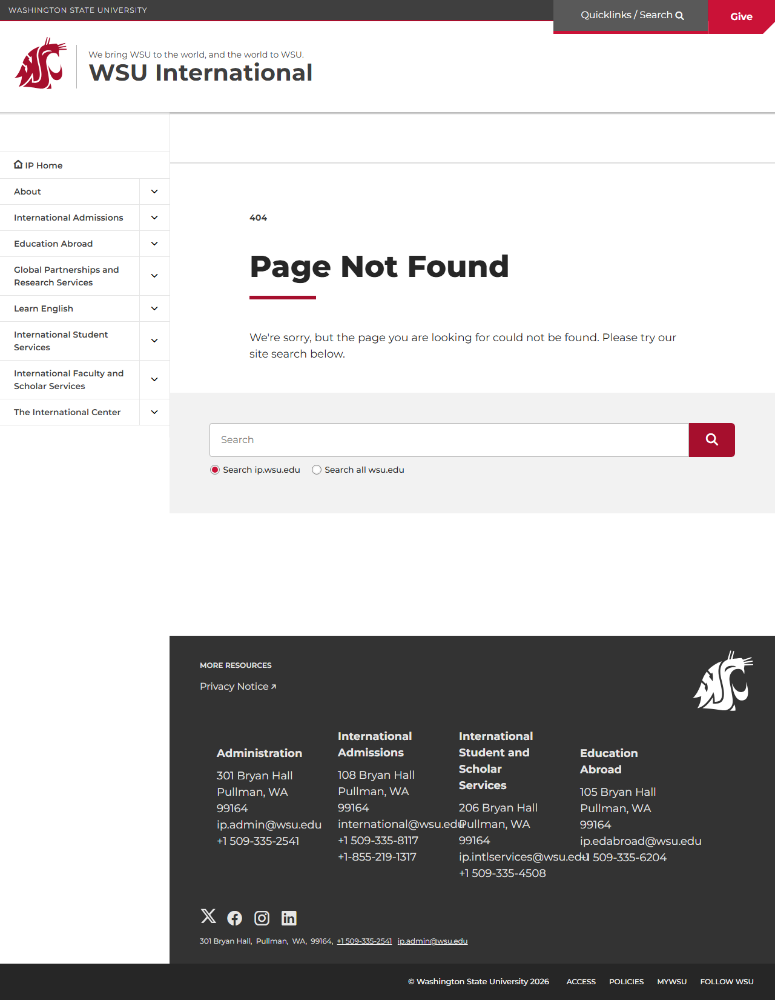
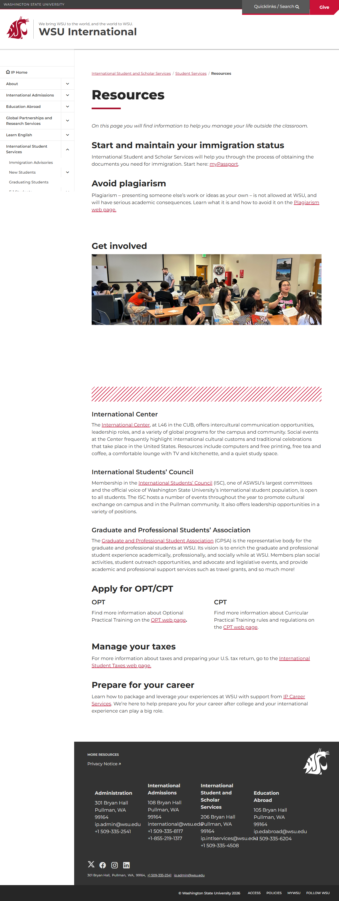
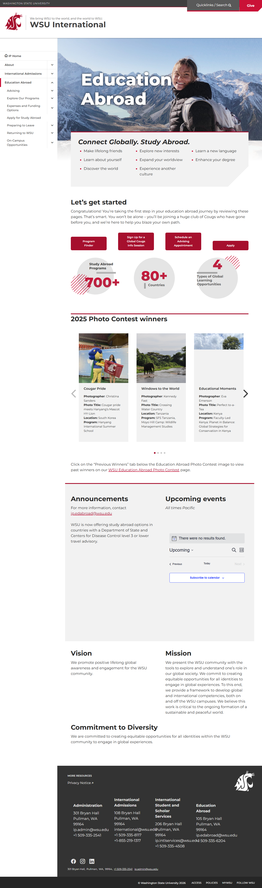

# Site Report: https://ip.wsu.edu/

| Metric | Value |
|--------|-------|
| Status | ⚠️ 0/6 pages OK |
| Pages Scanned | 6 |
| Pages Passed | 0 |
| Pages Failed | 6 |
| Total JS Errors | 32 |
| Total JS Warnings | 0 |
| Total HTML | 1.7 MB |
| Total Screenshots | 3.7 MB |
| Total Images | 8 (1.3 MB) |
| Images Missing Alt | 0 |
| Folder | `ip-wsu-edu/` |

## Pages

| Status | Page | HTTP | Title | JS Errors | Images | Missing Alt |
|--------|------|------|-------|-----------|--------|-------------|
| ❌ | [/](_root/report.md) | 0 | WSU International \| Washington State... | 2 | 4 | 0 |
| ❌ | [/contact/](contact/report.md) | 0 | Contact GPRS \| WSU International \| ... | 1 | 0 | 0 |
| ❌ | [/international-students/](international-students/report.md) | 0 | Page not found \| WSU International \... | 2 | 0 | 0 |
| ❌ | [/programs/](programs/report.md) | 0 | Page not found \| WSU International \... | 2 | 0 | 0 |
| ❌ | [/resources/](resources/report.md) | 0 | Resources \| WSU International \| Was... | 1 | 0 | 0 |
| ❌ | [/study-abroad/](study-abroad/report.md) | 0 | Education Abroad \| WSU International... | 24 | 4 | 0 |

## Page Screenshots

### [/](_root/report.md)

### [/contact/](contact/report.md)

### [/international-students/](international-students/report.md)

### [/programs/](programs/report.md)

### [/resources/](resources/report.md)

### [/study-abroad/](study-abroad/report.md)

## Failed Pages

### /

- **URL:** https://ip.wsu.edu/
- **Status:** 0

### /study-abroad/

- **URL:** https://ip.wsu.edu/study-abroad/
- **Status:** 0

### /international-students/

- **URL:** https://ip.wsu.edu/international-students/
- **Status:** 0

### /programs/

- **URL:** https://ip.wsu.edu/programs/
- **Status:** 0

### /resources/

- **URL:** https://ip.wsu.edu/resources/
- **Status:** 0

### /contact/

- **URL:** https://ip.wsu.edu/contact/
- **Status:** 0

## Pages with JavaScript Errors

### /study-abroad/ (24 errors)

- `Failed to load resource: the server responded with a status of 405 ()`
- `Failed to load resource: the server responded with a status of 405 ()`
- `Failed to load resource: the server responded with a status of 405 ()`
- `Failed to load resource: the server responded with a status of 405 ()`
- `Failed to load resource: the server responded with a status of 405 ()`
- `Failed to load resource: the server responded with a status of 405 ()`
- `Failed to load resource: the server responded with a status of 405 ()`
- `Failed to load resource: the server responded with a status of 405 ()`
- `Failed to load resource: the server responded with a status of 405 ()`
- `Failed to load resource: the server responded with a status of 405 ()`
- ... and 14 more (see `study-abroad/errors.log`)

### / (2 errors)

- `Failed to load resource: net::ERR_SOCKET_NOT_CONNECTED`
- `Failed to load resource: net::ERR_SOCKET_NOT_CONNECTED`

### /international-students/ (2 errors)

- `Failed to load resource: the server responded with a status of 404 ()`
- `Failed to load resource: the server responded with a status of 405 ()`

### /programs/ (2 errors)

- `Failed to load resource: the server responded with a status of 404 ()`
- `Failed to load resource: the server responded with a status of 405 ()`

### /resources/ (1 errors)

- `Failed to load resource: the server responded with a status of 405 ()`

### /contact/ (1 errors)

- `Failed to load resource: the server responded with a status of 405 ()`

---

*Generated by AccessibilityScanner (FreeTools) v1.0*
