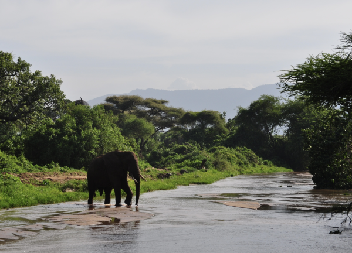

# Page Scan Report

| Field | Value |
|-------|-------|
| URL | https://ip.wsu.edu/study-abroad/ |
| Redirected To | https://ip.wsu.edu/education-abroad/ |
| Title | Education Abroad | WSU International | Washington State University |
| Status | ❌ 0 |
| HTML Size | 319.2 KB |
| Screenshots | 1 (1.2 MB) |
| Images | 5 (1.1 MB) |
| Images Missing Alt | 0 |
| JS Errors | 24 |
| JS Warnings | 0 |
| Auth | none |
| Captured | 2026-02-16T20:59:37.2177055Z |

## JavaScript Errors

- `Failed to load resource: the server responded with a status of 405 ()`
- `Failed to load resource: the server responded with a status of 405 ()`
- `Failed to load resource: the server responded with a status of 405 ()`
- `Failed to load resource: the server responded with a status of 405 ()`
- `Failed to load resource: the server responded with a status of 405 ()`
- `Failed to load resource: the server responded with a status of 405 ()`
- `Failed to load resource: the server responded with a status of 405 ()`
- `Failed to load resource: the server responded with a status of 405 ()`
- `Failed to load resource: the server responded with a status of 405 ()`
- `Failed to load resource: the server responded with a status of 405 ()`
- `Failed to load resource: the server responded with a status of 405 ()`
- `Failed to load resource: the server responded with a status of 405 ()`
- `Failed to load resource: the server responded with a status of 405 ()`
- `Failed to load resource: the server responded with a status of 405 ()`
- `Failed to load resource: the server responded with a status of 405 ()`
- `Failed to load resource: the server responded with a status of 405 ()`
- `Failed to load resource: the server responded with a status of 405 ()`
- `Failed to load resource: the server responded with a status of 405 ()`
- `Failed to load resource: the server responded with a status of 405 ()`
- `Failed to load resource: the server responded with a status of 405 ()`
- `Failed to load resource: the server responded with a status of 405 ()`
- `Failed to load resource: the server responded with a status of 405 ()`
- `Failed to load resource: the server responded with a status of 405 ()`
- `Failed to load resource: the server responded with a status of 405 ()`

## Actions

- Screenshot #1: page-loaded (1.2 MB)
- Downloaded 5 images to /images/

## Screenshots

### 1. page-loaded

## Page Images (5)

| # | Image | Alt Text | Size |
|---|-------|----------|------|
| 1 | [EA_Contest_winner_CougarPride_1.jpg](images/EA_Contest_winner_CougarPride_1.jpg) | "" | 26.1 KB |
| 2 | [EA_Contest_winner_WindowsToTheWorld_5.png](images/EA_Contest_winner_WindowsToTheWorld_5.png) | Elephant crossing a shallow stream in... | 433.2 KB |
| 3 | [EA_Contest_winner_ExperiencingLocalCulture_4.png](images/EA_Contest_winner_ExperiencingLocalCulture_4.png) | WSU student in a hanbok by a pond wit... | 562.4 KB |
| 4 | [EA_Contest_winner_WildlifeAndNaturalEncounters_6.jpg](images/EA_Contest_winner_WildlifeAndNaturalEncounters_6.jpg) | Seal napping on a rocky shore with tw... | 41.0 KB |
| 5 | [EA_Contest_winner_LandmarksAndLandscapes_2.jpg](images/EA_Contest_winner_LandmarksAndLandscapes_2.jpg) | A mountainous landscape with snow-cap... | 44.3 KB |

### Gallery

## Files

- `01-page-loaded.png` — page-loaded (1.2 MB)
- `page.html` — rendered HTML content
- `metadata.json` — machine-readable scan data
- `errors.log` — JavaScript console errors
- `warnings.log` — JavaScript console warnings
- `info.log` — navigation and timing details
- `actions.log` — interactions performed on the page
- `images/` — 5 page images (1.1 MB)
