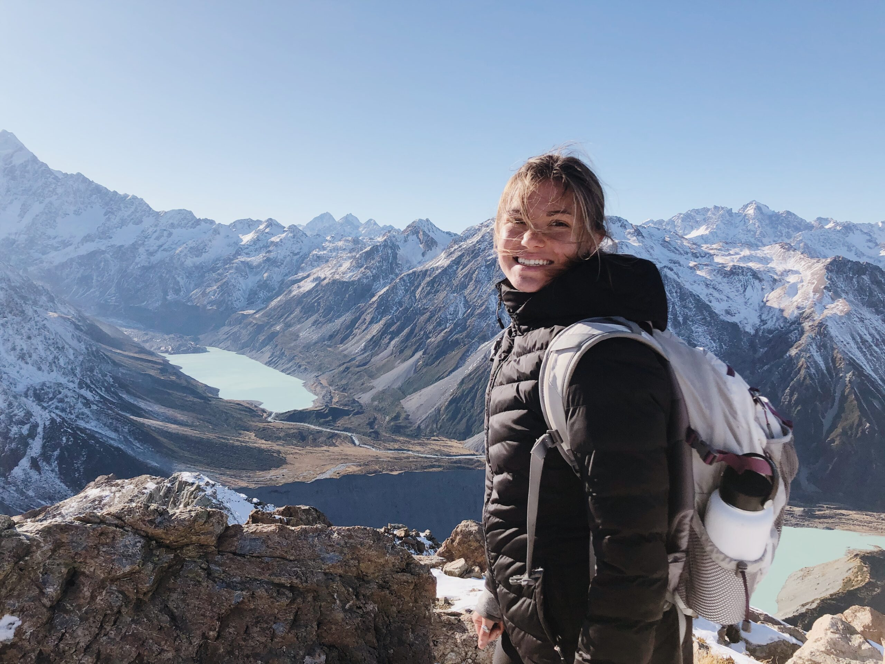

# 📄 Page Scan Report

> **URL:** https://ip.wsu.edu/study-abroad/  
> **Captured:** 2026-02-16 22:18:49 UTC  
> **Status:** ✅ 200  

---

## 📑 Contents

- [Summary](#-summary)
- [Screenshots](#-screenshots)
- [Page Images](#-page-images)
- [JavaScript Errors](#-javascript-errors)
- [Actions](#-actions)
- [Files](#-files)

---

## 📋 Summary

| Field | Value |
|-------|-------|
| URL | https://ip.wsu.edu/study-abroad/ |
| Redirected To | https://ip.wsu.edu/education-abroad/ |
| Title | Education Abroad | WSU International | Washington State University |
| Status | ✅ 200 |
| HTML Size | 326.5 KB |
| Screenshots | 1 (1.2 MB) |
| Images | 7 (2.4 MB) |
| Images Missing Alt | ✅ 0 |
| JS Errors | 🔴 24 |
| JS Warnings | 0 |
| Auth | none |
| Captured | 2026-02-16T22:18:49.3299985Z |

## 🔴 JavaScript Errors

<details>
<summary><strong>24 error(s) detected</strong></summary>

```
Failed to load resource: the server responded with a status of 405 ()
Failed to load resource: the server responded with a status of 405 ()
Failed to load resource: the server responded with a status of 405 ()
Failed to load resource: the server responded with a status of 405 ()
Failed to load resource: the server responded with a status of 405 ()
Failed to load resource: the server responded with a status of 405 ()
Failed to load resource: the server responded with a status of 405 ()
Failed to load resource: the server responded with a status of 405 ()
Failed to load resource: the server responded with a status of 405 ()
Failed to load resource: the server responded with a status of 405 ()
Failed to load resource: the server responded with a status of 405 ()
Failed to load resource: the server responded with a status of 405 ()
Failed to load resource: the server responded with a status of 405 ()
Failed to load resource: the server responded with a status of 405 ()
Failed to load resource: the server responded with a status of 405 ()
Failed to load resource: the server responded with a status of 405 ()
Failed to load resource: the server responded with a status of 405 ()
Failed to load resource: the server responded with a status of 405 ()
Failed to load resource: the server responded with a status of 405 ()
Failed to load resource: the server responded with a status of 405 ()
... and 4 more (see errors.log)
```

</details>

## 🔧 Actions

<details>
<summary><strong>2 action(s) performed</strong></summary>

- Screenshot #1: page-loaded (1.2 MB)
- Downloaded 7 images to /images/

</details>

## 📸 Screenshots

<table>
<tr>
<td align="center" width="50%">
<a href="01-page-loaded.png">

</a>
<br /><strong>1. page-loaded</strong>
<br /><sub>1.2 MB</sub>
</td>
<td></td>
</tr>
</table>

## 🖼️ Page Images (7)

<details open>
<summary><strong>📋 Image Index</strong> — 7 images, 2.4 MB</summary>

| # | Image | Alt Text | Size |
|--:|-------|----------|-----:|
| 1 | [Brooke-Nichols-Photo-scaled-1.jpg](images/Brooke-Nichols-Photo-scaled-1.jpg) | Picture of Brooke Nichols, Peer Advisor | 709.9 KB |
| 2 | [EA_Contest_winner_CougarPride_1.jpg](images/EA_Contest_winner_CougarPride_1.jpg) | "" | 26.1 KB |
| 3 | [EA_Contest_winner_WindowsToTheWorld_5.png](images/EA_Contest_winner_WindowsToTheWorld_5.png) | Elephant crossing a shallow stream in... | 433.2 KB |
| 4 | [EA_Contest_winner_EducationalMoments_3.png](images/EA_Contest_winner_EducationalMoments_3.png) | A WSU student holds tea leaves in a K... | 597.8 KB |
| 5 | [EA_Contest_winner_ExperiencingLocalCulture_4.png](images/EA_Contest_winner_ExperiencingLocalCulture_4.png) | WSU student in a hanbok by a pond wit... | 562.4 KB |
| 6 | [EA_Contest_winner_WildlifeAndNaturalEncounters_6.jpg](images/EA_Contest_winner_WildlifeAndNaturalEncounters_6.jpg) | Seal napping on a rocky shore with tw... | 41.0 KB |
| 7 | [EA_Contest_winner_LandmarksAndLandscapes_2.jpg](images/EA_Contest_winner_LandmarksAndLandscapes_2.jpg) | A mountainous landscape with snow-cap... | 44.3 KB |

</details>

<details open>
<summary><strong>🖼️ Gallery</strong></summary>

<table>
<tr>
<td align="center" width="33%">
<a href="images/Brooke-Nichols-Photo-scaled-1.jpg">

</a>
<br /><sub>Brooke-Nichols-Photo-scaled-1.jpg</sub>
</td>
<td align="center" width="33%">
<a href="images/EA_Contest_winner_CougarPride_1.jpg">

</a>
<br /><sub>EA_Contest_winner_CougarPride_1.jpg</sub>
</td>
<td align="center" width="33%">
<a href="images/EA_Contest_winner_WindowsToTheWorld_5.png">

</a>
<br /><sub>EA_Contest_winner_WindowsToTheWorld_5.png</sub>
</td>
</tr>
<tr>
<td align="center" width="33%">
<a href="images/EA_Contest_winner_EducationalMoments_3.png">

</a>
<br /><sub>EA_Contest_winner_EducationalMoments_3.png</sub>
</td>
<td align="center" width="33%">
<a href="images/EA_Contest_winner_ExperiencingLocalCulture_4.png">

</a>
<br /><sub>EA_Contest_winner_ExperiencingLocalCulture_4.png</sub>
</td>
<td align="center" width="33%">
<a href="images/EA_Contest_winner_WildlifeAndNaturalEncounters_6.jpg">

</a>
<br /><sub>EA_Contest_winner_WildlifeAndNaturalEncounters_6.jpg</sub>
</td>
</tr>
<tr>
<td align="center" width="33%">
<a href="images/EA_Contest_winner_LandmarksAndLandscapes_2.jpg">

</a>
<br /><sub>EA_Contest_winner_LandmarksAndLandscapes_2.jpg</sub>
</td>
<td></td>
<td></td>
</tr>
</table>

</details>

## 📁 Files

| File | Description |
|------|-------------|
| `01-page-loaded.png` | page-loaded (1.2 MB) |
| `page.html` | Rendered HTML content |
| `metadata.json` | Machine-readable scan data |
| `errors.log` | JavaScript console errors |
| `warnings.log` | JavaScript console warnings |
| `info.log` | Navigation and timing details |
| `actions.log` | Interactions performed |
| `images/` | 7 page images (2.4 MB) |

---

*Generated by AccessibilityScanner (FreeTools) v1.0*
