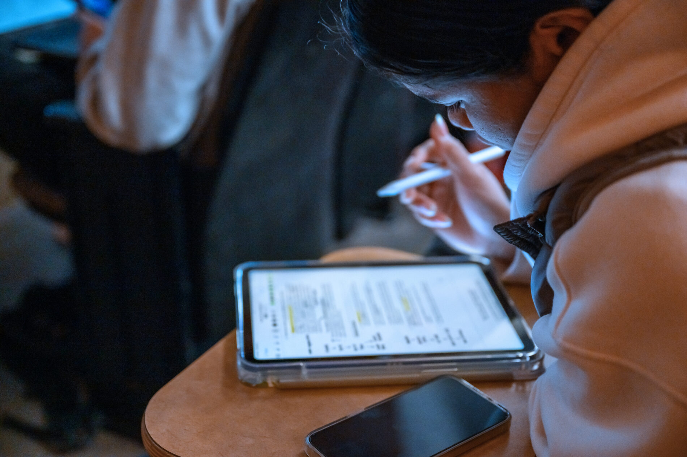
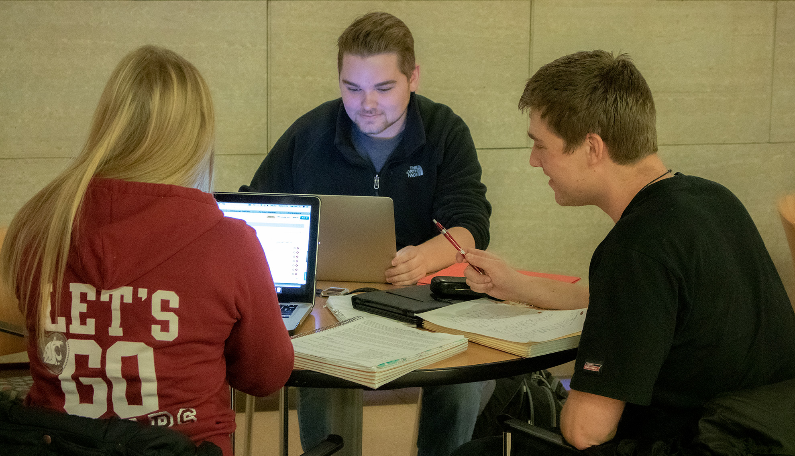
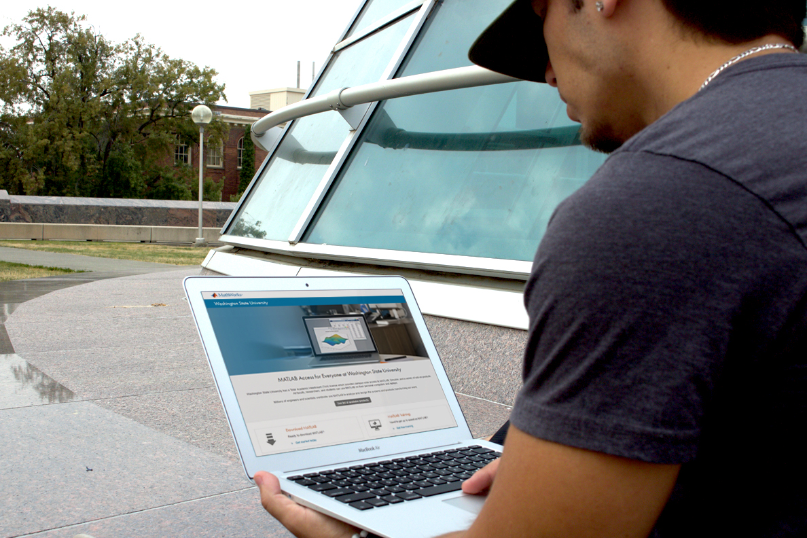
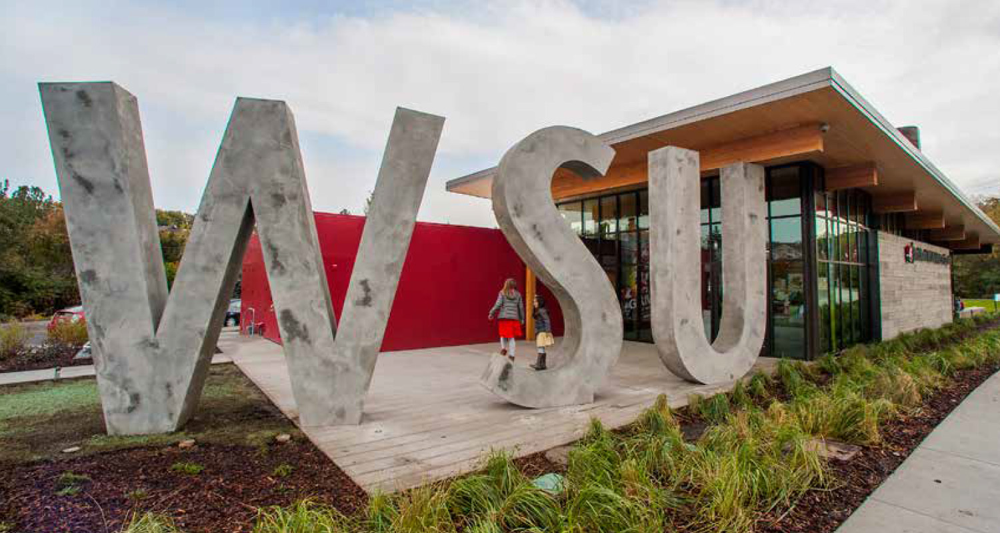
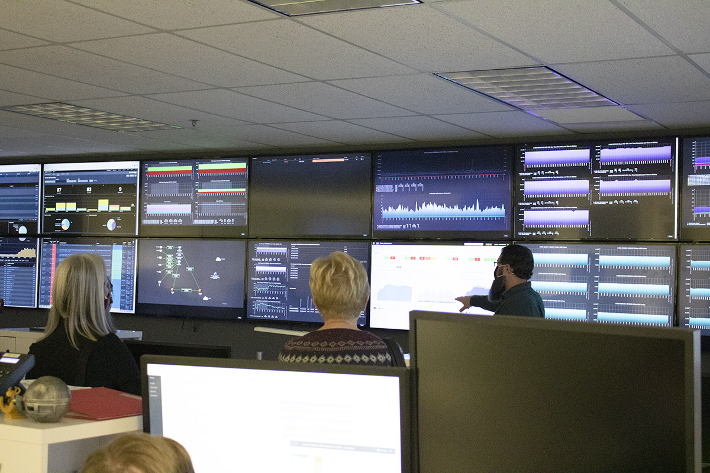
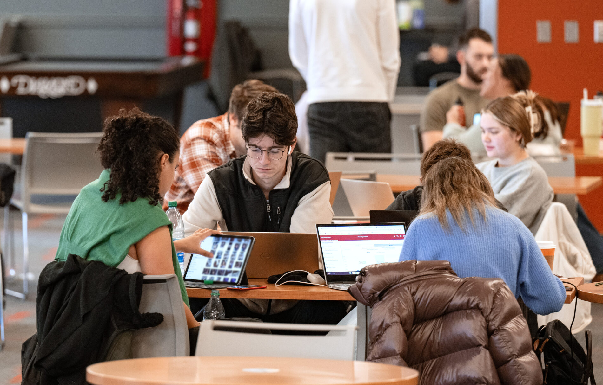

# 📄 Page Scan Report

> **URL:** https://its.wsu.edu/  
> **Captured:** 2026-02-16 22:09:15 UTC  
> **Status:** ✅ 200  

---

## 📑 Contents

- [Summary](#-summary)
- [Screenshots](#-screenshots)
- [Page Images](#-page-images)
- [Actions](#-actions)
- [Files](#-files)

---

## 📋 Summary

| Field | Value |
|-------|-------|
| URL | https://its.wsu.edu/ |
| Title | Information Technology Services | Washington State University |
| Status | ✅ 200 |
| HTML Size | 248.0 KB |
| Screenshots | 1 (1.5 MB) |
| Images | 9 (3.9 MB) |
| Images Missing Alt | ✅ 0 |
| JS Errors | ✅ 0 |
| JS Warnings | 0 |
| Auth | none |
| Captured | 2026-02-16T22:09:15.2415697Z |

## 🔧 Actions

<strong>2 action(s) performed</strong>

- Screenshot #1: page-loaded (1.5 MB)
- Downloaded 9 images to /images/

## 📸 Screenshots

<table>
<tr>
<td align="center" width="50%">

 <strong>1. page-loaded</strong>
 1.5 MB
</td>
<td></td>
</tr>
</table>

## 🖼️ Page Images (9)

<strong>📋 Image Index</strong> — 9 images, 3.9 MB

| # | Image | Alt Text | Size |
|--:|-------|----------|-----:|
| 1 | [Preperation-Week-Fall-2023_7916-copy-2.jpg](images/Preperation-Week-Fall-2023_7916-copy-2.jpg) | A person in the foreground is sitting... | 484.9 KB |
| 2 | [image-2.jpg](images/image-2.jpg) | A person sitting at a desk, holding a... | 327.9 KB |
| 3 | [Bryan123_9700.jpg](images/Bryan123_9700.jpg) | Bryan Clock Tower | 406.4 KB |
| 4 | [2108_hp_zoom_375x250.jpg](images/2108_hp_zoom_375x250.jpg) | Cougar Pride bronze sculpture | 59.7 KB |
| 5 | [wsu-its-ms-teams-project_1980x1138.jpg](images/wsu-its-ms-teams-project_1980x1138.jpg) | Coug head logo  | 767.5 KB |
| 6 | [student-matlab-1.jpg](images/student-matlab-1.jpg) | Pullman Washington WSU campus | 920.4 KB |
| 7 | [WSU-Visitor-23.jpg](images/WSU-Visitor-23.jpg) | Blue heart Statue  | 305.2 KB |
| 8 | [IMG_1614.jpg](images/IMG_1614.jpg) | Security operations room | 317.9 KB |
| 9 | [Prep-Week-in-CUB_2483-1900x1215-1.jpg](images/Prep-Week-in-CUB_2483-1900x1215-1.jpg) | Washington State University's 12-foot... | 418.8 KB |

<strong>🖼️ Gallery</strong>

<table>
<tr>
<td align="center" width="33%">

 Preperation-Week-Fall-2023_7916-copy-2.jpg
</td>
<td align="center" width="33%">

 image-2.jpg
</td>
<td align="center" width="33%">

 Bryan123_9700.jpg
</td>
</tr>
<tr>
<td align="center" width="33%">

 2108_hp_zoom_375x250.jpg
</td>
<td align="center" width="33%">

 wsu-its-ms-teams-project_1980x1138.jpg
</td>
<td align="center" width="33%">

 student-matlab-1.jpg
</td>
</tr>
<tr>
<td align="center" width="33%">

 WSU-Visitor-23.jpg
</td>
<td align="center" width="33%">

 IMG_1614.jpg
</td>
<td align="center" width="33%">

 Prep-Week-in-CUB_2483-1900x1215-1.jpg
</td>
</tr>
</table>

## 📁 Files

| File | Description |
|------|-------------|
| `01-page-loaded.png` | page-loaded (1.5 MB) |
| `page.html` | Rendered HTML content |
| `metadata.json` | Machine-readable scan data |
| `errors.log` | JavaScript console errors |
| `warnings.log` | JavaScript console warnings |
| `info.log` | Navigation and timing details |
| `actions.log` | Interactions performed |
| `images/` | 9 page images (3.9 MB) |

---

*Generated by AccessibilityScanner (FreeTools) v1.0*
