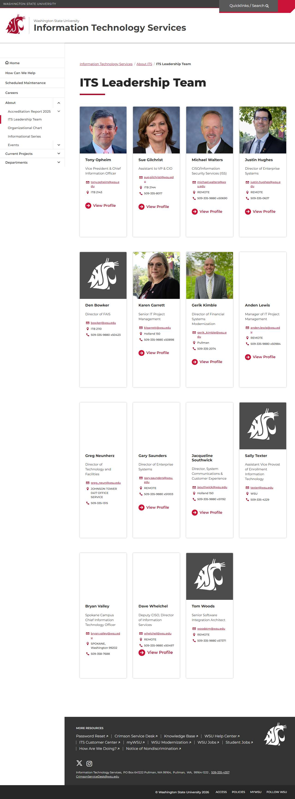

# 📄 Page Scan Report

> **URL:** https://its.wsu.edu/about-its/its-leadership-team/  
> **Captured:** 2026-02-19 02:16:03 UTC  
> **Status:** ✅ 200  

---

## 📑 Contents

- [Summary](#-summary)
- [Screenshots](#-screenshots)
- [Page Images](#-page-images)
- [Accessibility](#-accessibility)
- [Actions](#-actions)
- [Files](#-files)

---

## 📋 Summary

| Field | Value |
|-------|-------|
| URL | https://its.wsu.edu/about-its/its-leadership-team/ |
| Title | ITS Leadership Team | Information Technology Services | Washington State University |
| Status | ✅ 200 |
| HTML Size | 255.0 KB |
| Screenshots | 1 (237.7 KB) |
| Images | 15 (referenced by URL) |
| Images Missing Alt | ⚠️ 1 |
| JS Errors | ✅ 0 |
| JS Warnings | 0 |
| A11y Violations | ⚠️ 45 |
| 🔴 Critical | 0 |
| 🟠 Serious | 45 |
| 🟡 Moderate | 0 |
| 🔵 Minor | 0 |
| Tools Run | axe, htmlcheck |
| Auth | none |
| Captured | 2026-02-19T02:16:03.6072201Z |

## 🔧 Actions

<strong>4 action(s) performed</strong>

- Screenshot #1: page-loaded (237.7 KB)
- Cataloged 15 images by URL (no download)
- axe-core: 14 violations (326ms)
- htmlcheck: 31 violations (1ms)

## 📸 Screenshots

<table>
<tr>
<td align="center" width="50%">

 <strong>1. page-loaded</strong>
 237.7 KB
</td>
<td></td>
</tr>
</table>

## 🖼️ Page Images (15)

<strong>📋 Image Index</strong> — 15 images (referenced by URL)

| # | Source URL | Alt Text |
|--:|-----------|----------|
| 1 | https://wpcdn.web.wsu.edu/wp-its/uploads/sites/2898/2024/06/tony-opheim.jpg | Photo of Tony Opheim Vice President &... |
| 2 | https://wpcdn.web.wsu.edu/wp-its/uploads/sites/2898/2024/06/Sue_Gilchrist.jpg | Photo of Sue Gilchrist Assistant to V... |
| 3 | https://wpcdn.web.wsu.edu/wp-its/uploads/sites/2898/2024/06/Michael_Walters.jpg | Photo of Michael Walters Interim CISO... |
| 4 | https://wpcdn.web.wsu.edu/wp-its/uploads/sites/2898/2024/08/Justin-Hughes-082... | Cougar Head Logo |
| 5 | https://wpcdn.web.wsu.edu/wp-its/uploads/sites/2898/2024/06/Coug-GREY-photo-p... | Cougar Head Logo |
| 6 | https://wpcdn.web.wsu.edu/wp-its/uploads/sites/2898/2024/07/karen-v3_2024.jpg | Cougar Head Logo |
| 7 | https://wpcdn.web.wsu.edu/wp-its/uploads/sites/2898/2025/01/Gerik2022-1152x15... | ⚠️ *(missing)* |
| 8 | https://wpcdn.web.wsu.edu/wp-its/uploads/sites/2898/2024/08/Anden-Lewis-0824.jpg | Cougar Head Logo |
| 9 | https://wpcdn.web.wsu.edu/wp-its/uploads/sites/2898/2025/02/Greg_Neunherz_202... | Cougar Head Logo |
| 10 | https://wpcdn.web.wsu.edu/wp-its/uploads/sites/2898/2024/08/Gary-Saunders-082... | Gary Saunders |
| 11 | https://wpcdn.web.wsu.edu/wp-its/uploads/sites/2898/2024/07/JS_v2_2024.jpg | Photo of Jacqueline Southwick Directo... |
| 12 | https://wpcdn.web.wsu.edu/wp-its/uploads/sites/2898/2025/02/Bryan_Valley_2025... | Cougar Head Logo |
| 13 | https://wpcdn.web.wsu.edu/wp-its/uploads/sites/2898/2024/08/Dave-Whelchel-082... | Cougar Head Logo |
| 14 | https://wpcdn.web.wsu.edu/wp-its/uploads/sites/2898/2024/06/Carrie_Johnson.jpg | Photo of Carrie Johnson Executive Dir... |
| 15 | https://wpcdn.web.wsu.edu/wp-its/uploads/sites/2898/2024/06/Gunjan-Sinha_24v2... | Cougar Head Logo |

<strong>🖼️ Gallery</strong>

<table>
<tr>
<td align="center" width="33%">

 https://wpcdn.web.wsu.edu/wp-its/uploads/sites/...
</td>
<td align="center" width="33%">

 https://wpcdn.web.wsu.edu/wp-its/uploads/sites/...
</td>
<td align="center" width="33%">

 https://wpcdn.web.wsu.edu/wp-its/uploads/sites/...
</td>
</tr>
<tr>
<td align="center" width="33%">

 https://wpcdn.web.wsu.edu/wp-its/uploads/sites/...
</td>
<td align="center" width="33%">

 https://wpcdn.web.wsu.edu/wp-its/uploads/sites/...
</td>
<td align="center" width="33%">

 https://wpcdn.web.wsu.edu/wp-its/uploads/sites/...
</td>
</tr>
<tr>
<td align="center" width="33%">

 https://wpcdn.web.wsu.edu/wp-its/uploads/sites/... ⚠️
</td>
<td align="center" width="33%">

 https://wpcdn.web.wsu.edu/wp-its/uploads/sites/...
</td>
<td align="center" width="33%">

 https://wpcdn.web.wsu.edu/wp-its/uploads/sites/...
</td>
</tr>
<tr>
<td align="center" width="33%">

 https://wpcdn.web.wsu.edu/wp-its/uploads/sites/...
</td>
<td align="center" width="33%">

 https://wpcdn.web.wsu.edu/wp-its/uploads/sites/...
</td>
<td align="center" width="33%">

 https://wpcdn.web.wsu.edu/wp-its/uploads/sites/...
</td>
</tr>
<tr>
<td align="center" width="33%">

 https://wpcdn.web.wsu.edu/wp-its/uploads/sites/...
</td>
<td align="center" width="33%">

 https://wpcdn.web.wsu.edu/wp-its/uploads/sites/...
</td>
<td align="center" width="33%">

 https://wpcdn.web.wsu.edu/wp-its/uploads/sites/...
</td>
</tr>
</table>

⚠️ <strong>Images Missing Alt Text</strong> (1)

| # | Source URL |
|--:|-----------|
| 1 | https://wpcdn.web.wsu.edu/wp-its/uploads/sites/2898/2025/01/Gerik2022-1152x15... |

## ♿ Accessibility

### Summary

| Severity | axe | htmlcheck |
|----------|:---:|:---:|
| 🔴 critical | 0 | 0 |
| 🟠 serious | 14 | 31 |
| 🟡 moderate | 0 | 0 |
| 🔵 minor | 0 | 0 |
| **Total** | **14** | **31** |

### Violations by Confidence

<strong>3 rule(s) violated</strong>

| # | Rule | Sev | Confidence | axe | htmlcheck | Example |
|--:|------|:---:|:----------:|:---:|:---:|---------|
| 1 | [link-name](../../a11y-rules.md#link-name) | 🟠 | 🟢 2/2 | ⚠️ | ⚠️ | `` |
| 2 | [image-alt](../../a11y-rules.md#image-alt) | 🟠 | 🟡 1/2 | ✅ | ⚠️ | `

> **Note:** Automated scanning catches ~30-60% of WCAG issues. Manual keyboard and screen reader testing is still required for full compliance.

## 📁 Files

| File | Description |
|------|-------------|
| `01-page-loaded.jpg` | page-loaded (237.7 KB) |
| `page.html` | Rendered HTML content |
| `metadata.json` | Machine-readable scan data |
| `errors.log` | JavaScript console errors |
| `warnings.log` | JavaScript console warnings |
| `info.log` | Navigation and timing details |
| `actions.log` | Interactions performed |
| `a11y-axe.json` | axe accessibility results |
| `a11y-htmlcheck.json` | htmlcheck accessibility results |
| `a11y-summary.json` | Merged cross-tool accessibility summary |

---

*Generated by AccessibilityScanner (FreeTools) v1.0*
