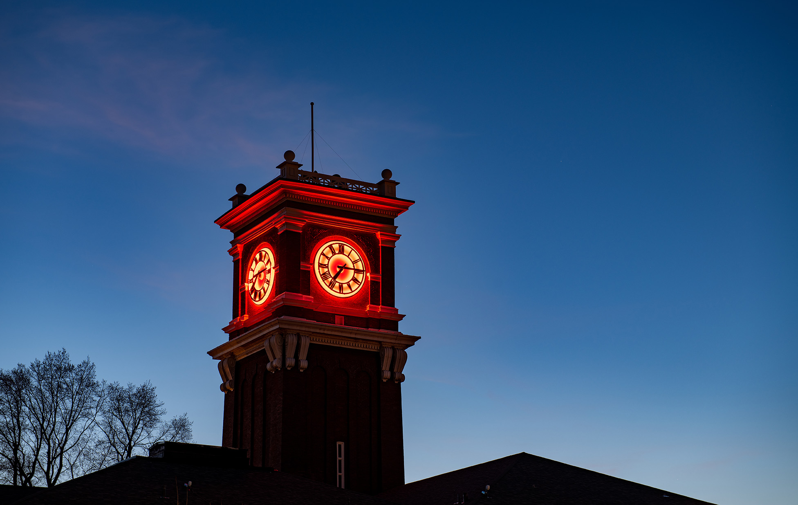

# 📄 Page Scan Report

> **URL:** https://its.wsu.edu/crimson-service-desk/  
> **Captured:** 2026-02-16 22:09:50 UTC  
> **Status:** ✅ 200  

---

## 📑 Contents

- [Summary](#-summary)
- [Screenshots](#-screenshots)
- [Page Images](#-page-images)
- [Actions](#-actions)
- [Files](#-files)

---

## 📋 Summary

| Field | Value |
|-------|-------|
| URL | https://its.wsu.edu/crimson-service-desk/ |
| Title | Crimson Service Desk | Information Technology Services | Washington State University |
| Status | ✅ 200 |
| HTML Size | 1.4 MB |
| Screenshots | 1 (842.8 KB) |
| Images | 4 (408.9 KB) |
| Images Missing Alt | ✅ 0 |
| JS Errors | ✅ 0 |
| JS Warnings | 0 |
| Auth | none |
| Captured | 2026-02-16T22:09:50.9973724Z |

## 🔧 Actions

<strong>2 action(s) performed</strong>

- Screenshot #1: page-loaded (842.8 KB)
- Downloaded 4 images to /images/

## 📸 Screenshots

<table>
<tr>
<td align="center" width="50%">

 <strong>1. page-loaded</strong>
 842.8 KB
</td>
<td></td>
</tr>
</table>

## 🖼️ Page Images (4)

<strong>📋 Image Index</strong> — 4 images, 408.9 KB

| # | Image | Alt Text | Size |
|--:|-------|----------|-----:|
| 1 | [Bryan123_9700.jpg](images/Bryan123_9700.jpg) | Bryan Clock Tower | 406.4 KB |
| 2 | [send_FILL0_wght400_GRAD0_opsz48.png](images/send_FILL0_wght400_GRAD0_opsz48.png) | Icon link to the Crimson Service Desk... | 749 bytes |
| 3 | [quick_reference_all_FILL0_wght400_GRAD0_opsz48.png](images/quick_reference_all_FILL0_wght400_GRAD0_opsz48.png) | View Your Tickets https://jira.esg.ws... | 863 bytes |
| 4 | [lightbulb_FILL0_wght400_GRAD0_opsz48.png](images/lightbulb_FILL0_wght400_GRAD0_opsz48.png) | Icon representing a lightbulb, symbol... | 949 bytes |

<strong>🖼️ Gallery</strong>

<table>
<tr>
<td align="center" width="33%">

 Bryan123_9700.jpg
</td>
<td align="center" width="33%">

 send_FILL0_wght400_GRAD0_opsz48.png
</td>
<td align="center" width="33%">

 quick_reference_all_FILL0_wght400_GRAD0_opsz48.png
</td>
</tr>
<tr>
<td align="center" width="33%">

 lightbulb_FILL0_wght400_GRAD0_opsz48.png
</td>
<td></td>
<td></td>
</tr>
</table>

## 📁 Files

| File | Description |
|------|-------------|
| `01-page-loaded.png` | page-loaded (842.8 KB) |
| `page.html` | Rendered HTML content |
| `metadata.json` | Machine-readable scan data |
| `errors.log` | JavaScript console errors |
| `warnings.log` | JavaScript console warnings |
| `info.log` | Navigation and timing details |
| `actions.log` | Interactions performed |
| `images/` | 4 page images (408.9 KB) |

---

*Generated by AccessibilityScanner (FreeTools) v1.0*
