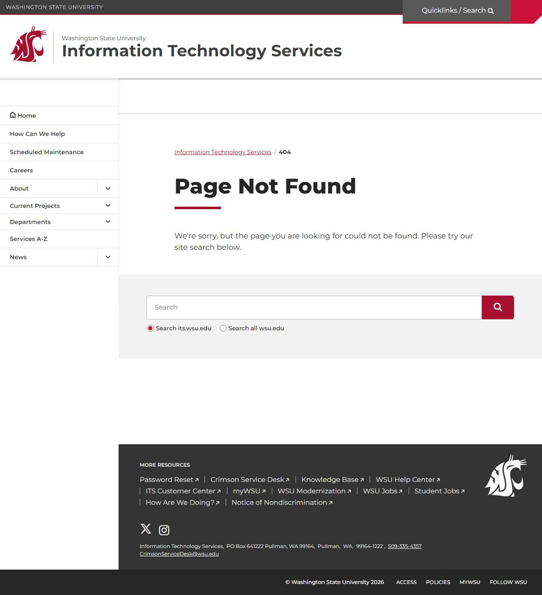

# 📄 Page Scan Report

> **URL:** https://its.wsu.edu/documents/2023/07/collaboration-and-directory-services-in-microsoft-365.pdf/  
> **Captured:** 2026-02-19 02:17:08 UTC  
> **Status:** ❌ 404  

---

## 📑 Contents

- [Summary](#-summary)
- [Screenshots](#-screenshots)
- [Page Images](#-page-images)
- [JavaScript Errors](#-javascript-errors)
- [Accessibility](#-accessibility)
- [Actions](#-actions)
- [Files](#-files)

---

## 📋 Summary

| Field | Value |
|-------|-------|
| URL | https://its.wsu.edu/documents/2023/07/collaboration-and-directory-services-in-microsoft-365.pdf/ |
| Redirected To | https://its.wsu.edu/documents/2023/07/collaboration-and-directory-services-in-microsoft-365.pdf/#gsc.tab=0 |
| Title | Page not found | Information Technology Services | Washington State University |
| Status | ❌ 404 |
| HTML Size | 236.4 KB |
| Screenshots | 1 (79.0 KB) |
| Images | 0 (referenced by URL) |
| Images Missing Alt | ✅ 0 |
| JS Errors | 🔴 5 |
| JS Warnings | 2 |
| A11y Violations | ⚠️ 7 |
| 🔴 Critical | 0 |
| 🟠 Serious | 7 |
| 🟡 Moderate | 0 |
| 🔵 Minor | 0 |
| Tools Run | axe, htmlcheck |
| Auth | none |
| Captured | 2026-02-19T02:17:08.4733921Z |

## 🔴 JavaScript Errors

<details>
<summary><strong>5 error(s) detected</strong></summary>

```
Failed to load resource: the server responded with a status of 404 ()
Access to XMLHttpRequest at 'https://www.google.com/cse/static/element/f71e4ed980f4c082/default_v6+en.css' from origin 'https://its.wsu.edu' has been blocked by CORS policy: No 'Access-Control-Allow-O...
Failed to load resource: net::ERR_FAILED
Access to XMLHttpRequest at 'https://www.google.com/cse/static/style/look/v6/default.css' from origin 'https://its.wsu.edu' has been blocked by CORS policy: No 'Access-Control-Allow-Origin' header is ...
Failed to load resource: net::ERR_FAILED
```

</details>

## 🔧 Actions

<details>
<summary><strong>4 action(s) performed</strong></summary>

- Screenshot #1: page-loaded (79.0 KB)
- No images found on page
- axe-core: 1 violations (164ms)
- htmlcheck: 6 violations (1ms)

</details>

## 📸 Screenshots

<table>
<tr>
<td align="center" width="50%">
<a href="01-page-loaded.jpg">

</a>
<br /><strong>1. page-loaded</strong>
<br /><sub>79.0 KB</sub>
</td>
<td></td>
</tr>
</table>

## 🖼️ Page Images (0)

*No images found on page.*

## ♿ Accessibility

### Summary

| Severity | axe | htmlcheck |
|----------|:---:|:---:|
| 🔴 critical | 0 | 0 |
| 🟠 serious | 1 | 6 |
| 🟡 moderate | 0 | 0 |
| 🔵 minor | 0 | 0 |
| **Total** | **1** | **6** |

### Violations by Confidence

<details open>
<summary><strong>3 rule(s) violated</strong></summary>

| # | Rule | Sev | Confidence | axe | htmlcheck | Example |
|--:|------|:---:|:----------:|:---:|:---:|---------|
| 1 | [link-name](../../a11y-rules.md#link-name) | 🟠 | 🟢 2/2 | ⚠️ | ⚠️ | `<a href="" class="wsu-header-utility-bar__cta"></a>` |
| 2 | [image-alt](../../a11y-rules.md#image-alt) | 🟠 | 🟡 1/2 | ✅ | ⚠️ | `

> **Note:** Automated scanning catches ~30-60% of WCAG issues. Manual keyboard and screen reader testing is still required for full compliance.

## 📁 Files

| File | Description |
|------|-------------|
| `01-page-loaded.jpg` | page-loaded (79.0 KB) |
| `page.html` | Rendered HTML content |
| `metadata.json` | Machine-readable scan data |
| `errors.log` | JavaScript console errors |
| `warnings.log` | JavaScript console warnings |
| `info.log` | Navigation and timing details |
| `actions.log` | Interactions performed |
| `a11y-axe.json` | axe accessibility results |
| `a11y-htmlcheck.json` | htmlcheck accessibility results |
| `a11y-summary.json` | Merged cross-tool accessibility summary |

---

*Generated by AccessibilityScanner (FreeTools) v1.0*
