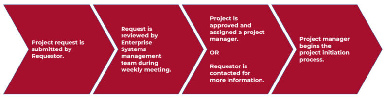

# Page Scan Report

| Field | Value |
|-------|-------|
| URL | https://its.wsu.edu/enterprise-systems/enterprise-systems-project-overview/ |
| Title | Project Overview | Information Technology Services | Washington State University |
| Status | ✅ 200 |
| HTML Size | 231.3 KB |
| Screenshots | 1 (347.3 KB) |
| Images | 1 (32.2 KB) |
| Images Missing Alt | 0 |
| JS Errors | 0 |
| JS Warnings | 0 |
| Auth | none |
| Captured | 2026-02-16T20:40:22.0226641Z |

## Actions

- Screenshot #1: page-loaded (347.3 KB)
- Downloaded 1 images to /images/

## Screenshots

### 1. page-loaded

## Page Images (1)

| # | Image | Alt Text | Size |
|---|-------|----------|------|
| 1 | [ESG-Project-Process-Graphic-1188x306-1-792x204.jpg](images/ESG-Project-Process-Graphic-1188x306-1-792x204.jpg) | The Project request is submitted by r... | 32.2 KB |

### Gallery

## Files

- `01-page-loaded.png` — page-loaded (347.3 KB)
- `page.html` — rendered HTML content
- `metadata.json` — machine-readable scan data
- `errors.log` — JavaScript console errors
- `warnings.log` — JavaScript console warnings
- `info.log` — navigation and timing details
- `actions.log` — interactions performed on the page
- `images/` — 1 page images (32.2 KB)
