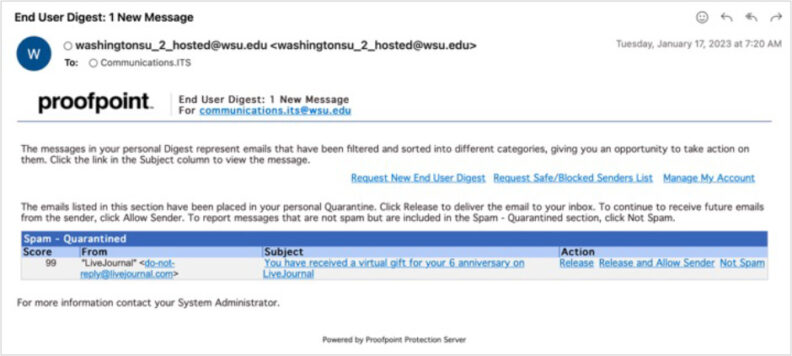

# Page Scan Report

| Field | Value |
|-------|-------|
| URL | https://its.wsu.edu/information-security-services/security-spam-phishing-and-malware/ |
| Title | Spam, Phishing, and Malware | Information Technology Services | Washington State University |
| Status | ✅ 200 |
| HTML Size | 251.1 KB |
| Screenshots | 1 (374.1 KB) |
| Images | 1 (46.5 KB) |
| Images Missing Alt | 0 |
| JS Errors | 0 |
| JS Warnings | 1 |
| Auth | none |
| Captured | 2026-02-16T21:01:59.7583227Z |

## Actions

- Screenshot #1: page-loaded (374.1 KB)
- Downloaded 1 images to /images/

## Screenshots

### 1. page-loaded

## Page Images (1)

| # | Image | Alt Text | Size |
|---|-------|----------|------|
| 1 | [Security_ProofPoint_Spam_2023-792x356.jpg](images/Security_ProofPoint_Spam_2023-792x356.jpg) | ProofPoint end user digest screen shot | 46.5 KB |

### Gallery

## Files

- `01-page-loaded.png` — page-loaded (374.1 KB)
- `page.html` — rendered HTML content
- `metadata.json` — machine-readable scan data
- `errors.log` — JavaScript console errors
- `warnings.log` — JavaScript console warnings
- `info.log` — navigation and timing details
- `actions.log` — interactions performed on the page
- `images/` — 1 page images (46.5 KB)
