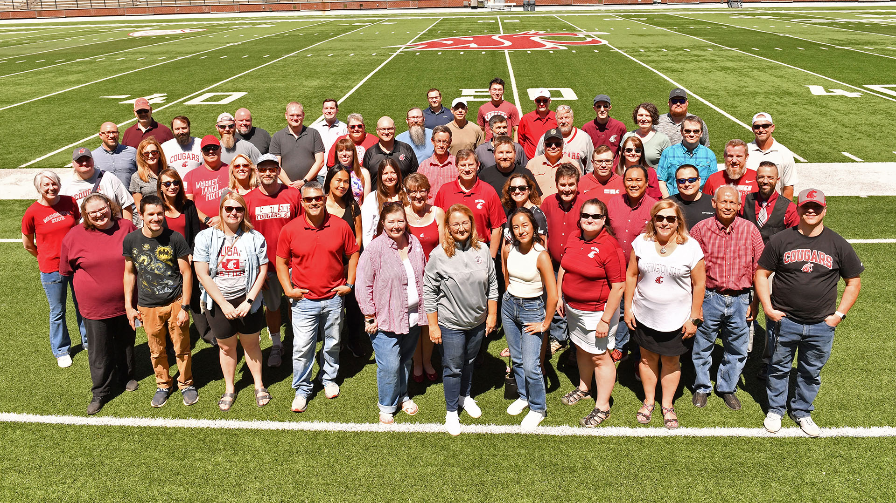

# 📄 Page Scan Report

> **URL:** https://its.wsu.edu/its-careers/  
> **Captured:** 2026-02-16 22:10:31 UTC  
> **Status:** ✅ 200  

---

## 📑 Contents

- [Summary](#-summary)
- [Screenshots](#-screenshots)
- [Page Images](#-page-images)
- [Actions](#-actions)
- [Files](#-files)

---

## 📋 Summary

| Field | Value |
|-------|-------|
| URL | https://its.wsu.edu/its-careers/ |
| Title | ITS Careers | Information Technology Services | Washington State University |
| Status | ✅ 200 |
| HTML Size | 234.9 KB |
| Screenshots | 1 (1.9 MB) |
| Images | 4 (1.0 MB) |
| Images Missing Alt | ✅ 0 |
| JS Errors | ✅ 0 |
| JS Warnings | 0 |
| Auth | none |
| Captured | 2026-02-16T22:10:31.6002486Z |

## 🔧 Actions

<strong>2 action(s) performed</strong>

- Screenshot #1: page-loaded (1.9 MB)
- Downloaded 4 images to /images/

## 📸 Screenshots

<table>
<tr>
<td align="center" width="50%">

 <strong>1. page-loaded</strong>
 1.9 MB
</td>
<td></td>
</tr>
</table>

## 🖼️ Page Images (4)

<strong>📋 Image Index</strong> — 4 images, 1.0 MB

| # | Image | Alt Text | Size |
|--:|-------|----------|-----:|
| 1 | [IT-Group_2023.jpg](images/IT-Group_2023.jpg) | IT Group photo 2023 | 788.6 KB |
| 2 | [Steve-Rathbun-768x521-1.jpg](images/Steve-Rathbun-768x521-1.jpg) | Photo of Steve Rathbun Lead Senior Ne... | 116.8 KB |
| 3 | [Keela-Ruppenthall-768x521-1.jpg](images/Keela-Ruppenthall-768x521-1.jpg) | Keela Ruppenthall: IT Security Consul... | 94.9 KB |
| 4 | [Jonathan-Lee-768x521-1.jpg](images/Jonathan-Lee-768x521-1.jpg) | Jonathan Lee: IT Project Management | 71.0 KB |

<strong>🖼️ Gallery</strong>

<table>
<tr>
<td align="center" width="33%">

 IT-Group_2023.jpg
</td>
<td align="center" width="33%">

 Steve-Rathbun-768x521-1.jpg
</td>
<td align="center" width="33%">

 Keela-Ruppenthall-768x521-1.jpg
</td>
</tr>
<tr>
<td align="center" width="33%">

 Jonathan-Lee-768x521-1.jpg
</td>
<td></td>
<td></td>
</tr>
</table>

## 📁 Files

| File | Description |
|------|-------------|
| `01-page-loaded.png` | page-loaded (1.9 MB) |
| `page.html` | Rendered HTML content |
| `metadata.json` | Machine-readable scan data |
| `errors.log` | JavaScript console errors |
| `warnings.log` | JavaScript console warnings |
| `info.log` | Navigation and timing details |
| `actions.log` | Interactions performed |
| `images/` | 4 page images (1.0 MB) |

---

*Generated by AccessibilityScanner (FreeTools) v1.0*
