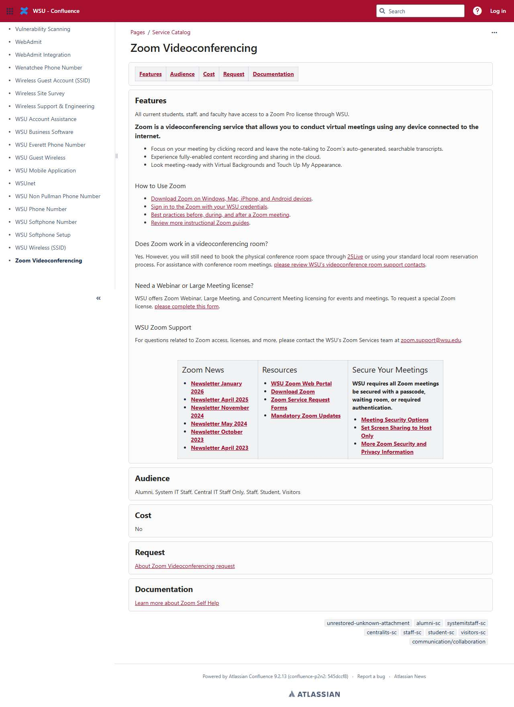

# 📄 Page Scan Report

> **URL:** https://its.wsu.edu/request-its-services/zoom-video-conferencing-service  
> **Captured:** 2026-02-19 02:22:14 UTC  
> **Status:** ✅ 200  

---

## 📑 Contents

- [Summary](#-summary)
- [Screenshots](#-screenshots)
- [Page Images](#-page-images)
- [JavaScript Errors](#-javascript-errors)
- [Accessibility](#-accessibility)
- [Actions](#-actions)
- [Files](#-files)

---

## 📋 Summary

| Field | Value |
|-------|-------|
| URL | https://its.wsu.edu/request-its-services/zoom-video-conferencing-service |
| Redirected To | https://confluence.esg.wsu.edu/spaces/ITSERVICES/pages/297828492/Zoom+Videoconferencing |
| Title | Zoom Videoconferencing - WSU Technology Service Catalog - WSU - Confluence |
| Status | ✅ 200 |
| HTML Size | 313.2 KB |
| Screenshots | 1 (157.9 KB) |
| Images | 2 (referenced by URL) |
| Images Missing Alt | ⚠️ 1 |
| JS Errors | 🔴 4 |
| JS Warnings | 156 |
| A11y Violations | ⚠️ 8 |
| 🔴 Critical | 2 |
| 🟠 Serious | 1 |
| 🟡 Moderate | 5 |
| 🔵 Minor | 0 |
| Tools Run | axe, htmlcheck |
| Auth | none |
| Captured | 2026-02-19T02:22:14.5860465Z |

## 🔴 JavaScript Errors

<details>
<summary><strong>4 error(s) detected</strong></summary>

```
Failed to load resource: the server responded with a status of 401 ()
Failed to load resource: the server responded with a status of 401 ()
Failed to load resource: the server responded with a status of 404 ()
Failed to load resource: the server responded with a status of 401 ()
```

</details>

## 🔧 Actions

<details>
<summary><strong>4 action(s) performed</strong></summary>

- Screenshot #1: page-loaded (157.9 KB)
- Cataloged 2 images by URL (no download)
- axe-core: 3 violations (574ms)
- htmlcheck: 5 violations (1ms)

</details>

## 📸 Screenshots

<table>
<tr>
<td align="center" width="50%">
<a href="01-page-loaded.jpg">

</a>
<br /><strong>1. page-loaded</strong>
<br /><sub>157.9 KB</sub>
</td>
<td></td>
</tr>
</table>

## 🖼️ Page Images (2)

<details open>
<summary><strong>📋 Image Index</strong> — 2 images (referenced by URL)</summary>

| # | Source URL | Alt Text |
|--:|-----------|----------|
| 1 | https://confluence.esg.wsu.edu/download/attachments/655361/atl.site.dark.logo... | WSU - Confluence |
| 2 | https://confluence.esg.wsu.edu/download/attachments/290983209/ITSERVICES?vers... | ⚠️ *(missing)* |

</details>

<details open>
<summary><strong>🖼️ Gallery</strong></summary>

<table>
<tr>
<td align="center" width="33%">
<a href="https://confluence.esg.wsu.edu/download/attachments/655361/atl.site.dark.logo?version=1&modificationDate=1755194767507&api=v2">

</a>
<br /><sub>https://confluence.esg.wsu.edu/download/attachm...</sub>
</td>
<td align="center" width="33%">
<a href="https://confluence.esg.wsu.edu/download/attachments/290983209/ITSERVICES?version=1&modificationDate=1738189238807&api=v2">

</a>
<br /><sub>https://confluence.esg.wsu.edu/download/attachm... ⚠️</sub>
</td>
<td></td>
</tr>
</table>

</details>

<details>
<summary>⚠️ <strong>Images Missing Alt Text</strong> (1)</summary>

| # | Source URL |
|--:|-----------|
| 1 | https://confluence.esg.wsu.edu/download/attachments/290983209/ITSERVICES?vers... |

</details>

## ♿ Accessibility

### Summary

| Severity | axe | htmlcheck |
|----------|:---:|:---:|
| 🔴 critical | 2 | 0 |
| 🟠 serious | 1 | 0 |
| 🟡 moderate | 0 | 5 |
| 🔵 minor | 0 | 0 |
| **Total** | **3** | **5** |

### Violations by Confidence

<details open>
<summary><strong>4 rule(s) violated</strong></summary>

| # | Rule | Sev | Confidence | axe | htmlcheck | Example |
|--:|------|:---:|:----------:|:---:|:---:|---------|
| 1 | [color-contrast](../../a11y-rules.md#color-contrast) | 🟠 | 🟢 1/1 | ⚠️ | — | `<span class="aui-icon aui-icon-small aui-iconfont-appswit...` |
| 2 | [aria-required-children](../../a11y-rules.md#aria-required-children) | 🔴 | 🟡 1/2 | ⚠️ | ✅ | `<ul role="list" aria-busy="true" class="plugin_pagetree_c...` |
| 3 | [aria-required-parent](../../a11y-rules.md#aria-required-parent) | 🔴 | 🟡 1/2 | ⚠️ | ✅ | `<a role="menuitem" id="login-link" href="/login.action?os...` |
| 4 | [tabindex](../../a11y-rules.md#tabindex) | 🟡 | 🟡 1/2 | ✅ | ⚠️ | `tabindex="1"` |

</details>

> **Note:** Automated scanning catches ~30-60% of WCAG issues. Manual keyboard and screen reader testing is still required for full compliance.

## 📁 Files

| File | Description |
|------|-------------|
| `01-page-loaded.jpg` | page-loaded (157.9 KB) |
| `page.html` | Rendered HTML content |
| `metadata.json` | Machine-readable scan data |
| `errors.log` | JavaScript console errors |
| `warnings.log` | JavaScript console warnings |
| `info.log` | Navigation and timing details |
| `actions.log` | Interactions performed |
| `a11y-axe.json` | axe accessibility results |
| `a11y-htmlcheck.json` | htmlcheck accessibility results |
| `a11y-summary.json` | Merged cross-tool accessibility summary |

---

*Generated by AccessibilityScanner (FreeTools) v1.0*
