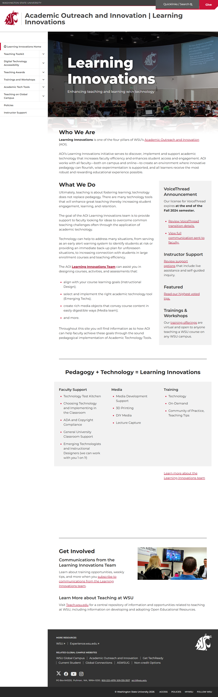
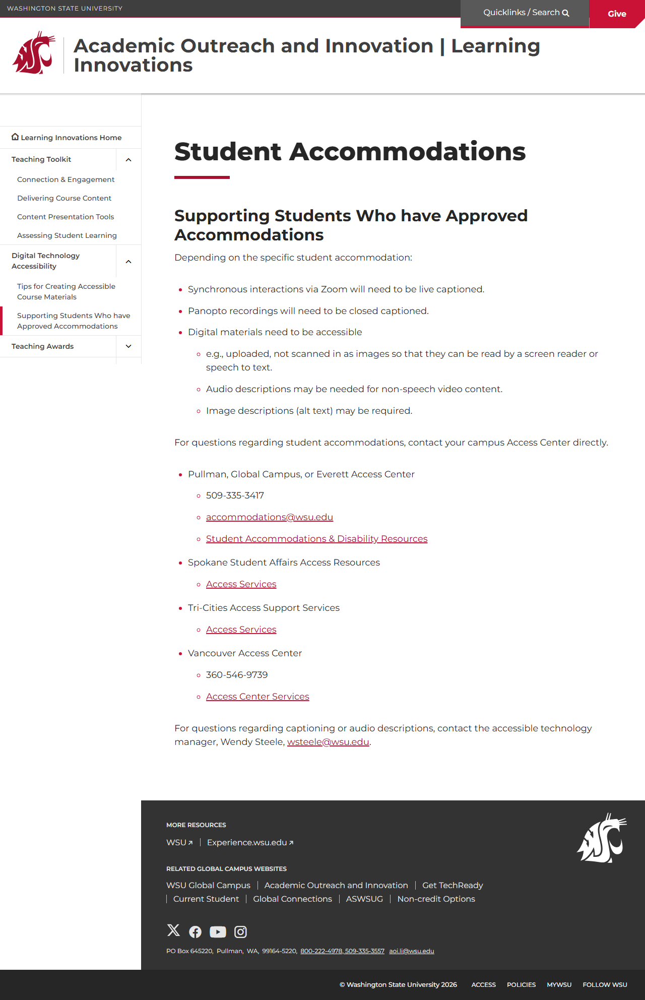
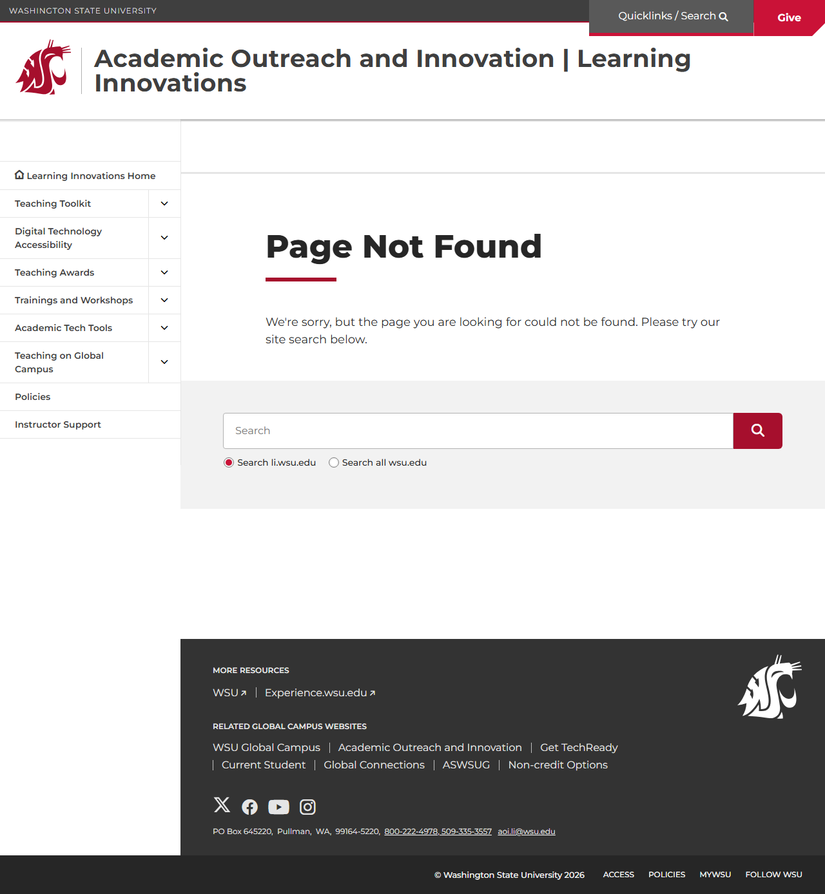

# Site Report: https://li.wsu.edu/

| Metric | Value |
|--------|-------|
| Status | ⚠️ 0/6 pages OK |
| Pages Scanned | 6 |
| Pages Passed | 0 |
| Pages Failed | 6 |
| Total JS Errors | 5 |
| Total JS Warnings | 1 |
| Total HTML | 1.3 MB |
| Total Screenshots | 1.7 MB |
| Total Images | 1 (133.3 KB) |
| Images Missing Alt | 0 |
| Folder | `li-wsu-edu/` |

## Pages

| Status | Page | HTTP | Title | JS Errors | Images | Missing Alt |
|--------|------|------|-------|-----------|--------|-------------|
| ❌ | [/](_root/report.md) | 0 | Academic Outreach and Innovation \| L... | 1 | 1 | 0 |
| ❌ | [/contact/](contact/report.md) | 0 | Page not found \| Academic Outreach a... | 1 | 0 | 0 |
| ❌ | [/resources/](resources/report.md) | 0 | Page not found \| Academic Outreach a... | 1 | 0 | 0 |
| ❌ | [/services/](services/report.md) | 0 | Page not found \| Academic Outreach a... | 1 | 0 | 0 |
| ❌ | [/support/](support/report.md) | 0 | Supporting Students Who have Approved... | 0 | 0 | 0 |
| ❌ | [/technology/](technology/report.md) | 0 | Page not found \| Academic Outreach a... | 1 | 0 | 0 |

## Page Screenshots

### [/](_root/report.md)

### [/contact/](contact/report.md)

### [/resources/](resources/report.md)

### [/services/](services/report.md)

### [/support/](support/report.md)

### [/technology/](technology/report.md)

## Failed Pages

### /

- **URL:** https://li.wsu.edu/
- **Status:** 0

### /services/

- **URL:** https://li.wsu.edu/services/
- **Status:** 0

### /technology/

- **URL:** https://li.wsu.edu/technology/
- **Status:** 0

### /resources/

- **URL:** https://li.wsu.edu/resources/
- **Status:** 0

### /support/

- **URL:** https://li.wsu.edu/support/
- **Status:** 0

### /contact/

- **URL:** https://li.wsu.edu/contact/
- **Status:** 0

## Pages with JavaScript Errors

### / (1 errors)

- `Failed to load resource: net::ERR_SOCKET_NOT_CONNECTED`

### /services/ (1 errors)

- `Failed to load resource: the server responded with a status of 404 ()`

### /technology/ (1 errors)

- `Failed to load resource: the server responded with a status of 404 ()`

### /resources/ (1 errors)

- `Failed to load resource: the server responded with a status of 404 ()`

### /contact/ (1 errors)

- `Failed to load resource: the server responded with a status of 404 ()`

---

*Generated by AccessibilityScanner (FreeTools) v1.0*
