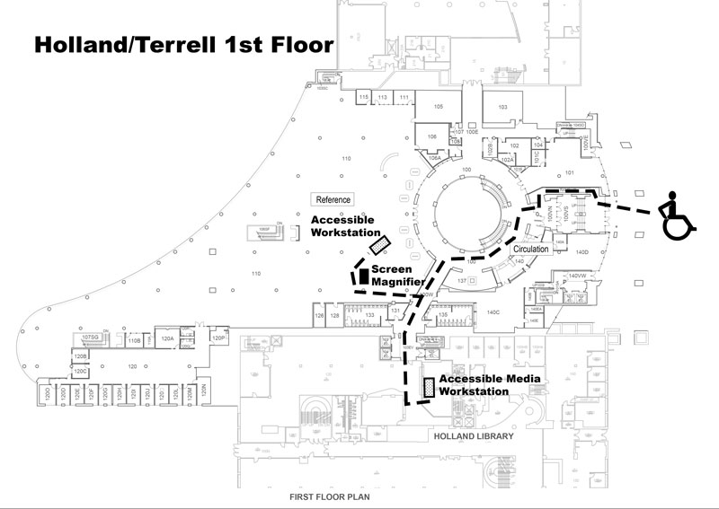
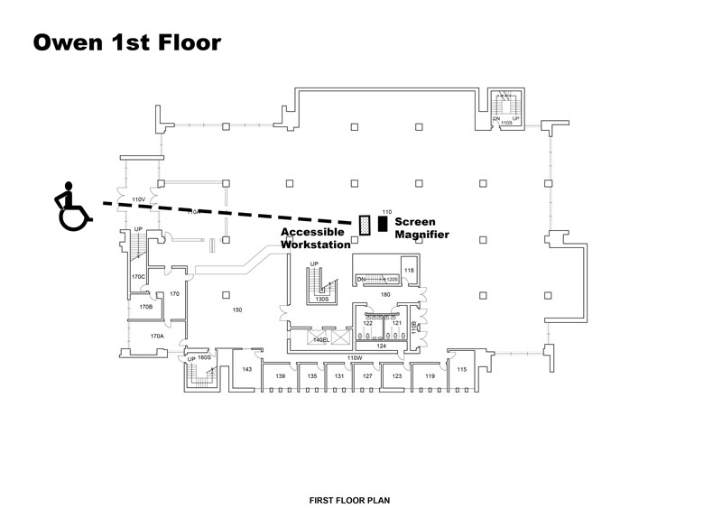

# Page Scan Report

| Field | Value |
|-------|-------|
| URL | https://libraries.wsu.edu/accessibility/ |
| Title | Accessibility – WSU Libraries |
| Status | ✅ 200 |
| HTML Size | 52.5 KB |
| Screenshots | 1 (270.3 KB) |
| Images | 2 (99.0 KB) |
| Images Missing Alt | 0 |
| JS Errors | 0 |
| JS Warnings | 0 |
| Auth | none |
| Captured | 2026-02-16T20:41:24.5648739Z |

## Actions

- Screenshot #1: page-loaded (270.3 KB)
- Downloaded 2 images to /images/

## Screenshots

### 1. page-loaded

## Page Images (2)

| # | Image | Alt Text | Size |
|---|-------|----------|------|
| 1 | [Terrell_01-update.jpg](images/Terrell_01-update.jpg) | Map of Holland and Terrell first floo... | 61.8 KB |
| 2 | [Owen_01.jpg](images/Owen_01.jpg) | Map of Owen first floor with accessib... | 37.2 KB |

### Gallery

## Files

- `01-page-loaded.png` — page-loaded (270.3 KB)
- `page.html` — rendered HTML content
- `metadata.json` — machine-readable scan data
- `errors.log` — JavaScript console errors
- `warnings.log` — JavaScript console warnings
- `info.log` — navigation and timing details
- `actions.log` — interactions performed on the page
- `images/` — 2 page images (99.0 KB)
