# 📄 Page Scan Report

> **URL:** https://libraries.wsu.edu/library-map/  
> **Captured:** 2026-02-16 22:20:41 UTC  
> **Status:** ✅ 200  

---

## 📑 Contents

- [Summary](#-summary)
- [Screenshots](#-screenshots)
- [Page Images](#-page-images)
- [Actions](#-actions)
- [Files](#-files)

---

## 📋 Summary

| Field | Value |
|-------|-------|
| URL | https://libraries.wsu.edu/library-map/ |
| Title | Library Map – WSU Libraries |
| Status | ✅ 200 |
| HTML Size | 47.9 KB |
| Screenshots | 1 (485.6 KB) |
| Images | 13 (716.9 KB) |
| Images Missing Alt | ✅ 0 |
| JS Errors | ✅ 0 |
| JS Warnings | 20 |
| Auth | none |
| Captured | 2026-02-16T22:20:41.2348666Z |

## 🔧 Actions

<strong>2 action(s) performed</strong>

- Screenshot #1: page-loaded (485.6 KB)
- Downloaded 13 images to /images/

## 📸 Screenshots

<table>
<tr>
<td align="center" width="50%">

 <strong>1. page-loaded</strong>
 485.6 KB
</td>
<td></td>
</tr>
</table>

## 🖼️ Page Images (13)

<strong>📋 Image Index</strong> — 13 images, 716.9 KB

| # | Image | Alt Text | Size |
|--:|-------|----------|-----:|
| 1 | [callnumbers.svg](images/callnumbers.svg) | Call Numbers and orientation of floor... | 32.5 KB |
| 2 | [HOLLANDTERRELL12026.svg](images/HOLLANDTERRELL12026.svg) | Resources microforms new Books access... | 103.0 KB |
| 3 | [TERRELLG2026.svg](images/TERRELLG2026.svg) | Palouse Study Lounge, Graduate and Pr... | 126.5 KB |
| 4 | [TERRELLB2026.svg](images/TERRELLB2026.svg) | Deweys, Compact Storage, Locked Compa... | 145.7 KB |
| 5 | [HOLLAND22026.svg](images/HOLLAND22026.svg) | Library Administration Offices | 84.9 KB |
| 6 | [HOLLAND32026.svg](images/HOLLAND32026.svg) | Oversized books, Jackson Documents, U... | 54.0 KB |
| 7 | [HOLLAND42024_MO.svg](images/HOLLAND42024_MO.svg) | Center for Digital Scholarship and Cu... | 22.1 KB |
| 8 | [OWEN12024_MO.svg](images/OWEN12024_MO.svg) | Access Services, Current Print Journa... | 15.0 KB |
| 9 | [OWEN22024_MO.svg](images/OWEN22024_MO.svg) | Owen Library Second Floor, Stacks #20... | 27.7 KB |
| 10 | [OWEN32024_MO.svg](images/OWEN32024_MO.svg) | Emeritus Society, Classroom 319D, Sta... | 27.4 KB |
| 11 | [OWEN42024_MO.svg](images/OWEN42024_MO.svg) | Stacks #401-424 | 19.4 KB |
| 12 | [OWEN52024_MO.svg](images/OWEN52024_MO.svg) | Study rooms 543, 539, 535, Stacks #50... | 29.7 KB |
| 13 | [OWEN62024_MO.svg](images/OWEN62024_MO.svg) | Study rooms 643, 639, 635, Stacks #60... | 29.0 KB |

<strong>🖼️ Gallery</strong>

<table>
<tr>
<td align="center" width="33%">
<a href="images/callnumbers.svg">
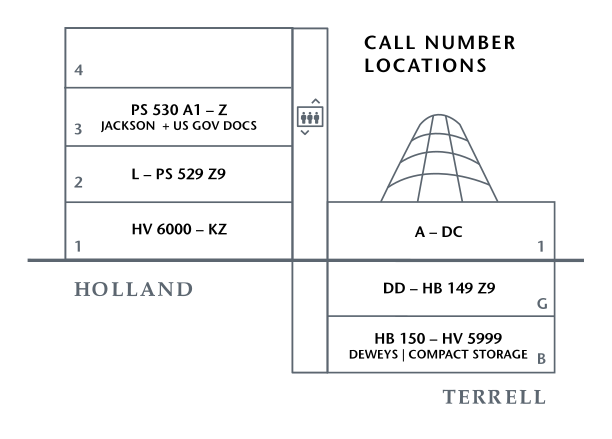
</a>
 callnumbers.svg
</td>
<td align="center" width="33%">
<a href="images/HOLLANDTERRELL12026.svg">
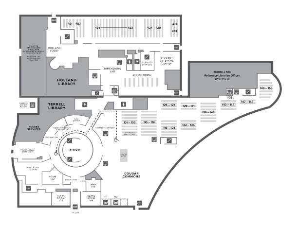
</a>
 HOLLANDTERRELL12026.svg
</td>
<td align="center" width="33%">
<a href="images/TERRELLG2026.svg">
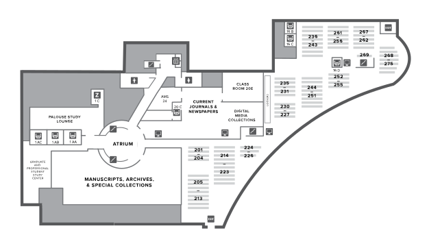
</a>
 TERRELLG2026.svg
</td>
</tr>
<tr>
<td align="center" width="33%">
<a href="images/TERRELLB2026.svg">
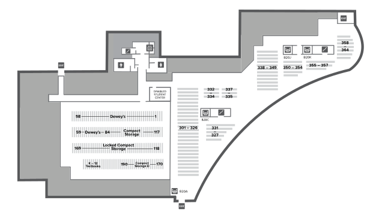
</a>
 TERRELLB2026.svg
</td>
<td align="center" width="33%">
<a href="images/HOLLAND22026.svg">
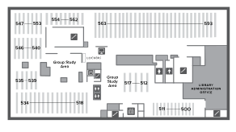
</a>
 HOLLAND22026.svg
</td>
<td align="center" width="33%">
<a href="images/HOLLAND32026.svg">
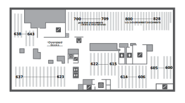
</a>
 HOLLAND32026.svg
</td>
</tr>
<tr>
<td align="center" width="33%">
<a href="images/HOLLAND42024_MO.svg">
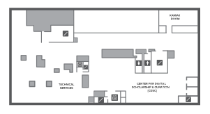
</a>
 HOLLAND42024_MO.svg
</td>
<td align="center" width="33%">
<a href="images/OWEN12024_MO.svg">
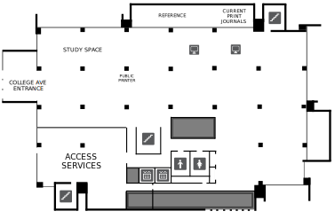
</a>
 OWEN12024_MO.svg
</td>
<td align="center" width="33%">
<a href="images/OWEN22024_MO.svg">
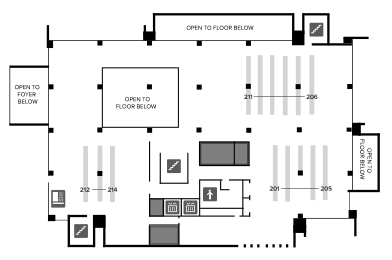
</a>
 OWEN22024_MO.svg
</td>
</tr>
<tr>
<td align="center" width="33%">
<a href="images/OWEN32024_MO.svg">
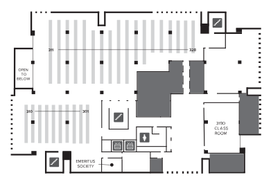
</a>
 OWEN32024_MO.svg
</td>
<td align="center" width="33%">
<a href="images/OWEN42024_MO.svg">
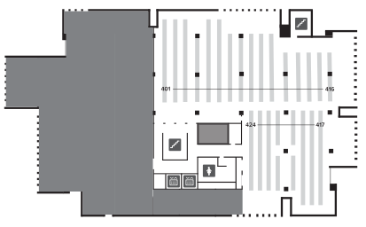
</a>
 OWEN42024_MO.svg
</td>
<td align="center" width="33%">
<a href="images/OWEN52024_MO.svg">
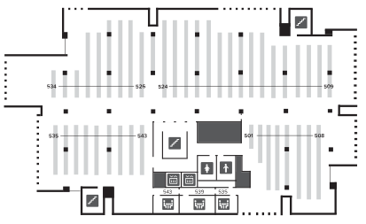
</a>
 OWEN52024_MO.svg
</td>
</tr>
<tr>
<td align="center" width="33%">
<a href="images/OWEN62024_MO.svg">
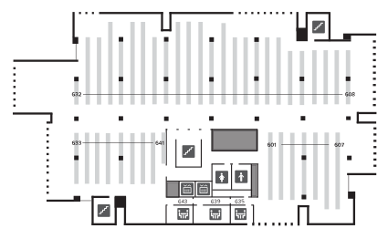
</a>
 OWEN62024_MO.svg
</td>
<td></td>
<td></td>
</tr>
</table>

## 📁 Files

| File | Description |
|------|-------------|
| `01-page-loaded.png` | page-loaded (485.6 KB) |
| `page.html` | Rendered HTML content |
| `metadata.json` | Machine-readable scan data |
| `errors.log` | JavaScript console errors |
| `warnings.log` | JavaScript console warnings |
| `info.log` | Navigation and timing details |
| `actions.log` | Interactions performed |
| `images/` | 13 page images (716.9 KB) |

---

*Generated by AccessibilityScanner (FreeTools) v1.0*
