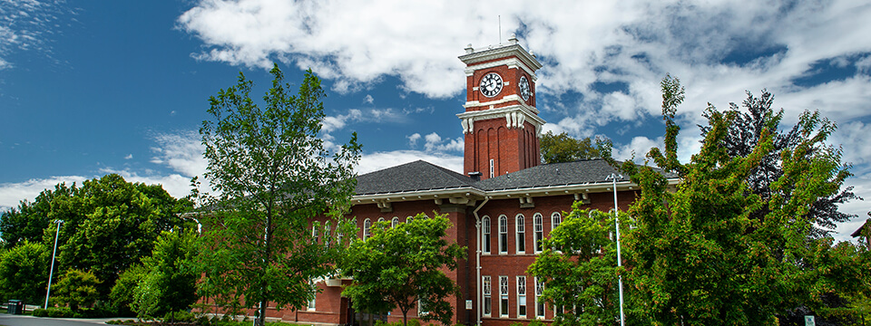
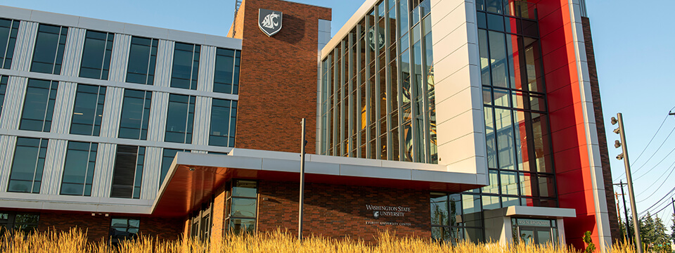
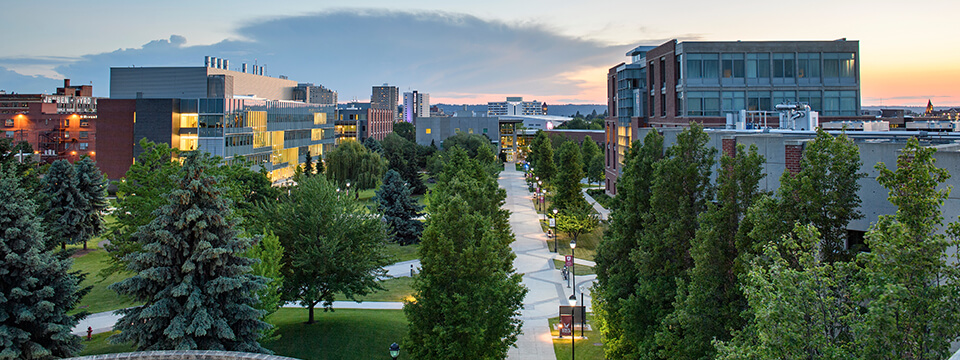
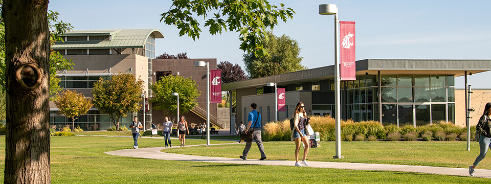
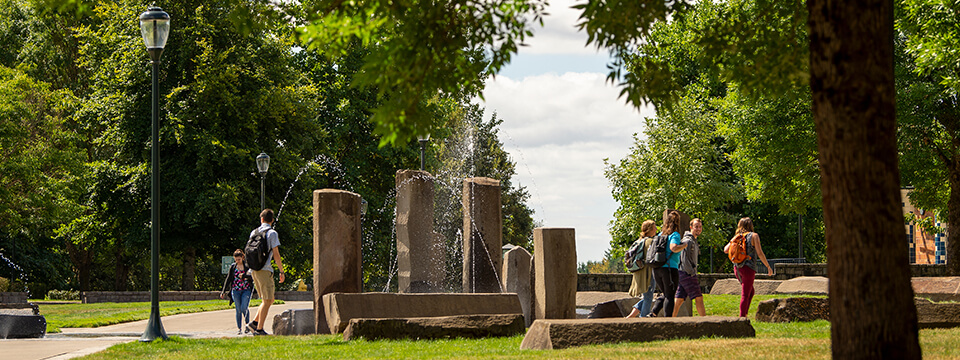

# Page Scan Report

| Field | Value |
|-------|-------|
| URL | https://maps.wsu.edu/ |
| Title | WSU Maps | Washington State University |
| Status | ❌ 0 |
| HTML Size | 42.5 KB |
| Screenshots | 1 (343.7 KB) |
| Images | 5 (1.2 MB) |
| Images Missing Alt | 5 |
| JS Errors | 2 |
| JS Warnings | 0 |
| Auth | none |
| Captured | 2026-02-16T20:58:42.4604387Z |

## JavaScript Errors

- `Failed to load resource: net::ERR_SOCKET_NOT_CONNECTED`
- `Failed to load resource: net::ERR_SOCKET_NOT_CONNECTED`

## Actions

- Screenshot #1: page-loaded (343.7 KB)
- Downloaded 5 images to /images/

## Screenshots

### 1. page-loaded

## Page Images (5)

| # | Image | Alt Text | Size |
|---|-------|----------|------|
| 1 | [img_0006_Bryan-Hall-Tower-sh_3739-sm.jpg](images/img_0006_Bryan-Hall-Tower-sh_3739-sm.jpg) | *(none)* | 281.3 KB |
| 2 | [img_0005_Everett_1947-sm.jpg](images/img_0005_Everett_1947-sm.jpg) | *(none)* | 222.1 KB |
| 3 | [img_0004_Spokane_1099.jpg](images/img_0004_Spokane_1099.jpg) | *(none)* | 244.7 KB |
| 4 | [img_0003_TriCities_0627.jpg](images/img_0003_TriCities_0627.jpg) | *(none)* | 238.9 KB |
| 5 | [img_0002_Vancouver_3541.jpg](images/img_0002_Vancouver_3541.jpg) | *(none)* | 283.8 KB |

### Gallery

### ⚠️ Images Missing Alt Text (5)

- `img_0006_Bryan-Hall-Tower-sh_3739-sm.jpg` — https://s3.wp.wsu.edu/uploads/sites/2671/2021/01/img_0006_Bryan-Hall-Tower-sh_3739-sm.jpg
- `img_0005_Everett_1947-sm.jpg` — https://s3.wp.wsu.edu/uploads/sites/2671/2021/01/img_0005_Everett_1947-sm.jpg
- `img_0004_Spokane_1099.jpg` — https://s3.wp.wsu.edu/uploads/sites/2671/2021/01/img_0004_Spokane_1099.jpg
- `img_0003_TriCities_0627.jpg` — https://s3.wp.wsu.edu/uploads/sites/2671/2021/01/img_0003_TriCities_0627.jpg
- `img_0002_Vancouver_3541.jpg` — https://s3.wp.wsu.edu/uploads/sites/2671/2021/01/img_0002_Vancouver_3541.jpg

## Files

- `01-page-loaded.png` — page-loaded (343.7 KB)
- `page.html` — rendered HTML content
- `metadata.json` — machine-readable scan data
- `errors.log` — JavaScript console errors
- `warnings.log` — JavaScript console warnings
- `info.log` — navigation and timing details
- `actions.log` — interactions performed on the page
- `images/` — 5 page images (1.2 MB)
