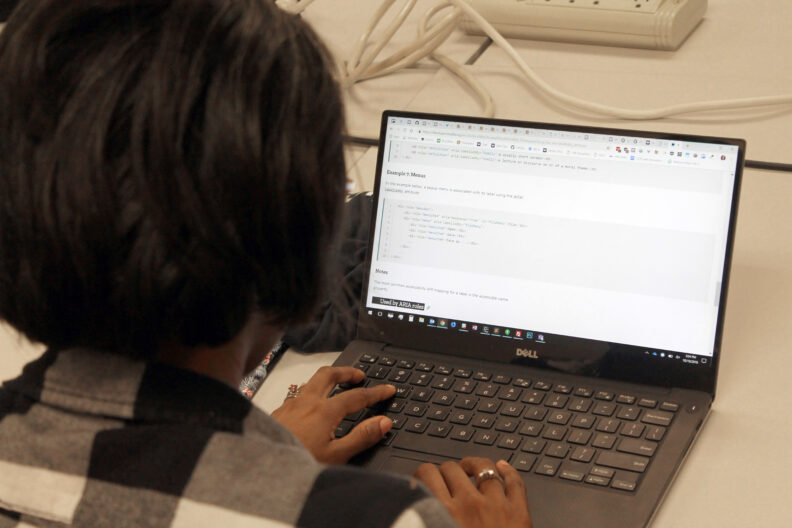
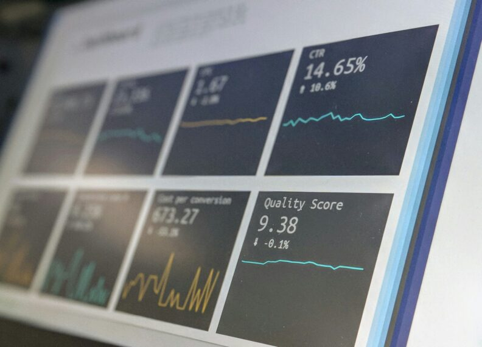
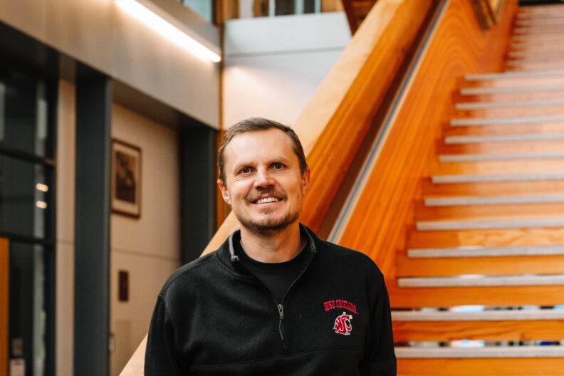

# Page Scan Report

| Field | Value |
|-------|-------|
| URL | https://math.wsu.edu/ |
| Title | Department of Mathematics and Statistics | Washington State University |
| Status | ❌ 0 |
| HTML Size | 231.3 KB |
| Screenshots | 1 (1.6 MB) |
| Images | 8 (479.8 KB) |
| Images Missing Alt | 0 |
| JS Errors | 5 |
| JS Warnings | 0 |
| Auth | none |
| Captured | 2026-02-16T20:37:05.1174071Z |

## JavaScript Errors

- `Failed to load resource: net::ERR_SOCKET_NOT_CONNECTED`
- `Failed to load resource: net::ERR_SOCKET_NOT_CONNECTED`
- `Failed to load resource: net::ERR_SOCKET_NOT_CONNECTED`
- `Failed to load resource: net::ERR_SOCKET_NOT_CONNECTED`
- `Failed to load resource: net::ERR_SOCKET_NOT_CONNECTED`

## Actions

- Screenshot #1: page-loaded (1.6 MB)
- Downloaded 8 images to /images/

## Screenshots

### 1. page-loaded

## Page Images (8)

| # | Image | Alt Text | Size |
|---|-------|----------|------|
| 1 | [research900x200-792x176.jpg](images/research900x200-792x176.jpg) | Student and faculty work through a pr... | 34.7 KB |
| 2 | [elizabeth-woolner-rT4Xgus3QdA-unsplash-1-792x528.jpg](images/elizabeth-woolner-rT4Xgus3QdA-unsplash-1-792x528.jpg) | Over the shoulder view of a student's... | 69.5 KB |
| 3 | [stephen-dawson-qwtCeJ5cLYs-unsplash-792x570.jpg](images/stephen-dawson-qwtCeJ5cLYs-unsplash-792x570.jpg) | A dynamic view of a computer monitor ... | 50.6 KB |
| 4 | [thisisengineering-fgdmH3iqvMw-unsplash-crop-792x566.jpg](images/thisisengineering-fgdmH3iqvMw-unsplash-crop-792x566.jpg) | Up close shot of a person's hand maki... | 50.8 KB |
| 5 | [Sergey_-Lapin_IMG_1135-792x528.jpg](images/Sergey_-Lapin_IMG_1135-792x528.jpg) | Sergey Lapin | 94.8 KB |
| 6 | [In-the-media-header-792x445.png](images/In-the-media-header-792x445.png) | In the media. | 18.5 KB |
| 7 | [cybersecurity-1024x676-1-792x523.jpg](images/cybersecurity-1024x676-1-792x523.jpg) | A composite featuring a darkly lit pa... | 88.9 KB |
| 8 | [2025-TopTenSeniors-mortarboards-792x523.jpg](images/2025-TopTenSeniors-mortarboards-792x523.jpg) | A top view of the heads of graduating... | 72.0 KB |

### Gallery

## Files

- `01-page-loaded.png` — page-loaded (1.6 MB)
- `page.html` — rendered HTML content
- `metadata.json` — machine-readable scan data
- `errors.log` — JavaScript console errors
- `warnings.log` — JavaScript console warnings
- `info.log` — navigation and timing details
- `actions.log` — interactions performed on the page
- `images/` — 8 page images (479.8 KB)
