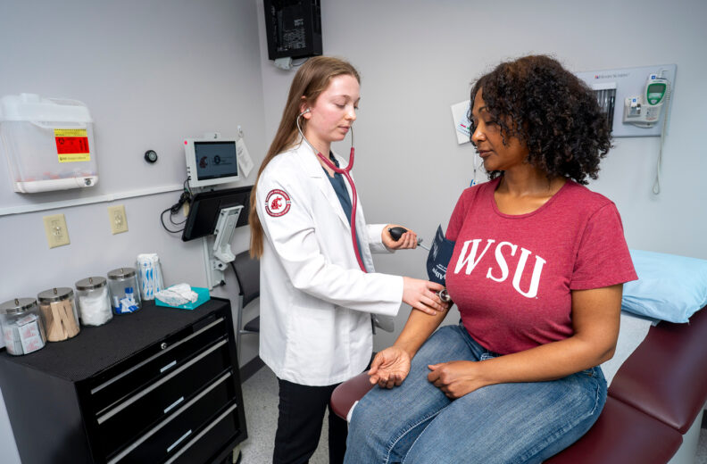
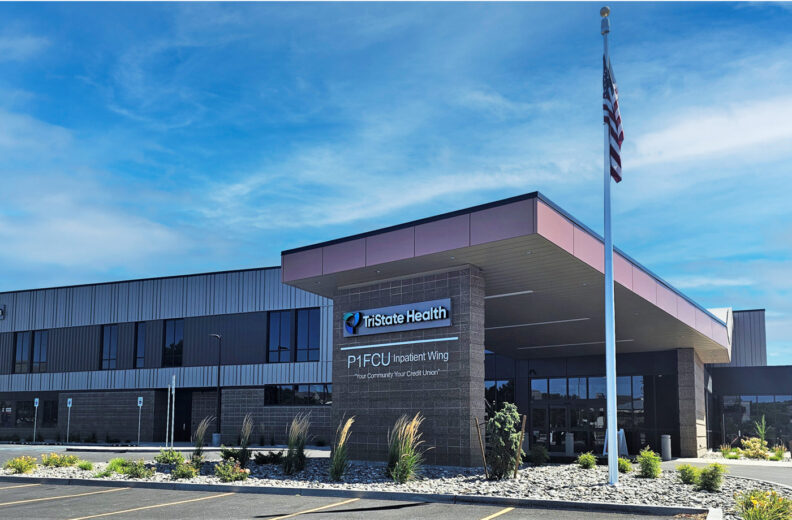

# 📄 Page Scan Report

> **URL:** https://medicine.wsu.edu/  
> **Captured:** 2026-02-16 22:19:22 UTC  
> **Status:** ✅ 200  

---

## 📑 Contents

- [Summary](#-summary)
- [Screenshots](#-screenshots)
- [Page Images](#-page-images)
- [Actions](#-actions)
- [Files](#-files)

---

## 📋 Summary

| Field | Value |
|-------|-------|
| URL | https://medicine.wsu.edu/ |
| Title | Elson S. Floyd College of Medicine | Washington State University |
| Status | ✅ 200 |
| HTML Size | 246.6 KB |
| Screenshots | 1 (1.9 MB) |
| Images | 13 (1.5 MB) |
| Images Missing Alt | ⚠️ 1 |
| JS Errors | ✅ 0 |
| JS Warnings | 1 |
| Auth | none |
| Captured | 2026-02-16T22:19:22.2136052Z |

## 🔧 Actions

<strong>2 action(s) performed</strong>

- Screenshot #1: page-loaded (1.9 MB)
- Downloaded 13 images to /images/

## 📸 Screenshots

<table>
<tr>
<td align="center" width="50%">

 <strong>1. page-loaded</strong>
 1.9 MB
</td>
<td></td>
</tr>
</table>

## 🖼️ Page Images (13)

<strong>📋 Image Index</strong> — 13 images, 1.5 MB

| # | Image | Alt Text | Size |
|--:|-------|----------|-----:|
| 1 | [WSUMED-10-year-anniversary-wordmark_H-color-792x396.png](images/WSUMED-10-year-anniversary-wordmark_H-color-792x396.png) | 10 year anniversary logo | 28.9 KB |
| 2 | [WSUMED-VCC-Surgery.jpg](images/WSUMED-VCC-Surgery.jpg) | Surgery teaching in virtual clinic ce... | 273.0 KB |
| 3 | [Research.jpg](images/Research.jpg) | Two researchers reviewing monitors. | 244.6 KB |
| 4 | [WSU-Health2.jpg](images/WSU-Health2.jpg) | Doctor checking the heart rate of a p... | 184.7 KB |
| 5 | [Cell-792x520.jpg](images/Cell-792x520.jpg) | A microscopic image of tissue stained... | 127.8 KB |
| 6 | [Jeff-Haney--792x520.jpg](images/Jeff-Haney--792x520.jpg) | A small group of people stand outdoor... | 95.3 KB |
| 7 | [Student-Hand--792x520.jpg](images/Student-Hand--792x520.jpg) | ⚠️ *(missing)* | 51.4 KB |
| 8 | [Delisa-news--792x520.jpg](images/Delisa-news--792x520.jpg) | Two people standing close together in... | 86.5 KB |
| 9 | [WSUMED-10-year-news-event-1900x1080-1-792x450.jpg](images/WSUMED-10-year-news-event-1900x1080-1-792x450.jpg) | 10 year anniversary logo surrounded b... | 139.0 KB |
| 10 | [White-Coat-2025-792x520.jpg](images/White-Coat-2025-792x520.jpg) | Several students standing in a line w... | 84.1 KB |
| 11 | [First-Full-Ride-Student-Scholarship-792x520.jpg](images/First-Full-Ride-Student-Scholarship-792x520.jpg) | A healthcare professional wearing a w... | 79.0 KB |
| 12 | [TriState-New-WSU-Family-Medicine-Residency-792x520.jpg](images/TriState-New-WSU-Family-Medicine-Residency-792x520.jpg) | Exterior view of the TriState Health ... | 87.6 KB |
| 13 | [WA-state-city-scape-LH.png](images/WA-state-city-scape-LH.png) | Washington state skyline | 13.7 KB |

<strong>🖼️ Gallery</strong>

<table>
<tr>
<td align="center" width="33%">

 WSUMED-10-year-anniversary-wordmark_H-color-792x396.png
</td>
<td align="center" width="33%">

 WSUMED-VCC-Surgery.jpg
</td>
<td align="center" width="33%">

 Research.jpg
</td>
</tr>
<tr>
<td align="center" width="33%">

 WSU-Health2.jpg
</td>
<td align="center" width="33%">

 Cell-792x520.jpg
</td>
<td align="center" width="33%">

 Jeff-Haney--792x520.jpg
</td>
</tr>
<tr>
<td align="center" width="33%">

 Student-Hand--792x520.jpg ⚠️
</td>
<td align="center" width="33%">

 Delisa-news--792x520.jpg
</td>
<td align="center" width="33%">

 WSUMED-10-year-news-event-1900x1080-1-792x450.jpg
</td>
</tr>
<tr>
<td align="center" width="33%">

 White-Coat-2025-792x520.jpg
</td>
<td align="center" width="33%">

 First-Full-Ride-Student-Scholarship-792x520.jpg
</td>
<td align="center" width="33%">

 TriState-New-WSU-Family-Medicine-Residency-792x520.jpg
</td>
</tr>
<tr>
<td align="center" width="33%">

 WA-state-city-scape-LH.png
</td>
<td></td>
<td></td>
</tr>
</table>

⚠️ <strong>Images Missing Alt Text</strong> (1)

| Image | Source URL |
|-------|-----------|
| `Student-Hand--792x520.jpg` | https://wpcdn.web.wsu.edu/wp-medicine/uploads/sites/3023/2026/01/Student-Hand... |

## 📁 Files

| File | Description |
|------|-------------|
| `01-page-loaded.png` | page-loaded (1.9 MB) |
| `page.html` | Rendered HTML content |
| `metadata.json` | Machine-readable scan data |
| `errors.log` | JavaScript console errors |
| `warnings.log` | JavaScript console warnings |
| `info.log` | Navigation and timing details |
| `actions.log` | Interactions performed |
| `images/` | 13 page images (1.5 MB) |

---

*Generated by AccessibilityScanner (FreeTools) v1.0*
