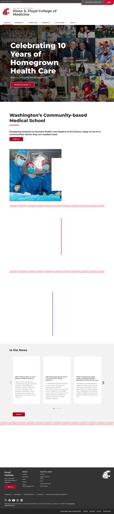
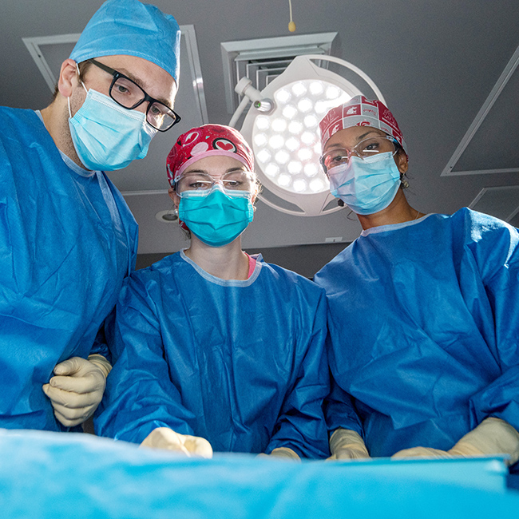
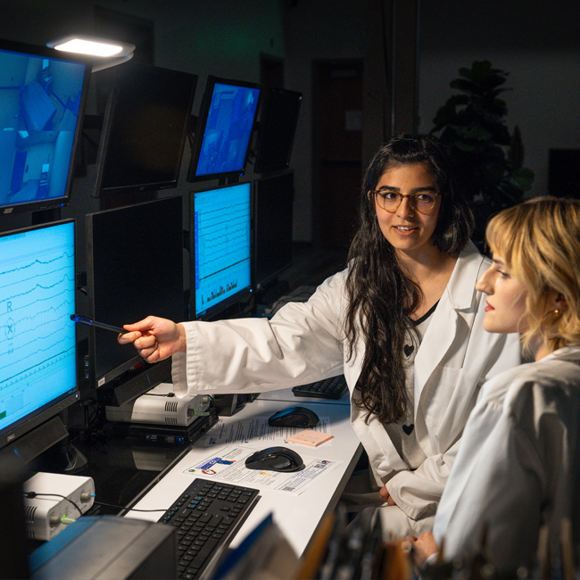
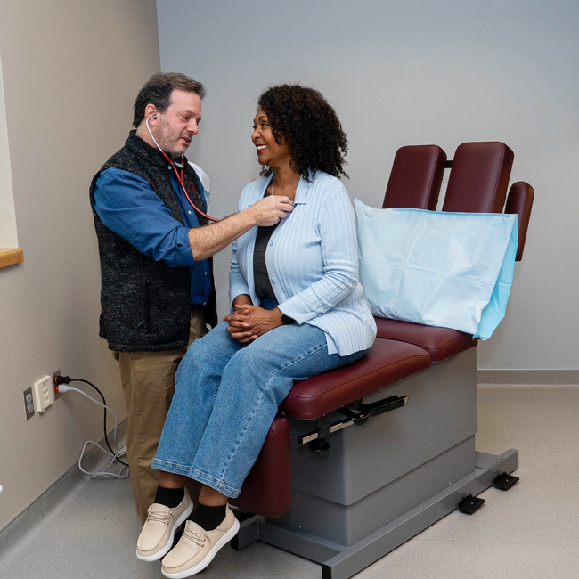
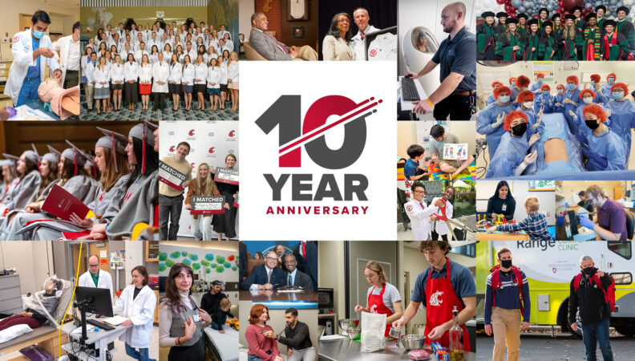
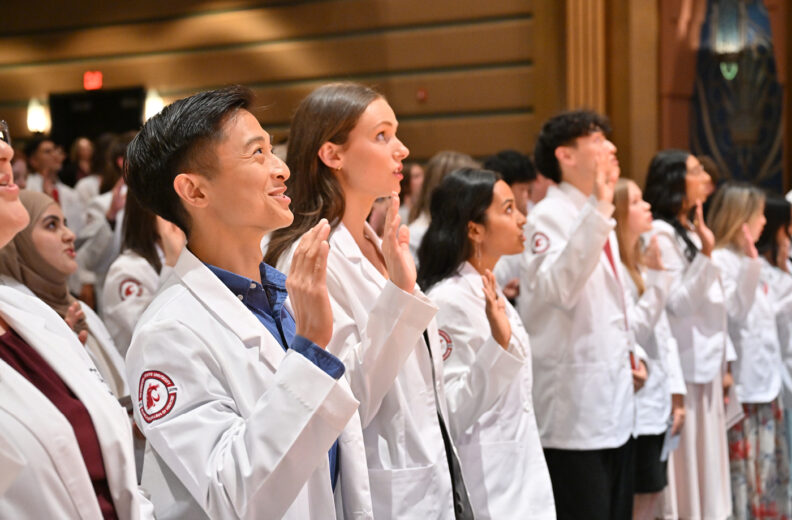

# Page Scan Report

| Field | Value |
|-------|-------|
| URL | https://medicine.wsu.edu/ |
| Title | Elson S. Floyd College of Medicine | Washington State University |
| Status | ❌ 0 |
| HTML Size | 228.4 KB |
| Screenshots | 1 (2.1 MB) |
| Images | 13 (1.5 MB) |
| Images Missing Alt | 1 |
| JS Errors | 3 |
| JS Warnings | 1 |
| Auth | none |
| Captured | 2026-02-16T20:37:05.1180819Z |

## JavaScript Errors

- `Failed to load resource: net::ERR_SOCKET_NOT_CONNECTED`
- `Failed to load resource: net::ERR_SOCKET_NOT_CONNECTED`
- `Failed to load resource: net::ERR_SOCKET_NOT_CONNECTED`

## Actions

- Screenshot #1: page-loaded (2.1 MB)
- Downloaded 13 images to /images/

## Screenshots

### 1. page-loaded

## Page Images (13)

| # | Image | Alt Text | Size |
|---|-------|----------|------|
| 1 | [WSUMED-10-year-anniversary-wordmark_H-color-792x396.png](images/WSUMED-10-year-anniversary-wordmark_H-color-792x396.png) | 10 year anniversary logo | 28.9 KB |
| 2 | [WSUMED-VCC-Surgery.jpg](images/WSUMED-VCC-Surgery.jpg) | Surgery teaching in virtual clinic ce... | 273.0 KB |
| 3 | [Research.jpg](images/Research.jpg) | Two researchers reviewing monitors. | 244.6 KB |
| 4 | [WSU-Health2.jpg](images/WSU-Health2.jpg) | Doctor checking the heart rate of a p... | 184.7 KB |
| 5 | [Cell-792x520.jpg](images/Cell-792x520.jpg) | A microscopic image of tissue stained... | 127.8 KB |
| 6 | [Jeff-Haney--792x520.jpg](images/Jeff-Haney--792x520.jpg) | A small group of people stand outdoor... | 95.3 KB |
| 7 | [Student-Hand--792x520.jpg](images/Student-Hand--792x520.jpg) | *(none)* | 51.4 KB |
| 8 | [Delisa-news--792x520.jpg](images/Delisa-news--792x520.jpg) | Two people standing close together in... | 86.5 KB |
| 9 | [WSUMED-10-year-news-event-1900x1080-1-792x450.jpg](images/WSUMED-10-year-news-event-1900x1080-1-792x450.jpg) | 10 year anniversary logo surrounded b... | 139.0 KB |
| 10 | [White-Coat-2025-792x520.jpg](images/White-Coat-2025-792x520.jpg) | Several students standing in a line w... | 84.1 KB |
| 11 | [First-Full-Ride-Student-Scholarship-792x520.jpg](images/First-Full-Ride-Student-Scholarship-792x520.jpg) | A healthcare professional wearing a w... | 79.0 KB |
| 12 | [TriState-New-WSU-Family-Medicine-Residency-792x520.jpg](images/TriState-New-WSU-Family-Medicine-Residency-792x520.jpg) | Exterior view of the TriState Health ... | 87.6 KB |
| 13 | [WA-state-city-scape-LH.png](images/WA-state-city-scape-LH.png) | Washington state skyline | 13.7 KB |

### Gallery

### ⚠️ Images Missing Alt Text (1)

- `Student-Hand--792x520.jpg` — https://wpcdn.web.wsu.edu/wp-medicine/uploads/sites/3023/2026/01/Student-Hand--792x520.jpg

## Files

- `01-page-loaded.png` — page-loaded (2.1 MB)
- `page.html` — rendered HTML content
- `metadata.json` — machine-readable scan data
- `errors.log` — JavaScript console errors
- `warnings.log` — JavaScript console warnings
- `info.log` — navigation and timing details
- `actions.log` — interactions performed on the page
- `images/` — 13 page images (1.5 MB)
