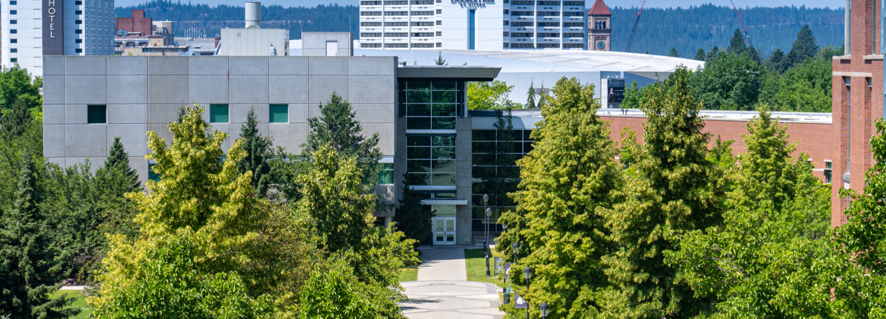
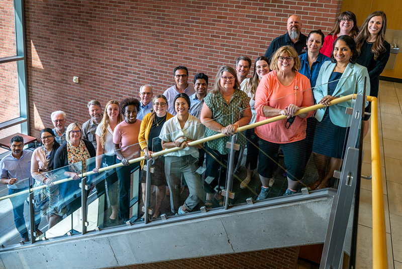
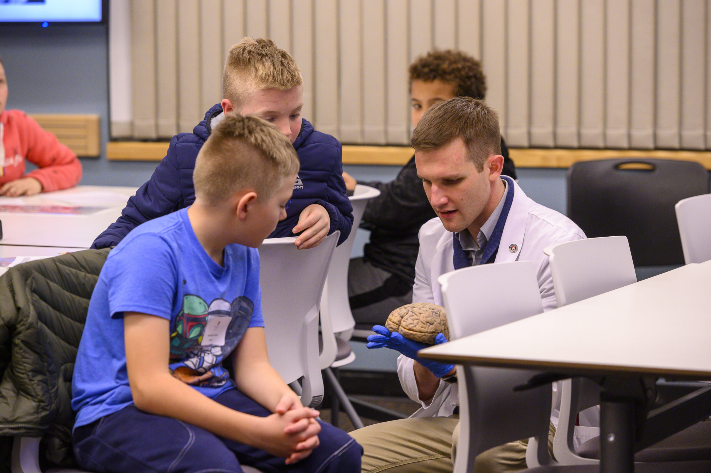
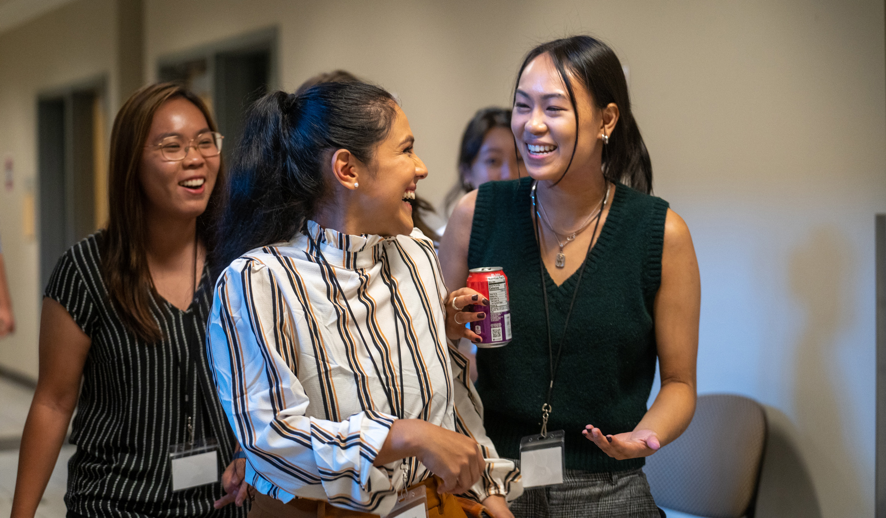
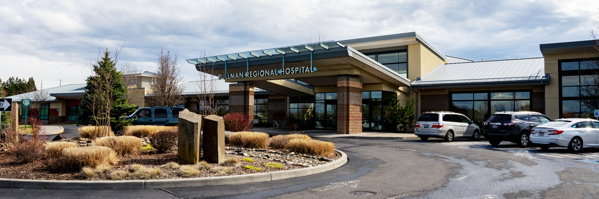

# 📄 Page Scan Report

> **URL:** https://medicine.wsu.edu/about/  
> **Captured:** 2026-02-16 22:19:29 UTC  
> **Status:** ✅ 200  

---

## 📑 Contents

- [Summary](#-summary)
- [Screenshots](#-screenshots)
- [Page Images](#-page-images)
- [Actions](#-actions)
- [Files](#-files)

---

## 📋 Summary

| Field | Value |
|-------|-------|
| URL | https://medicine.wsu.edu/about/ |
| Title | About | Elson S. Floyd College of Medicine | Washington State University |
| Status | ✅ 200 |
| HTML Size | 244.5 KB |
| Screenshots | 1 (2.6 MB) |
| Images | 12 (5.2 MB) |
| Images Missing Alt | ✅ 0 |
| JS Errors | ✅ 0 |
| JS Warnings | 1 |
| Auth | none |
| Captured | 2026-02-16T22:19:29.5436294Z |

## 🔧 Actions

<strong>2 action(s) performed</strong>

- Screenshot #1: page-loaded (2.6 MB)
- Downloaded 12 images to /images/

## 📸 Screenshots

<table>
<tr>
<td align="center" width="50%">

 <strong>1. page-loaded</strong>
 2.6 MB
</td>
<td></td>
</tr>
</table>

## 🖼️ Page Images (12)

<strong>📋 Image Index</strong> — 12 images, 5.2 MB

| # | Image | Alt Text | Size |
|--:|-------|----------|-----:|
| 1 | [WSUMED-10-year-anniversary-wordmark_H-color-792x396.png](images/WSUMED-10-year-anniversary-wordmark_H-color-792x396.png) | 10 year anniversary logo | 28.9 KB |
| 2 | [WSUMED-Medicine-Building.jpg](images/WSUMED-Medicine-Building.jpg) | College of Medicine Building | 1.1 MB |
| 3 | [WSUMED-student-with-patient.jpg](images/WSUMED-student-with-patient.jpg) | student with patient | 340.5 KB |
| 4 | [Heart-rate-check-792x531.jpg](images/Heart-rate-check-792x531.jpg) | MD student checking the heart rate of... | 91.3 KB |
| 5 | [WSUMED-Education-792x792.jpg](images/WSUMED-Education-792x792.jpg) | students learning how to use a breath... | 131.8 KB |
| 6 | [WSUMED-MD-23.jpg](images/WSUMED-MD-23.jpg) | Marcos Frank working in Lab | 282.9 KB |
| 7 | [WSU-Health2.jpg](images/WSU-Health2.jpg) | Doctor checking the heart rate of a p... | 184.7 KB |
| 8 | [WSUMED-AdmissionTeam.jpg](images/WSUMED-AdmissionTeam.jpg) | Admissions Team | 494.6 KB |
| 9 | [image-9.jpg](images/image-9.jpg) | Medical student showing a brain model... | 669.2 KB |
| 10 | [WSUMED-MD-Students-header.jpg](images/WSUMED-MD-Students-header.jpg) | three students walking down a hallway | 910.5 KB |
| 11 | [pullman-regional-hospital.jpg](images/pullman-regional-hospital.jpg) | Pullman Regional Hospital | 832.9 KB |
| 12 | [Elson-S-Floyd.jpg](images/Elson-S-Floyd.jpg) | Elson S Floyd | 228.0 KB |

<strong>🖼️ Gallery</strong>

<table>
<tr>
<td align="center" width="33%">

 WSUMED-10-year-anniversary-wordmark_H-color-792x396.png
</td>
<td align="center" width="33%">

 WSUMED-Medicine-Building.jpg
</td>
<td align="center" width="33%">

 WSUMED-student-with-patient.jpg
</td>
</tr>
<tr>
<td align="center" width="33%">

 Heart-rate-check-792x531.jpg
</td>
<td align="center" width="33%">

 WSUMED-Education-792x792.jpg
</td>
<td align="center" width="33%">

 WSUMED-MD-23.jpg
</td>
</tr>
<tr>
<td align="center" width="33%">

 WSU-Health2.jpg
</td>
<td align="center" width="33%">

 WSUMED-AdmissionTeam.jpg
</td>
<td align="center" width="33%">

 image-9.jpg
</td>
</tr>
<tr>
<td align="center" width="33%">

 WSUMED-MD-Students-header.jpg
</td>
<td align="center" width="33%">

 pullman-regional-hospital.jpg
</td>
<td align="center" width="33%">

 Elson-S-Floyd.jpg
</td>
</tr>
</table>

## 📁 Files

| File | Description |
|------|-------------|
| `01-page-loaded.png` | page-loaded (2.6 MB) |
| `page.html` | Rendered HTML content |
| `metadata.json` | Machine-readable scan data |
| `errors.log` | JavaScript console errors |
| `warnings.log` | JavaScript console warnings |
| `info.log` | Navigation and timing details |
| `actions.log` | Interactions performed |
| `images/` | 12 page images (5.2 MB) |

---

*Generated by AccessibilityScanner (FreeTools) v1.0*
