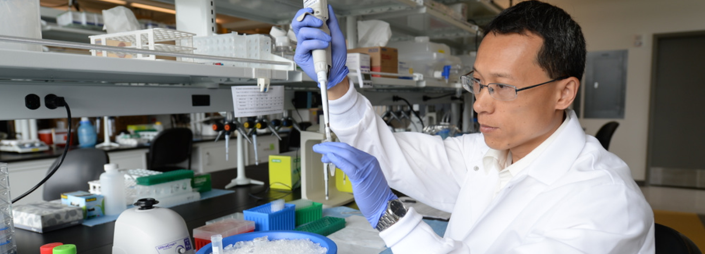
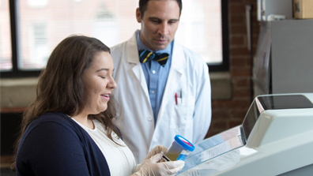
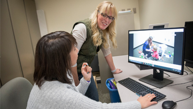
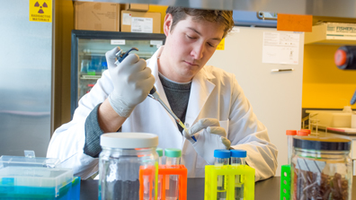
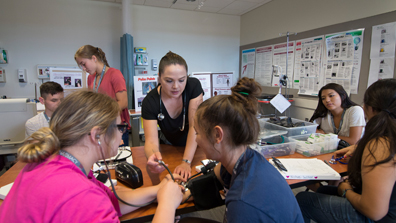
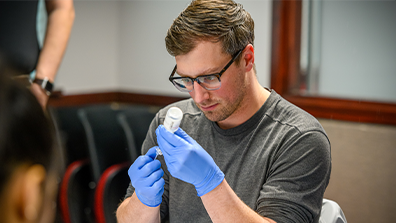
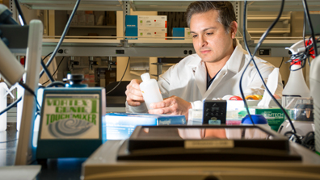
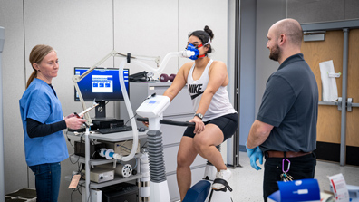
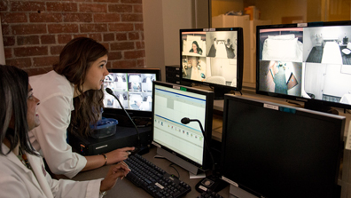
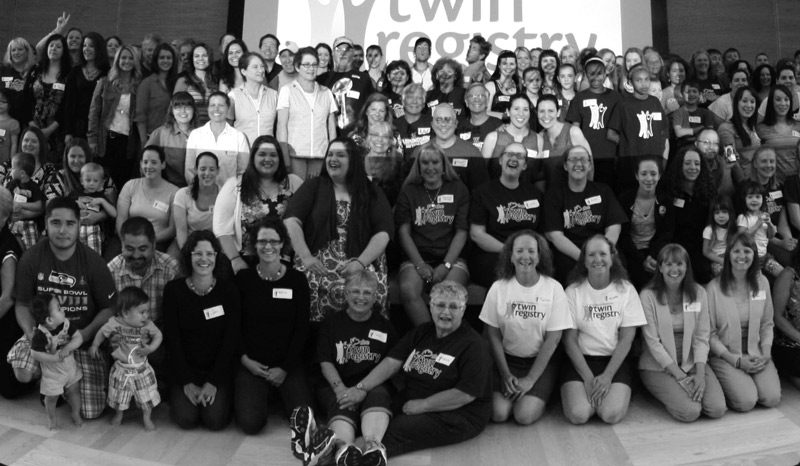

# Page Scan Report

| Field | Value |
|-------|-------|
| URL | https://medicine.wsu.edu/research/ |
| Title | Research Overview | Elson S. Floyd College of Medicine | Washington State University |
| Status | ❌ 0 |
| HTML Size | 258.0 KB |
| Screenshots | 1 (2.3 MB) |
| Images | 19 (2.2 MB) |
| Images Missing Alt | 5 |
| JS Errors | 0 |
| JS Warnings | 1 |
| Auth | none |
| Captured | 2026-02-16T21:00:48.6267067Z |

## Actions

- Screenshot #1: page-loaded (2.3 MB)
- Downloaded 19 images to /images/

## Screenshots

### 1. page-loaded

## Page Images (19)

| # | Image | Alt Text | Size |
|---|-------|----------|------|
| 1 | [WSUMED-10-year-anniversary-wordmark_H-color-792x396.png](images/WSUMED-10-year-anniversary-wordmark_H-color-792x396.png) | 10 year anniversary logo | 28.9 KB |
| 2 | [WSUMED-Research-Header.jpg](images/WSUMED-Research-Header.jpg) | Researcher placing sample in test tube | 500.5 KB |
| 3 | [Addictions.jpg](images/Addictions.jpg) | Researcher looking at a sample | 66.2 KB |
| 4 | [Autism.jpg](images/Autism.jpg) | Researchers looking at a computer | 72.2 KB |
| 5 | [Cancer.jpg](images/Cancer.jpg) | Researcher putting liquid in a tube | 83.6 KB |
| 6 | [Community-Health.jpg](images/Community-Health.jpg) | Community Health | 91.3 KB |
| 7 | [MD-student-educational-research-396x223-1.png](images/MD-student-educational-research-396x223-1.png) | Researcher fill up syringe | 155.3 KB |
| 8 | [Health-Policy.jpg](images/Health-Policy.jpg) | Group of people standing in circle ou... | 118.2 KB |
| 9 | [Neuroscience.jpg](images/Neuroscience.jpg) | Neuroscience research | 92.2 KB |
| 10 | [WSUMED-NEP-Research.jpg](images/WSUMED-NEP-Research.jpg) | Testing done on exercise bike | 62.7 KB |
| 11 | [Sleep-and-Performance.jpg](images/Sleep-and-Performance.jpg) | Sleep and Performance Research | 82.8 KB |
| 12 | [TwinFest2019.jpg](images/TwinFest2019.jpg) | Group photo with Twins | 114.3 KB |
| 13 | [Cell-792x520.jpg](images/Cell-792x520.jpg) | A microscopic image of tissue stained... | 127.8 KB |
| 14 | [Student-Hand--792x520.jpg](images/Student-Hand--792x520.jpg) | *(none)* | 51.4 KB |
| 15 | [Students-Research--792x520.jpg](images/Students-Research--792x520.jpg) | Three individuals wearing gloves prac... | 78.6 KB |
| 16 | [medium.jpg](images/medium.jpg) | *(none)* | 84.9 KB |
| 17 | [medium-1.jpg](images/medium-1.jpg) | *(none)* | 69.4 KB |
| 18 | [medium-2.jpg](images/medium-2.jpg) | *(none)* | 160.6 KB |
| 19 | [medium-3.jpg](images/medium-3.jpg) | *(none)* | 179.7 KB |

### Gallery

### ⚠️ Images Missing Alt Text (5)

- `Student-Hand--792x520.jpg` — https://wpcdn.web.wsu.edu/wp-medicine/uploads/sites/3023/2026/01/Student-Hand--792x520.jpg
- `medium.jpg` — https://profiles.aws.medicine.wsu.edu/PROFILES/314-Sterling_McPherson/medium.jpg
- `medium-1.jpg` — https://profiles.aws.medicine.wsu.edu/PROFILES/5430-Olivia_Coiado/medium.jpg
- `medium-2.jpg` — https://profiles.aws.medicine.wsu.edu/PROFILES/681-Karina_Bloom/medium.jpg
- `medium-3.jpg` — https://profiles.aws.medicine.wsu.edu/PROFILES/978-Renee_Wahl/medium.jpg

## Files

- `01-page-loaded.png` — page-loaded (2.3 MB)
- `page.html` — rendered HTML content
- `metadata.json` — machine-readable scan data
- `errors.log` — JavaScript console errors
- `warnings.log` — JavaScript console warnings
- `info.log` — navigation and timing details
- `actions.log` — interactions performed on the page
- `images/` — 19 page images (2.2 MB)
