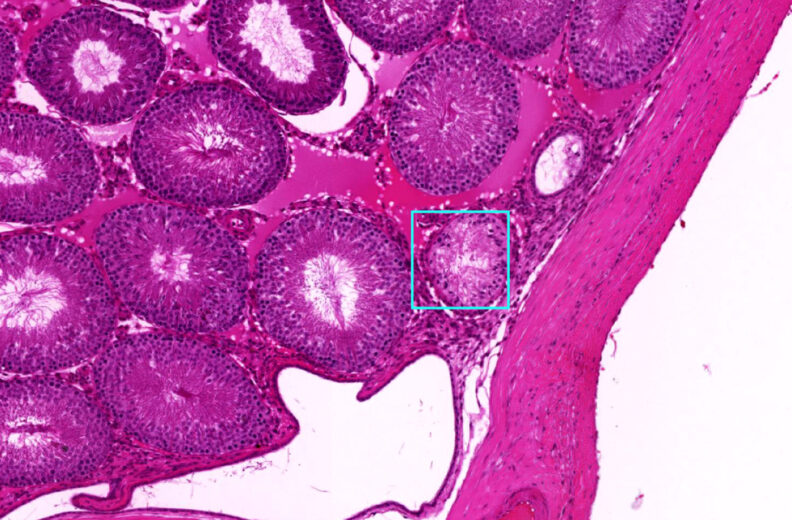
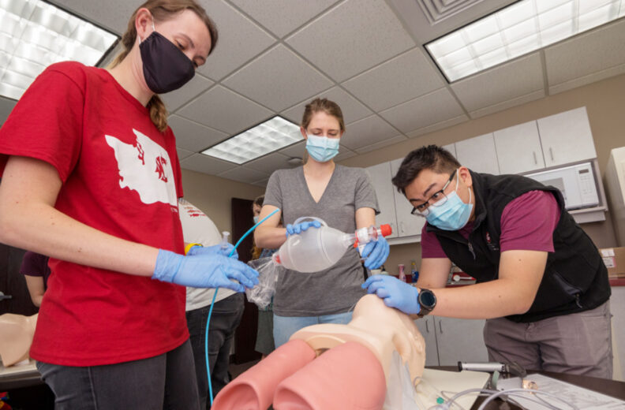

# 📄 Page Scan Report

> **URL:** https://medicine.wsu.edu/research/  
> **Captured:** 2026-02-16 22:19:42 UTC  
> **Status:** ✅ 200  

---

## 📑 Contents

- [Summary](#-summary)
- [Screenshots](#-screenshots)
- [Page Images](#-page-images)
- [Actions](#-actions)
- [Files](#-files)

---

## 📋 Summary

| Field | Value |
|-------|-------|
| URL | https://medicine.wsu.edu/research/ |
| Title | Research Overview | Elson S. Floyd College of Medicine | Washington State University |
| Status | ✅ 200 |
| HTML Size | 257.5 KB |
| Screenshots | 1 (2.3 MB) |
| Images | 19 (2.2 MB) |
| Images Missing Alt | ⚠️ 5 |
| JS Errors | ✅ 0 |
| JS Warnings | 1 |
| Auth | none |
| Captured | 2026-02-16T22:19:42.9152543Z |

## 🔧 Actions

<strong>2 action(s) performed</strong>

- Screenshot #1: page-loaded (2.3 MB)
- Downloaded 19 images to /images/

## 📸 Screenshots

<table>
<tr>
<td align="center" width="50%">

 <strong>1. page-loaded</strong>
 2.3 MB
</td>
<td></td>
</tr>
</table>

## 🖼️ Page Images (19)

<strong>📋 Image Index</strong> — 19 images, 2.2 MB

| # | Image | Alt Text | Size |
|--:|-------|----------|-----:|
| 1 | [WSUMED-10-year-anniversary-wordmark_H-color-792x396.png](images/WSUMED-10-year-anniversary-wordmark_H-color-792x396.png) | 10 year anniversary logo | 28.9 KB |
| 2 | [WSUMED-Research-Header.jpg](images/WSUMED-Research-Header.jpg) | Researcher placing sample in test tube | 500.5 KB |
| 3 | [Addictions.jpg](images/Addictions.jpg) | Researcher looking at a sample | 66.2 KB |
| 4 | [Autism.jpg](images/Autism.jpg) | Researchers looking at a computer | 72.2 KB |
| 5 | [Cancer.jpg](images/Cancer.jpg) | Researcher putting liquid in a tube | 83.6 KB |
| 6 | [Community-Health.jpg](images/Community-Health.jpg) | Community Health | 91.3 KB |
| 7 | [MD-student-educational-research-396x223-1.png](images/MD-student-educational-research-396x223-1.png) | Researcher fill up syringe | 155.3 KB |
| 8 | [Health-Policy.jpg](images/Health-Policy.jpg) | Group of people standing in circle ou... | 118.2 KB |
| 9 | [Neuroscience.jpg](images/Neuroscience.jpg) | Neuroscience research | 92.2 KB |
| 10 | [WSUMED-NEP-Research.jpg](images/WSUMED-NEP-Research.jpg) | Testing done on exercise bike | 62.7 KB |
| 11 | [Sleep-and-Performance.jpg](images/Sleep-and-Performance.jpg) | Sleep and Performance Research | 82.8 KB |
| 12 | [TwinFest2019.jpg](images/TwinFest2019.jpg) | Group photo with Twins | 114.3 KB |
| 13 | [Cell-792x520.jpg](images/Cell-792x520.jpg) | A microscopic image of tissue stained... | 127.8 KB |
| 14 | [Student-Hand--792x520.jpg](images/Student-Hand--792x520.jpg) | ⚠️ *(missing)* | 51.4 KB |
| 15 | [Students-Research--792x520.jpg](images/Students-Research--792x520.jpg) | Three individuals wearing gloves prac... | 78.6 KB |
| 16 | [medium.jpg](images/medium.jpg) | ⚠️ *(missing)* | 84.9 KB |
| 17 | [medium-1.jpg](images/medium-1.jpg) | ⚠️ *(missing)* | 69.4 KB |
| 18 | [medium-2.jpg](images/medium-2.jpg) | ⚠️ *(missing)* | 160.6 KB |
| 19 | [medium-3.jpg](images/medium-3.jpg) | ⚠️ *(missing)* | 179.7 KB |

<strong>🖼️ Gallery</strong>

<table>
<tr>
<td align="center" width="33%">

 WSUMED-10-year-anniversary-wordmark_H-color-792x396.png
</td>
<td align="center" width="33%">

 WSUMED-Research-Header.jpg
</td>
<td align="center" width="33%">

 Addictions.jpg
</td>
</tr>
<tr>
<td align="center" width="33%">

 Autism.jpg
</td>
<td align="center" width="33%">

 Cancer.jpg
</td>
<td align="center" width="33%">

 Community-Health.jpg
</td>
</tr>
<tr>
<td align="center" width="33%">

 MD-student-educational-research-396x223-1.png
</td>
<td align="center" width="33%">

 Health-Policy.jpg
</td>
<td align="center" width="33%">

 Neuroscience.jpg
</td>
</tr>
<tr>
<td align="center" width="33%">

 WSUMED-NEP-Research.jpg
</td>
<td align="center" width="33%">

 Sleep-and-Performance.jpg
</td>
<td align="center" width="33%">

 TwinFest2019.jpg
</td>
</tr>
<tr>
<td align="center" width="33%">

 Cell-792x520.jpg
</td>
<td align="center" width="33%">

 Student-Hand--792x520.jpg ⚠️
</td>
<td align="center" width="33%">

 Students-Research--792x520.jpg
</td>
</tr>
<tr>
<td align="center" width="33%">

 medium.jpg ⚠️
</td>
<td align="center" width="33%">

 medium-1.jpg ⚠️
</td>
<td align="center" width="33%">

 medium-2.jpg ⚠️
</td>
</tr>
<tr>
<td align="center" width="33%">

 medium-3.jpg ⚠️
</td>
<td></td>
<td></td>
</tr>
</table>

⚠️ <strong>Images Missing Alt Text</strong> (5)

| Image | Source URL |
|-------|-----------|
| `Student-Hand--792x520.jpg` | https://wpcdn.web.wsu.edu/wp-medicine/uploads/sites/3023/2026/01/Student-Hand... |
| `medium.jpg` | https://profiles.aws.medicine.wsu.edu/PROFILES/314-Sterling_McPherson/medium.jpg |
| `medium-1.jpg` | https://profiles.aws.medicine.wsu.edu/PROFILES/5430-Olivia_Coiado/medium.jpg |
| `medium-2.jpg` | https://profiles.aws.medicine.wsu.edu/PROFILES/681-Karina_Bloom/medium.jpg |
| `medium-3.jpg` | https://profiles.aws.medicine.wsu.edu/PROFILES/978-Renee_Wahl/medium.jpg |

## 📁 Files

| File | Description |
|------|-------------|
| `01-page-loaded.png` | page-loaded (2.3 MB) |
| `page.html` | Rendered HTML content |
| `metadata.json` | Machine-readable scan data |
| `errors.log` | JavaScript console errors |
| `warnings.log` | JavaScript console warnings |
| `info.log` | Navigation and timing details |
| `actions.log` | Interactions performed |
| `images/` | 19 page images (2.2 MB) |

---

*Generated by AccessibilityScanner (FreeTools) v1.0*
