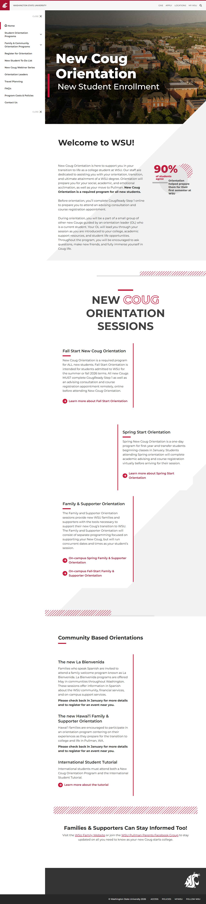

# 🌐 Site Report: https://message.wsu.edu/

> **Status:** ✅ 1/1 pages OK  
> **Folder:** `message-wsu-edu/`  

---

## 📋 Summary

```
Success Rate:  [██████████████████████████████] 100%
```

| Metric | Value |
|--------|-------|
| Pages Scanned | 1 |
| Pages Passed | ✅ 1 |
| Pages Failed | 0 |
| Total JS Errors | 0 |
| Total JS Warnings | 0 |
| Total Images | 5 (by URL) |
| Images Missing Alt | ⚠️ 1 |
| A11y Violations | ⚠️ 5 |
| 🔴 Critical | 0 |
| 🟠 Serious | 5 |
| 🟡 Moderate | 0 |
| 🔵 Minor | 0 |
| Total HTML | 71.4 KB |
| Total Screenshots | 441.0 KB |

## 🔒 SSL Certificate

| Field | Value |
|-------|-------|
| Subject | `CN=admission.wsu.edu` |
| Issuer | `CN=Amazon RSA 2048 M02, O=Amazon, C=US` |
| Valid From | 2025-05-13 |
| Expires | 🟢 2026-06-12 (113 days) |
| Algorithm | sha256RSA |
| Key Size | 2048 bits |
| Thumbprint | `6590E191000D216585A5B816E71676A19CAB32CD` |
| SANs | 10 domain(s) |

<details>
<summary><strong>Subject Alternative Names (10)</strong></summary>

| Domain | Type |
|--------|------|
| `*.admission.wsu.edu` | 🌐 Wildcard |
| `*.alive.wsu.edu` | 🌐 Wildcard |
| `*.choose.wsu.edu` | 🌐 Wildcard |
| `*.explore.wsu.edu` | 🌐 Wildcard |
| `*.why.wsu.edu` | 🌐 Wildcard |
| `admission.wsu.edu` | 🏫 WSU |
| `alive.wsu.edu` | 🏫 WSU |
| `choose.wsu.edu` | 🏫 WSU |
| `explore.wsu.edu` | 🏫 WSU |
| `why.wsu.edu` | 🏫 WSU |

</details>

## 📑 Pages

| Status | Page | HTTP | Title | 🔴 | 🟠 | 🟡 | 🔵 | A11y |
|:------:|------|:----:|-------|:--:|:--:|:--:|:--:|:----:|
| ✅ | [/](_root/report.md) | 200 | New Coug Orientation \| Washington St... |  | 5 |  |  | ⚠️ 5 |

## 📸 Page Screenshots

Click any thumbnail to view the full page report.

<table>
<tr>
<td align="center" width="33%">
<a href="_root/report.md">

</a>
<br />✅ <code>/</code>
</td>
<td></td>
<td></td>
</tr>
</table>

## ♿ Accessibility Summary

| Metric | Value |
|--------|-------|
| Pages with violations | 1/1 |
| Total violations | 5 |
| 🔴 Critical | 0 |
| 🟠 Serious | 5 |
| 🟡 Moderate | 0 |
| 🔵 Minor | 0 |

### Top 3 Issues

| # | Rule | Sev | Pages | Instances |
|--:|------|:---:|:-----:|:---------:|
| 1 | color-contrast | 🟠 | 1/1 | 1 |
| 2 | image-alt | 🟠 | 1/1 | 3 |
| 3 | link-name | 🟠 | 1/1 | 1 |

---

*Generated by AccessibilityScanner (FreeTools) v1.0*
