# Page Scan Report

| Field | Value |
|-------|-------|
| URL | https://murrow.wsu.edu/ |
| Title | Edward R. Murrow College of Communication | Washington State University |
| Status | ❌ 0 |
| HTML Size | 287.5 KB |
| Screenshots | 1 (509.7 KB) |
| Images | 40 (5.6 MB) |
| Images Missing Alt | 3 |
| JS Errors | 0 |
| JS Warnings | 0 |
| Auth | none |
| Captured | 2026-02-16T20:58:42.4635669Z |

## Actions

- Screenshot #1: page-loaded (509.7 KB)
- Downloaded 40 images to /images/

## Screenshots

### 1. page-loaded

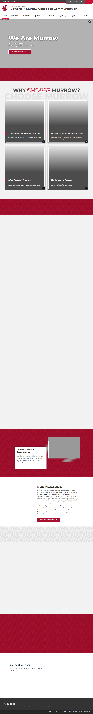

## Page Images (40)

| # | Image | Alt Text | Size |
|---|-------|----------|------|
| 1 | [COM-540-9.jpg](images/COM-540-9.jpg) | Students working on laptops in the Co... | 575.3 KB |
| 2 | [Experiential-Learning-Card-2.jpg](images/Experiential-Learning-Card-2.jpg) | Murrow student looking through video ... | 231.4 KB |
| 3 | [MCSS-Card.jpg](images/MCSS-Card.jpg) | Student taking a picture with the WSU... | 196.6 KB |
| 4 | [Internationally-Ranked-Scholars.jpg](images/Internationally-Ranked-Scholars.jpg) | Hall of Achievement recipient giving ... | 181.5 KB |
| 5 | [life-impacting-research-card-2.jpg](images/life-impacting-research-card-2.jpg) | Media Lab Group 2-19-25 | 124.2 KB |
| 6 | [Tony-Thompson-Fall-2024_310_800x533.jpg](images/Tony-Thompson-Fall-2024_310_800x533.jpg) | Navigate to the Advertising Major web... | 149.7 KB |
| 7 | [broadcasting-news-group-card.jpg](images/broadcasting-news-group-card.jpg) | Navigate to the Broadcast News Major ... | 214.7 KB |
| 8 | [broadcast-production-card.jpg](images/broadcast-production-card.jpg) | Navigate to the Broadcast Production ... | 198.7 KB |
| 9 | [integrated-strategic-communication-card.jpg](images/integrated-strategic-communication-card.jpg) | Navigate to the Integrated Strategic ... | 100.3 KB |
| 10 | [Bimbisar-Irom-Fall-2024_800x533.jpg](images/Bimbisar-Irom-Fall-2024_800x533.jpg) | Navigate to the Media Innovation Majo... | 138.0 KB |
| 11 | [Malu-Santos-of-Claire-MT-sunset-800x533-1.jpg](images/Malu-Santos-of-Claire-MT-sunset-800x533-1.jpg) | Navigate to the Multimedia Journalism... | 76.9 KB |
| 12 | [Chelsea-w-Student-camera_800x533.jpg](images/Chelsea-w-Student-camera_800x533.jpg) | Navigate to the Public Relations Majo... | 128.9 KB |
| 13 | [Student-Showcase_800x533.jpg](images/Student-Showcase_800x533.jpg) | Navigate to the Risk and Crisis Commu... | 188.8 KB |
| 14 | [Butch-and-students_800x533-1.jpg](images/Butch-and-students_800x533-1.jpg) | Navigate to the Communication Minor w... | 173.4 KB |
| 15 | [COM-552_2-19-25_800x533.jpg](images/COM-552_2-19-25_800x533.jpg) | Navigate to the Health Communication ... | 105.9 KB |
| 16 | [383-Grassroots-on-Greek-Row-1_800x533.jpg](images/383-Grassroots-on-Greek-Row-1_800x533.jpg) | Navigate to the Public Relations Mino... | 255.5 KB |
| 17 | [sports-communication-card.jpg](images/sports-communication-card.jpg) | Navigate to the Sports Communication ... | 186.3 KB |
| 18 | [students-on-a-laptop.jpg](images/students-on-a-laptop.jpg) | Navigate to the Master of Arts in Com... | 148.7 KB |
| 19 | [two-students-on-a-laptop.jpg](images/two-students-on-a-laptop.jpg) | Navigate to the Doctor of Philosophy ... | 215.7 KB |
| 20 | [graduate-certificate-strategic-communication-card.jpg](images/graduate-certificate-strategic-communication-card.jpg) | Navigate to the Strategic Communicati... | 121.1 KB |
| 21 | [graduate-certificate-health-communication-and-promotion-card.jpeg](images/graduate-certificate-health-communication-and-promotion-card.jpeg) | Navigate to the Health Communication ... | 133.7 KB |
| 22 | [ba-strategic-communication-card.jpg](images/ba-strategic-communication-card.jpg) | Navigate to the Strategic Communicati... | 262.2 KB |
| 23 | [ba-journalism-and-media-production-card.jpg](images/ba-journalism-and-media-production-card.jpg) | Navigate to the Journalism & Media Pr... | 237.9 KB |
| 24 | [ma-strategic-communication-card.jpg](images/ma-strategic-communication-card.jpg) | Navigate to the Strategic Communicati... | 173.6 KB |
| 25 | [ma-health-communication-and-promotion-card.jpeg](images/ma-health-communication-and-promotion-card.jpeg) | Navigate to the Health Communication ... | 139.5 KB |
| 26 | [image-26.jpg](images/image-26.jpg) | *(none)* | 385.8 KB |
| 27 | [Group-Fall-2023_1200x800-792x528.jpg](images/Group-Fall-2023_1200x800-792x528.jpg) | Murrow students being silly | 114.7 KB |
| 28 | [murrow-badge-2.jpg](images/murrow-badge-2.jpg) | Edward R. Murrow College of Communica... | 74.5 KB |
| 29 | [Roger-Nyhus-and-American-flag-1024x676-1-792x523.jpg](images/Roger-Nyhus-and-American-flag-1024x676-1-792x523.jpg) | Ambassador Roger Nyhus in front of Am... | 52.3 KB |
| 30 | [IMG_4126-792x528.jpeg](images/IMG_4126-792x528.jpeg) | Molly Schotzko | 40.6 KB |
| 31 | [Ana-Cabrera-1024x676-1-792x523.jpg](images/Ana-Cabrera-1024x676-1-792x523.jpg) | *(none)* | 38.9 KB |
| 32 | [GetAttachmentThumbnail.jpg](images/GetAttachmentThumbnail.jpg) | Gary R. and Margaret E. Petersen | 33.3 KB |
| 33 | [IMG_5895-scaled-e1763417352988-792x539.jpeg](images/IMG_5895-scaled-e1763417352988-792x539.jpeg) | Bruce Pinkleton, Jeremy Watson, Chris... | 85.9 KB |
| 34 | [Tricia-Raikes-1024x676-1-792x523.jpg](images/Tricia-Raikes-1024x676-1-792x523.jpg) | *(none)* | 56.2 KB |
| 35 | [X-icon-black.png](images/X-icon-black.png) | Navigate to Murrow on X | 13.3 KB |
| 36 | [Facebook-icon-black.png](images/Facebook-icon-black.png) | Navigate to Murrow on Facebook | 3.7 KB |
| 37 | [YouTube-icon-black.png](images/YouTube-icon-black.png) | Navigate to Murrow on YouTube | 4.4 KB |
| 38 | [LinkedIn-icon-black.png](images/LinkedIn-icon-black.png) | Navigate to Murrow on LinkedIn | 4.0 KB |
| 39 | [TikTok-icon-black.png](images/TikTok-icon-black.png) | Navigate to Murrow on TikTok | 5.3 KB |
| 40 | [smartphone-instagram-profile-follow-murrow-social-media.png](images/smartphone-instagram-profile-follow-murrow-social-media.png) | smartphone with Murrow college of edu... | 187.2 KB |

### Gallery

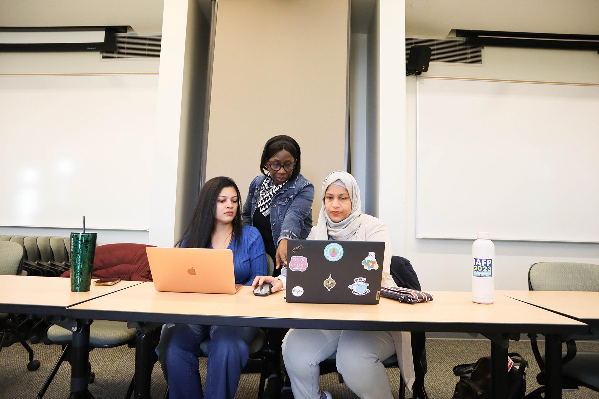

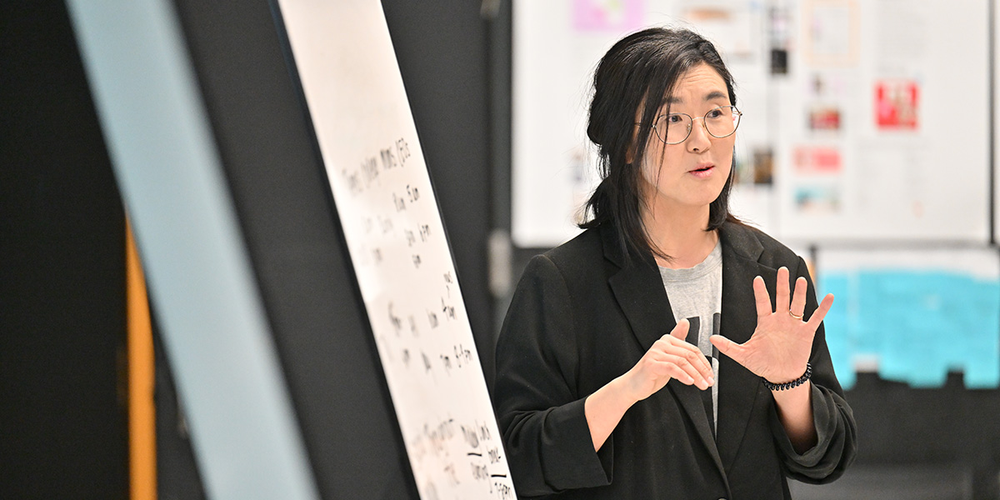

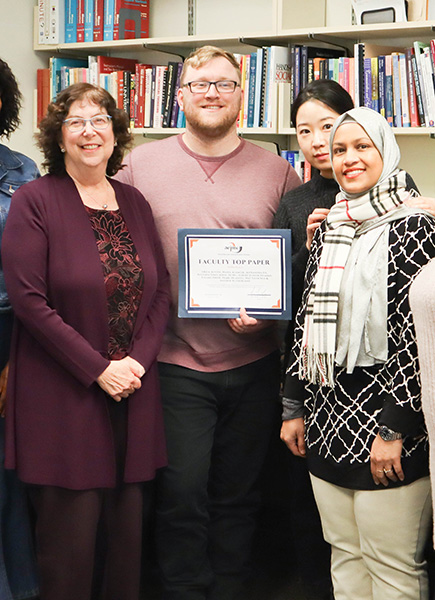

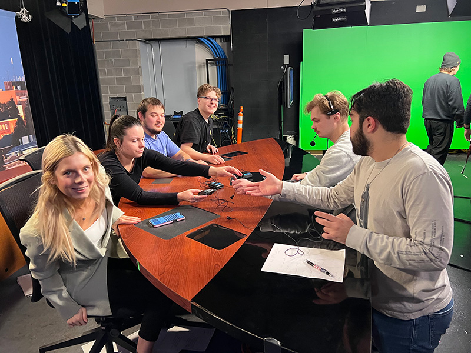

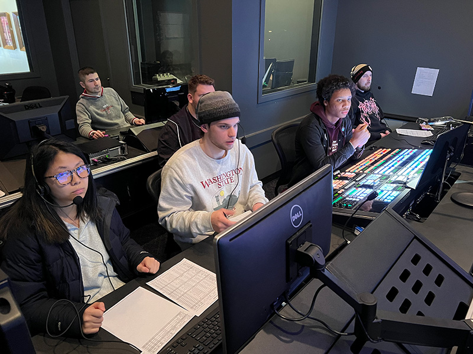

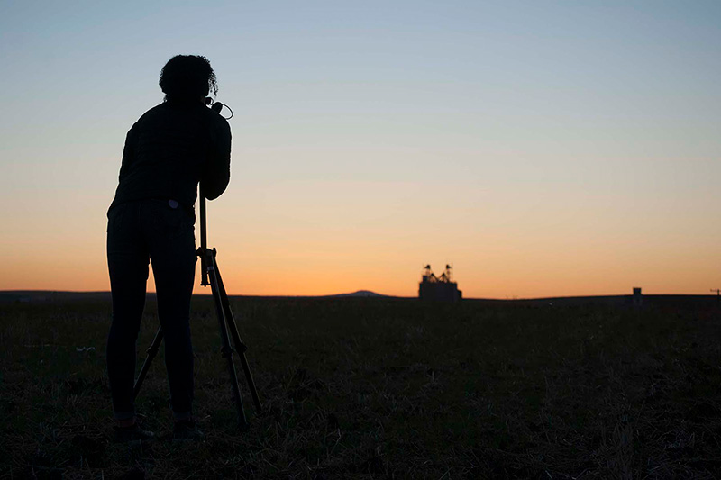

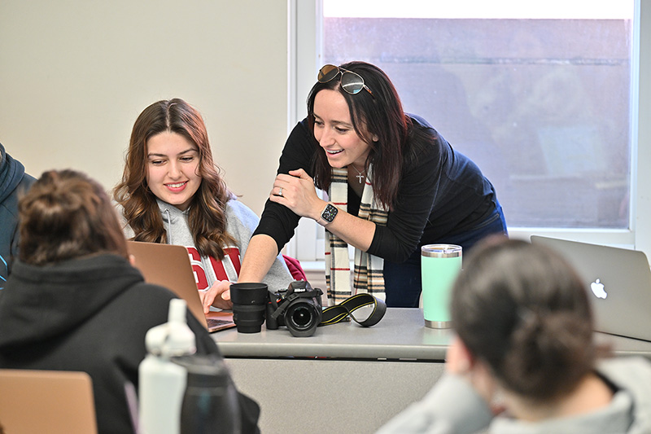

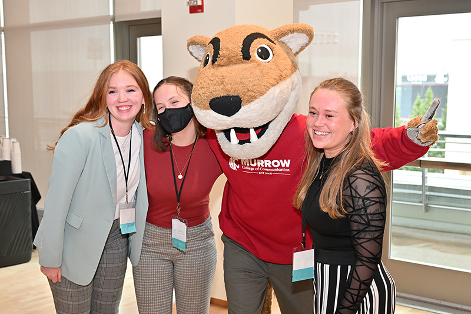

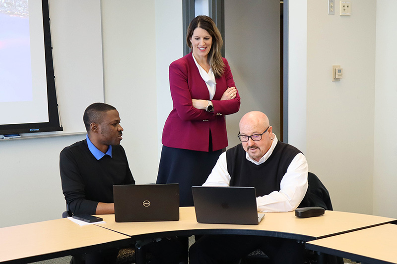

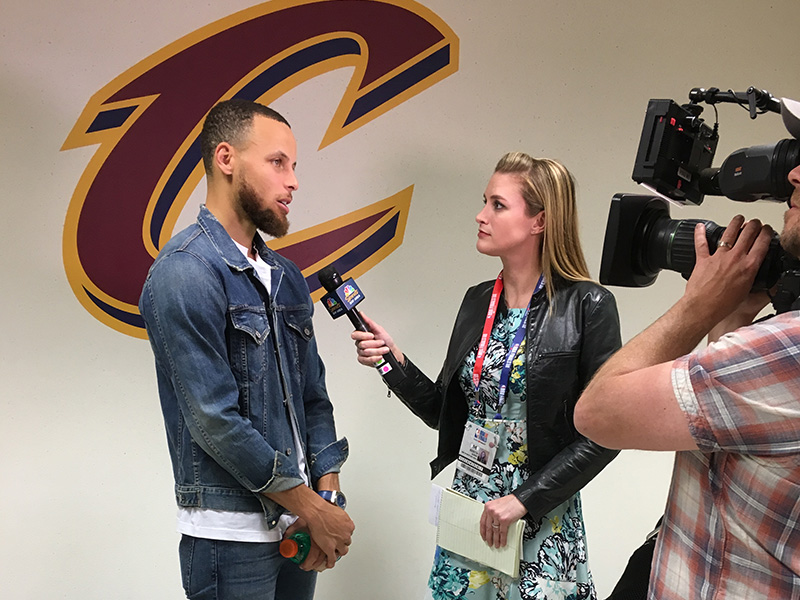

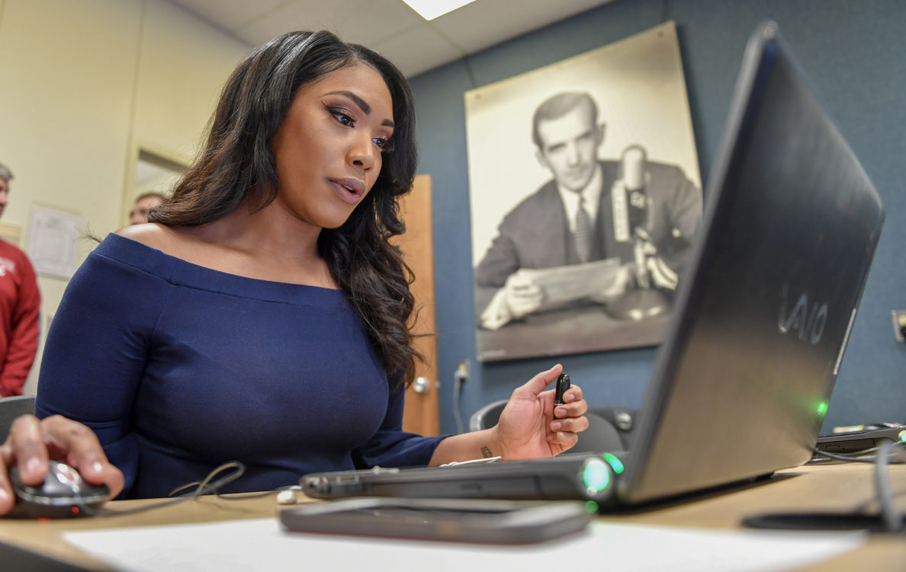

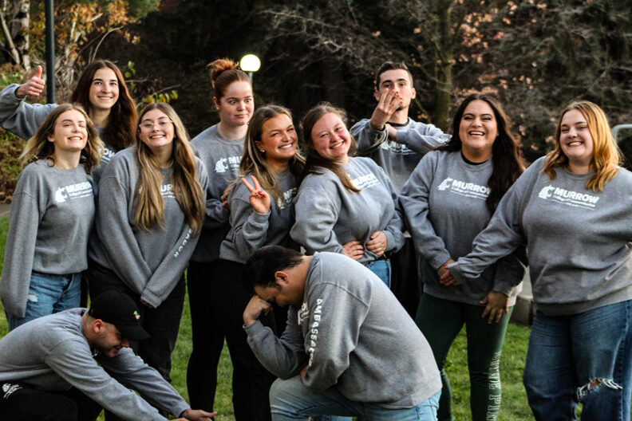

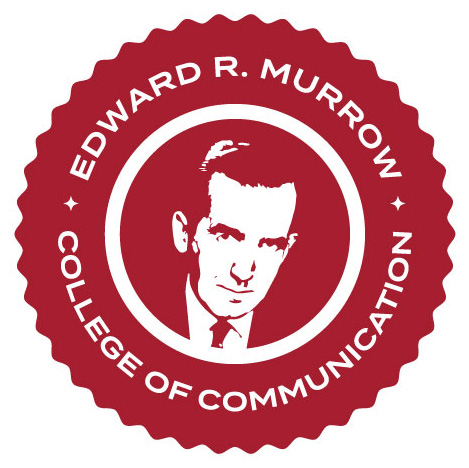

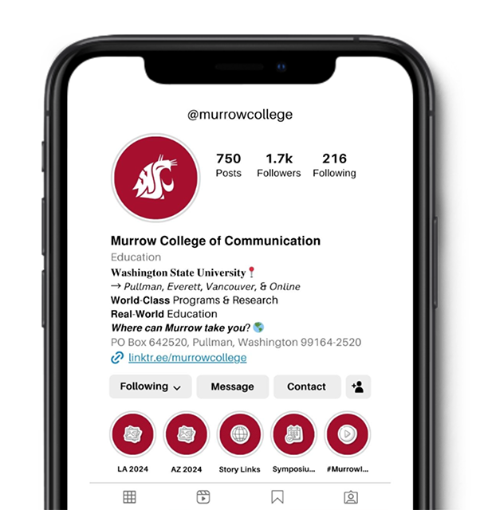

### ⚠️ Images Missing Alt Text (3)

- `image-26.jpg` — https://wpcdn.web.wsu.edu/wp-murrow/uploads/sites/3320/2025/05/girl-using-laptop-computer-from-home-while-studyin-2025-02-21-15-25-57-utc-scaled.jpg
- `Ana-Cabrera-1024x676-1-792x523.jpg` — https://wpcdn.web.wsu.edu/wp-murrow/uploads/sites/3320/2025/12/Ana-Cabrera-1024x676-1-792x523.jpg
- `Tricia-Raikes-1024x676-1-792x523.jpg` — https://wpcdn.web.wsu.edu/wp-murrow/uploads/sites/3320/2025/11/Tricia-Raikes-1024x676-1-792x523.jpg

## Files

- `01-page-loaded.png` — page-loaded (509.7 KB)
- `page.html` — rendered HTML content
- `metadata.json` — machine-readable scan data
- `errors.log` — JavaScript console errors
- `warnings.log` — JavaScript console warnings
- `info.log` — navigation and timing details
- `actions.log` — interactions performed on the page
- `images/` — 40 page images (5.6 MB)
