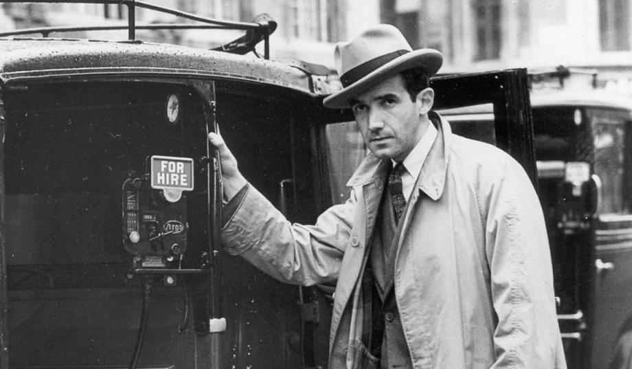
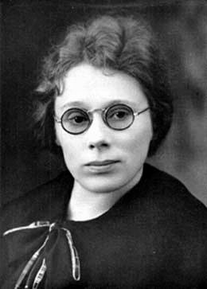
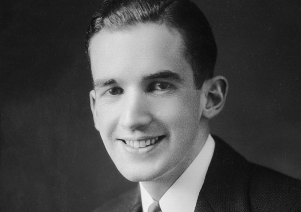
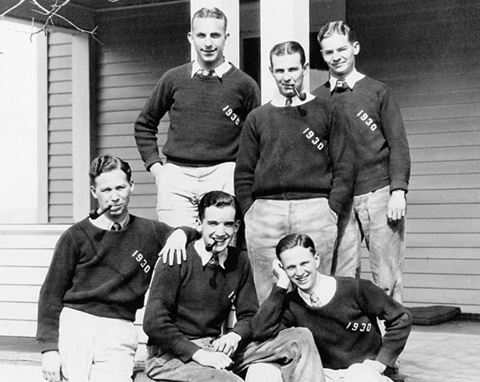
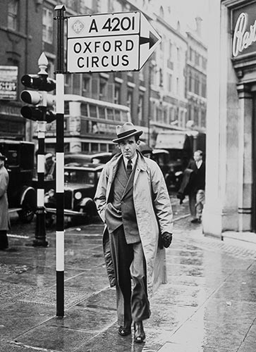
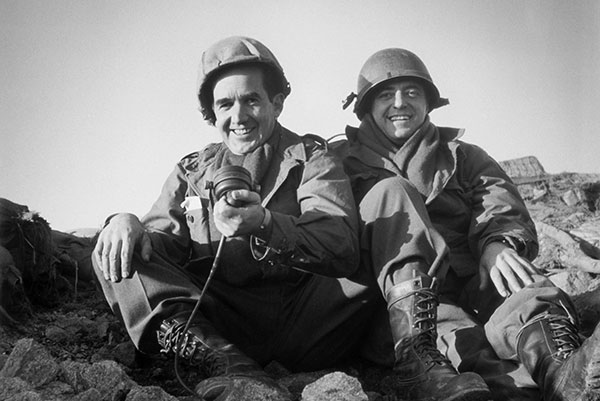
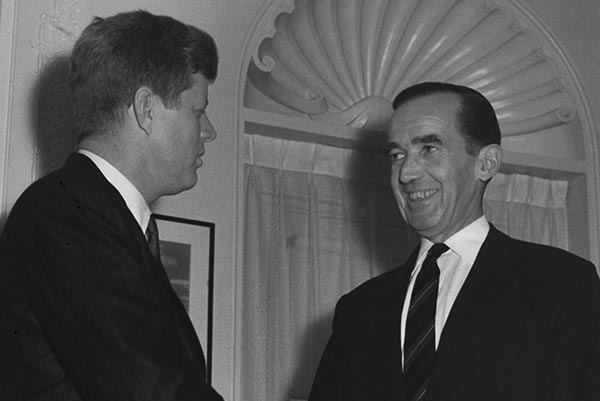
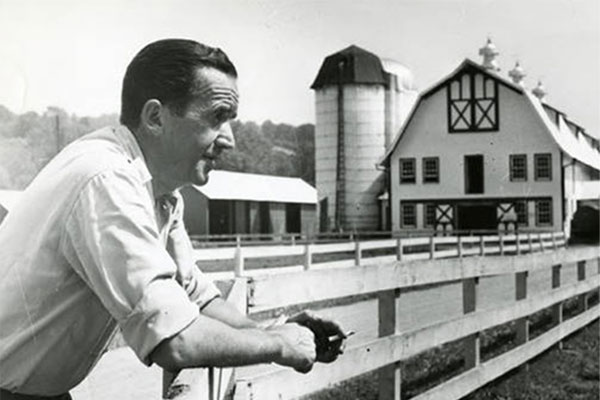
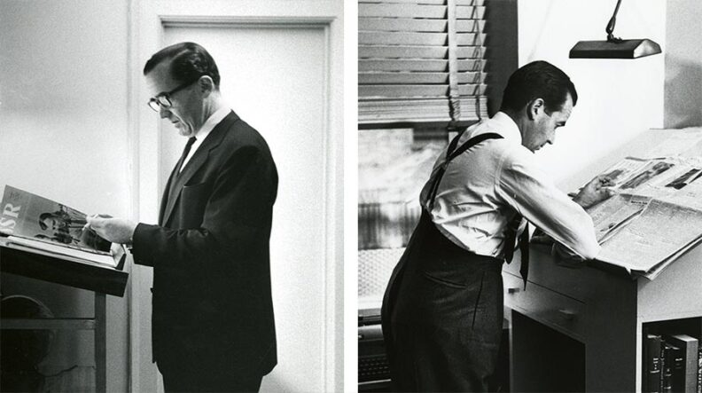
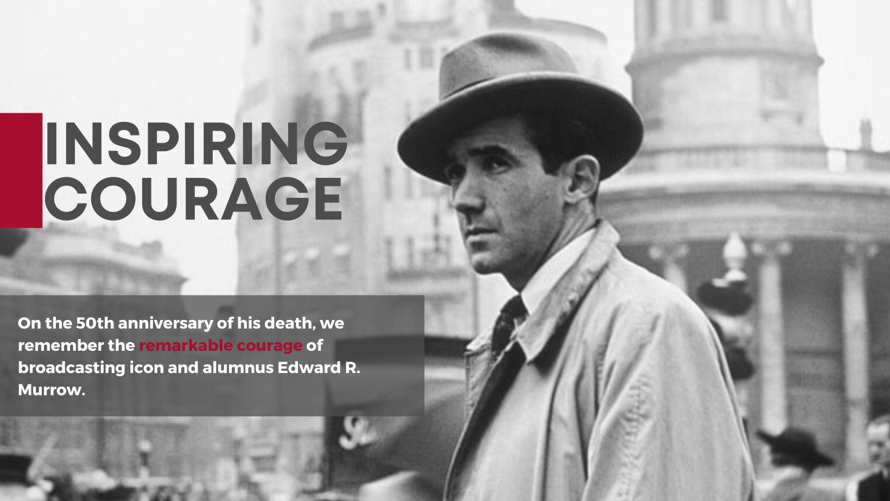

# Page Scan Report

| Field | Value |
|-------|-------|
| URL | https://murrow.wsu.edu/about/ |
| Redirected To | https://murrow.wsu.edu/about-edward-r-murrow/ |
| Title | About Edward R. Murrow | Edward R. Murrow College of Communication | Washington State University |
| Status | ❌ 0 |
| HTML Size | 276.3 KB |
| Screenshots | 1 (2.3 MB) |
| Images | 10 (1.0 MB) |
| Images Missing Alt | 0 |
| JS Errors | 0 |
| JS Warnings | 0 |
| Auth | none |
| Captured | 2026-02-16T21:00:42.3455060Z |

## Actions

- Screenshot #1: page-loaded (2.3 MB)
- Downloaded 10 images to /images/

## Screenshots

### 1. page-loaded

## Page Images (10)

| # | Image | Alt Text | Size |
|---|-------|----------|------|
| 1 | [Ed-Murrow.jpg](images/Ed-Murrow.jpg) | Ed Murrow Photo | 66.6 KB |
| 2 | [ida-lou-anderson1.jpg](images/ida-lou-anderson1.jpg) | Ida Lou Anderson | 14.8 KB |
| 3 | [young-edward-r-murrow.jpg](images/young-edward-r-murrow.jpg) | Young Edward R. Murrow | 29.8 KB |
| 4 | [murrow-frat-1930.jpg](images/murrow-frat-1930.jpg) | Murrow Fraternity 1930 | 67.8 KB |
| 5 | [murrow-oxford-circus.jpg](images/murrow-oxford-circus.jpg) | Edward R. Murrow walking down the street | 47.0 KB |
| 6 | [murrow-in-uniform.jpg](images/murrow-in-uniform.jpg) | Edward R. Murrow sites next to a man ... | 50.5 KB |
| 7 | [murrow-and-kennedy.jpg](images/murrow-and-kennedy.jpg) | Edward R. Murrow and President Kennedy | 27.1 KB |
| 8 | [murrow-on-a-farm.jpg](images/murrow-on-a-farm.jpg) | Edward R. Murrow leaning on a fence w... | 42.2 KB |
| 9 | [murrow-reading-newspaper-792x443.jpg](images/murrow-reading-newspaper-792x443.jpg) | Two images of Edward R. Murrow readin... | 56.6 KB |
| 10 | [Edward-R-Murrow-Inspiring-Courage.png](images/Edward-R-Murrow-Inspiring-Courage.png) | Inspiring Courage - On the 50th anniv... | 625.0 KB |

### Gallery

## Files

- `01-page-loaded.png` — page-loaded (2.3 MB)
- `page.html` — rendered HTML content
- `metadata.json` — machine-readable scan data
- `errors.log` — JavaScript console errors
- `warnings.log` — JavaScript console warnings
- `info.log` — navigation and timing details
- `actions.log` — interactions performed on the page
- `images/` — 10 page images (1.0 MB)
