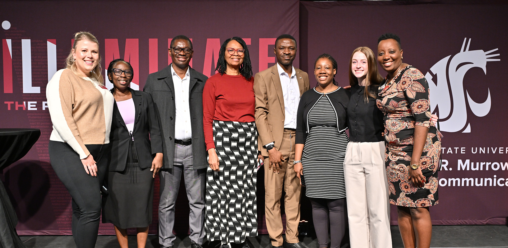

# Page Scan Report

| Field | Value |
|-------|-------|
| URL | https://murrow.wsu.edu/graduate/ |
| Redirected To | https://murrow.wsu.edu/graduate-programs/ |
| Title | Graduate Programs | Edward R. Murrow College of Communication | Washington State University |
| Status | ✅ 200 |
| HTML Size | 244.9 KB |
| Screenshots | 1 (1.6 MB) |
| Images | 7 (1.2 MB) |
| Images Missing Alt | 1 |
| JS Errors | 0 |
| JS Warnings | 0 |
| Auth | none |
| Captured | 2026-02-16T21:01:19.9798832Z |

## Actions

- Screenshot #1: page-loaded (1.6 MB)
- Downloaded 7 images to /images/

## Screenshots

### 1. page-loaded

## Page Images (7)

| # | Image | Alt Text | Size |
|---|-------|----------|------|
| 1 | [Grad-Students-Symposium-2024-1.jpg](images/Grad-Students-Symposium-2024-1.jpg) | Murrow Graduate Students Symposium 2024 | 705.9 KB |
| 2 | [MAC-Lab-Group_2-19-2025_1200x800-792x528.jpg](images/MAC-Lab-Group_2-19-2025_1200x800-792x528.jpg) | MAC lab group | 68.0 KB |
| 3 | [students-on-a-laptop.jpg](images/students-on-a-laptop.jpg) | students leaning over a laptop | 148.7 KB |
| 4 | [two-students-on-a-laptop.jpg](images/two-students-on-a-laptop.jpg) | Two students at a computer. | 215.7 KB |
| 5 | [Di_Mu.jpg](images/Di_Mu.jpg) | Di Mu | 12.0 KB |
| 6 | [Ying-Chia_Louise_Hsu.jpg](images/Ying-Chia_Louise_Hsu.jpg) | Louise Ying-Chia Hsu | 9.4 KB |
| 7 | [Jeremy_Watson-1-396x396.jpg](images/Jeremy_Watson-1-396x396.jpg) | *(none)* | 46.0 KB |

### Gallery

### ⚠️ Images Missing Alt Text (1)

- `Jeremy_Watson-1-396x396.jpg` — https://s3.wp.wsu.edu/uploads/sites/908/2023/10/Jeremy_Watson-1-396x396.jpg

## Files

- `01-page-loaded.png` — page-loaded (1.6 MB)
- `page.html` — rendered HTML content
- `metadata.json` — machine-readable scan data
- `errors.log` — JavaScript console errors
- `warnings.log` — JavaScript console warnings
- `info.log` — navigation and timing details
- `actions.log` — interactions performed on the page
- `images/` — 7 page images (1.2 MB)
