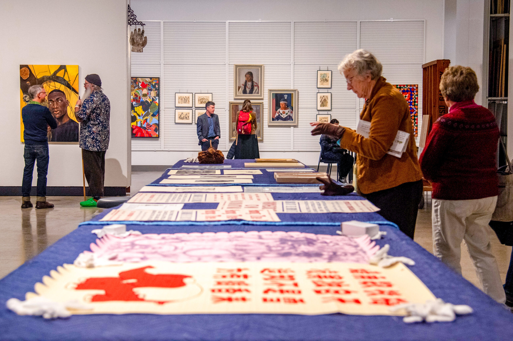
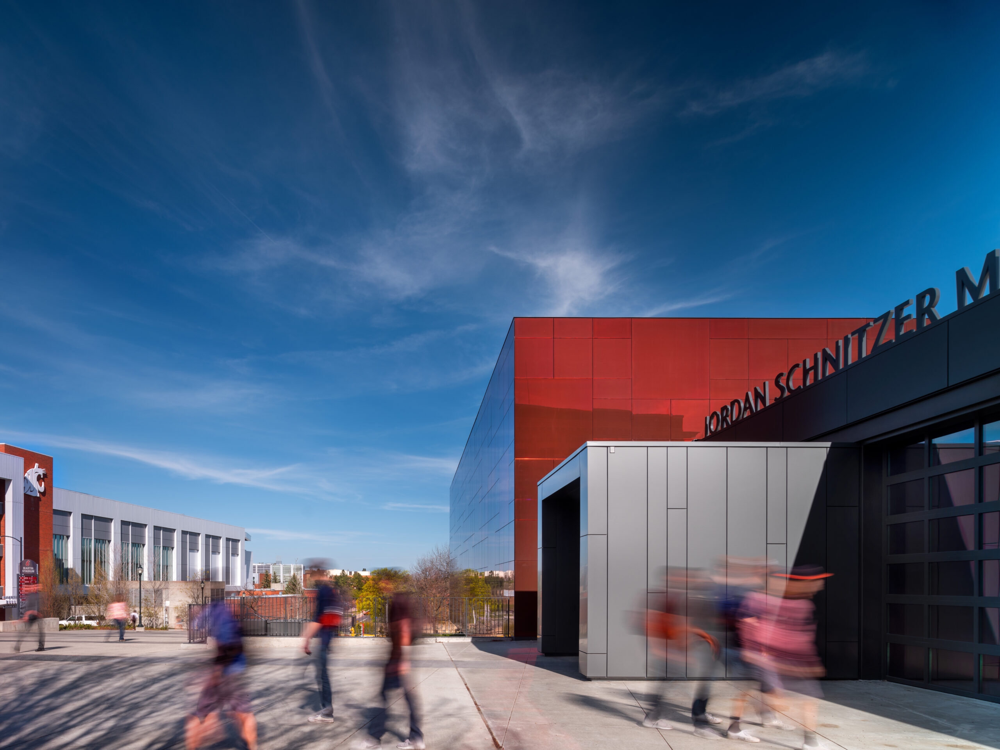
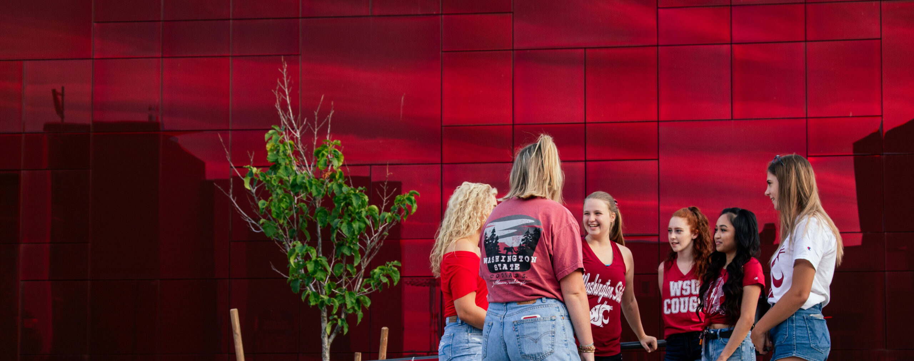
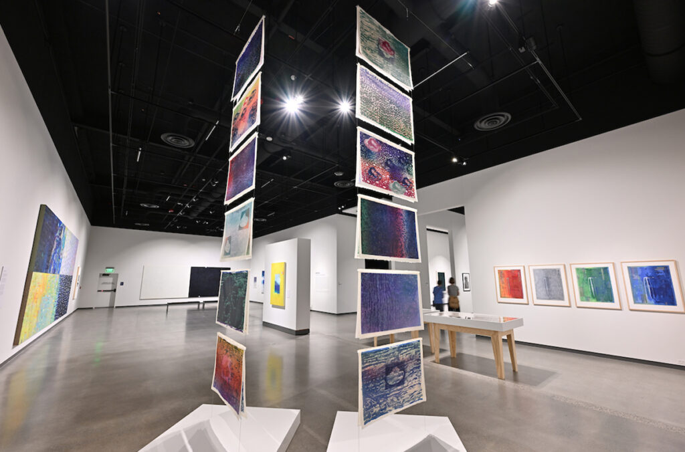
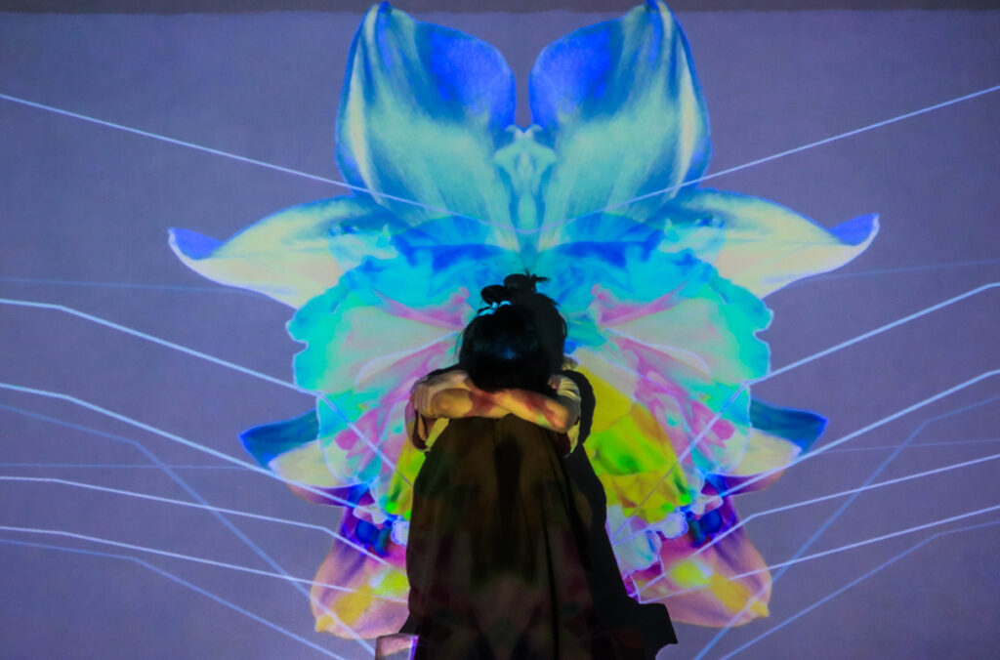
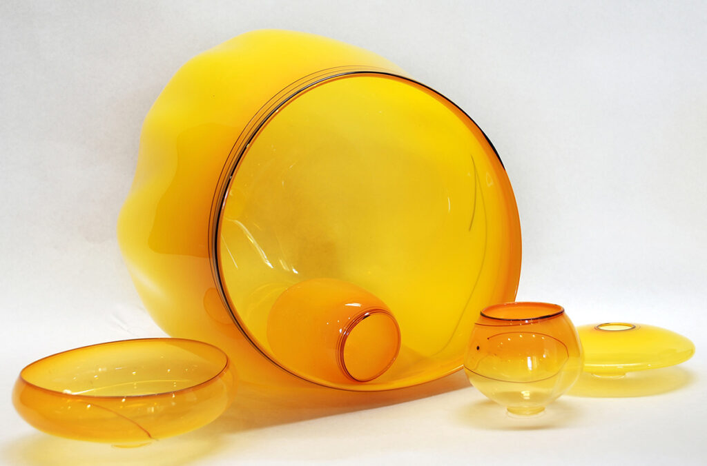
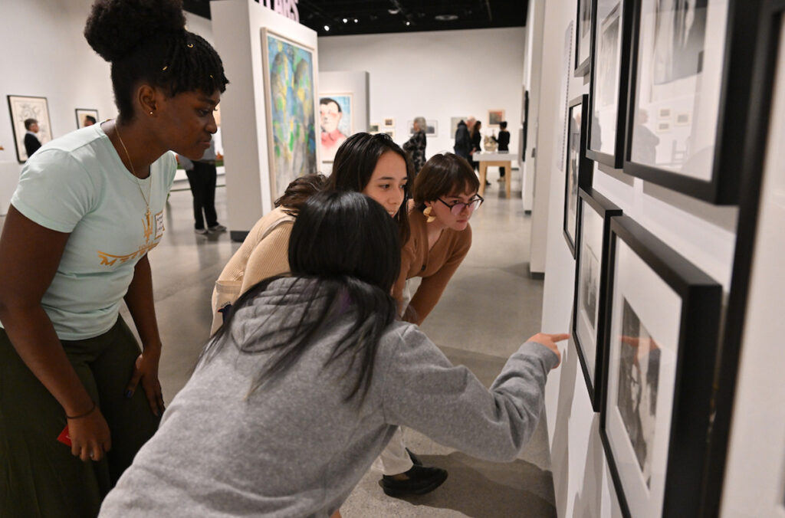

# 📄 Page Scan Report

> **URL:** https://museum.wsu.edu/  
> **Captured:** 2026-02-16 22:19:32 UTC  
> **Status:** ✅ 200  

---

## 📑 Contents

- [Summary](#-summary)
- [Screenshots](#-screenshots)
- [Page Images](#-page-images)
- [JavaScript Errors](#-javascript-errors)
- [Actions](#-actions)
- [Files](#-files)

---

## 📋 Summary

| Field | Value |
|-------|-------|
| URL | https://museum.wsu.edu/ |
| Title | Jordan Schnitzer Museum of Art WSU | Washington State University |
| Status | ✅ 200 |
| HTML Size | 245.9 KB |
| Screenshots | 1 (1.9 MB) |
| Images | 12 (4.3 MB) |
| Images Missing Alt | ✅ 0 |
| JS Errors | 🔴 1 |
| JS Warnings | 0 |
| Auth | none |
| Captured | 2026-02-16T22:19:32.1386834Z |

## 🔴 JavaScript Errors

<details>
<summary><strong>1 error(s) detected</strong></summary>

```
Failed to load resource: the server responded with a status of 405 ()
```

</details>

## 🔧 Actions

<details>
<summary><strong>2 action(s) performed</strong></summary>

- Screenshot #1: page-loaded (1.9 MB)
- Downloaded 12 images to /images/

</details>

## 📸 Screenshots

<table>
<tr>
<td align="center" width="50%">
<a href="01-page-loaded.png">

</a>
<br /><strong>1. page-loaded</strong>
<br /><sub>1.9 MB</sub>
</td>
<td></td>
</tr>
</table>

## 🖼️ Page Images (12)

<details open>
<summary><strong>📋 Image Index</strong> — 12 images, 4.3 MB</summary>

| # | Image | Alt Text | Size |
|--:|-------|----------|-----:|
| 1 | [JSMOAWSU-LOGO-DOUBLE-LINE-396x99-1.jpg](images/JSMOAWSU-LOGO-DOUBLE-LINE-396x99-1.jpg) | Jordan Schnitzer Museum of Art WSU | 10.2 KB |
| 2 | [733.017webcropped-scaled.jpg](images/733.017webcropped-scaled.jpg) | Outdoor view of Museum Entrance | 311.0 KB |
| 3 | [First-Year-Programs24-9_HeroBanner-_Exhib-scaled.jpg](images/First-Year-Programs24-9_HeroBanner-_Exhib-scaled.jpg) | A student observes two watercolor pai... | 569.6 KB |
| 4 | [Collection-Open-House-13-scaled.jpg](images/Collection-Open-House-13-scaled.jpg) | Visitors mingle and look at artwork i... | 925.8 KB |
| 5 | [image-5.jpg](images/image-5.jpg) | A class of students listens to a teac... | 1.2 MB |
| 6 | [733.014_@_Nic_Lehoux-scaled.jpg](images/733.014_@_Nic_Lehoux-scaled.jpg) | People walking near the museum door. | 442.8 KB |
| 7 | [JSMA-Exterior-19-8.22-13.new_-scaled.jpg](images/JSMA-Exterior-19-8.22-13.new_-scaled.jpg) | A group of WSU students gathered outs... | 345.4 KB |
| 8 | [smithexhibition-1024x676.jpg](images/smithexhibition-1024x676.jpg) | Keiko Hara: Four Decades of Paintings... | 122.4 KB |
| 9 | [Jordan-Schnitzer-Museum-of-Art-sign-1024x676.jpg](images/Jordan-Schnitzer-Museum-of-Art-sign-1024x676.jpg) | Sign above the entrance to the Jordan... | 125.4 KB |
| 10 | [MFAthesis-1024x676.jpg](images/MFAthesis-1024x676.jpg) | Closeup of artwork by Anna Le | 116.5 KB |
| 11 | [glassart-1024x676.jpg](images/glassart-1024x676.jpg) | A closeup of a glass-blown basket set. | 119.6 KB |
| 12 | [artmuseum1-1024x676.jpg](images/artmuseum1-1024x676.jpg) | Four women looking at a photography c... | 129.6 KB |

</details>

<details open>
<summary><strong>🖼️ Gallery</strong></summary>

<table>
<tr>
<td align="center" width="33%">
<a href="images/JSMOAWSU-LOGO-DOUBLE-LINE-396x99-1.jpg">

</a>
<br /><sub>JSMOAWSU-LOGO-DOUBLE-LINE-396x99-1.jpg</sub>
</td>
<td align="center" width="33%">
<a href="images/733.017webcropped-scaled.jpg">

</a>
<br /><sub>733.017webcropped-scaled.jpg</sub>
</td>
<td align="center" width="33%">
<a href="images/First-Year-Programs24-9_HeroBanner-_Exhib-scaled.jpg">

</a>
<br /><sub>First-Year-Programs24-9_HeroBanner-_Exhib-scaled.jpg</sub>
</td>
</tr>
<tr>
<td align="center" width="33%">
<a href="images/Collection-Open-House-13-scaled.jpg">

</a>
<br /><sub>Collection-Open-House-13-scaled.jpg</sub>
</td>
<td align="center" width="33%">
<a href="images/image-5.jpg">

</a>
<br /><sub>image-5.jpg</sub>
</td>
<td align="center" width="33%">
<a href="images/733.014_@_Nic_Lehoux-scaled.jpg">

</a>
<br /><sub>733.014_@_Nic_Lehoux-scaled.jpg</sub>
</td>
</tr>
<tr>
<td align="center" width="33%">
<a href="images/JSMA-Exterior-19-8.22-13.new_-scaled.jpg">

</a>
<br /><sub>JSMA-Exterior-19-8.22-13.new_-scaled.jpg</sub>
</td>
<td align="center" width="33%">
<a href="images/smithexhibition-1024x676.jpg">

</a>
<br /><sub>smithexhibition-1024x676.jpg</sub>
</td>
<td align="center" width="33%">
<a href="images/Jordan-Schnitzer-Museum-of-Art-sign-1024x676.jpg">

</a>
<br /><sub>Jordan-Schnitzer-Museum-of-Art-sign-1024x676.jpg</sub>
</td>
</tr>
<tr>
<td align="center" width="33%">
<a href="images/MFAthesis-1024x676.jpg">

</a>
<br /><sub>MFAthesis-1024x676.jpg</sub>
</td>
<td align="center" width="33%">
<a href="images/glassart-1024x676.jpg">

</a>
<br /><sub>glassart-1024x676.jpg</sub>
</td>
<td align="center" width="33%">
<a href="images/artmuseum1-1024x676.jpg">

</a>
<br /><sub>artmuseum1-1024x676.jpg</sub>
</td>
</tr>
</table>

</details>

## 📁 Files

| File | Description |
|------|-------------|
| `01-page-loaded.png` | page-loaded (1.9 MB) |
| `page.html` | Rendered HTML content |
| `metadata.json` | Machine-readable scan data |
| `errors.log` | JavaScript console errors |
| `warnings.log` | JavaScript console warnings |
| `info.log` | Navigation and timing details |
| `actions.log` | Interactions performed |
| `images/` | 12 page images (4.3 MB) |

---

*Generated by AccessibilityScanner (FreeTools) v1.0*
