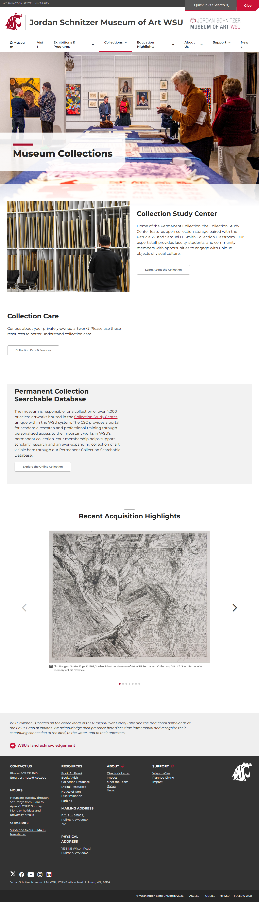
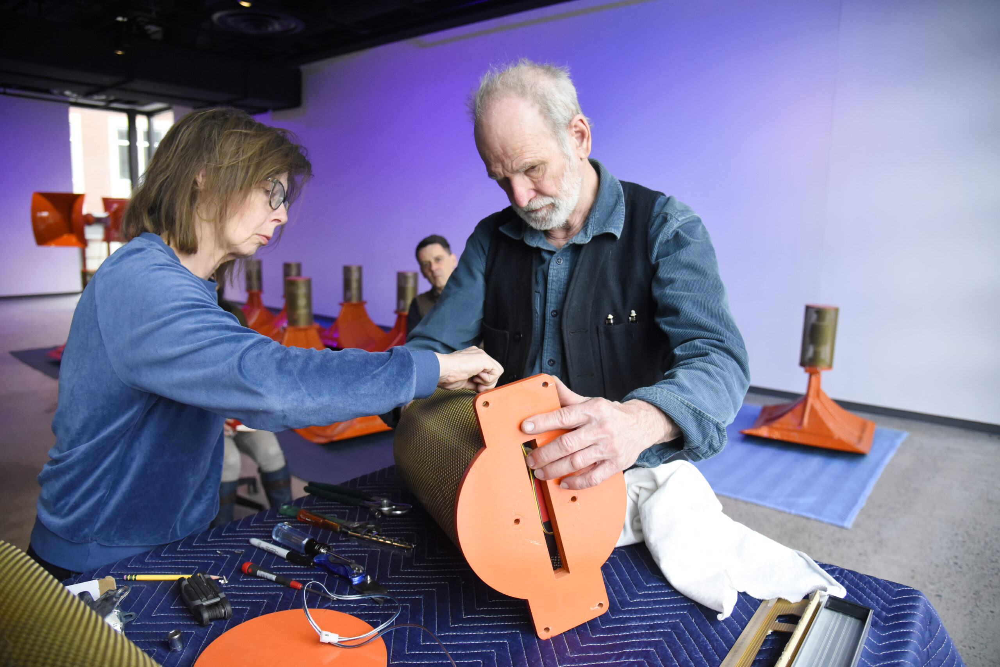
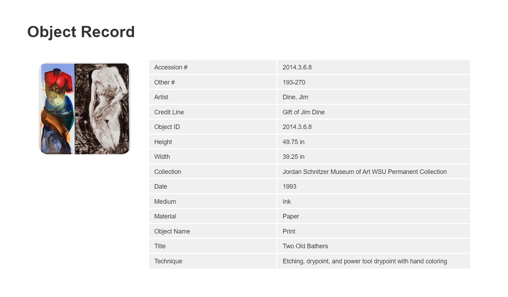
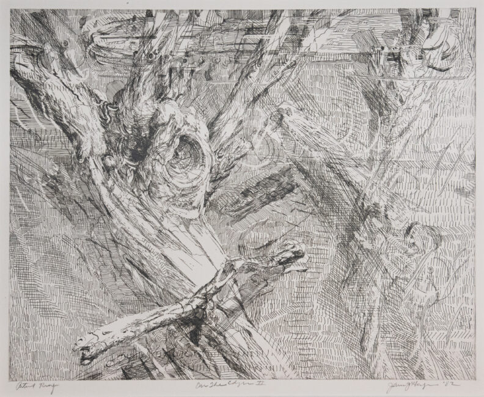
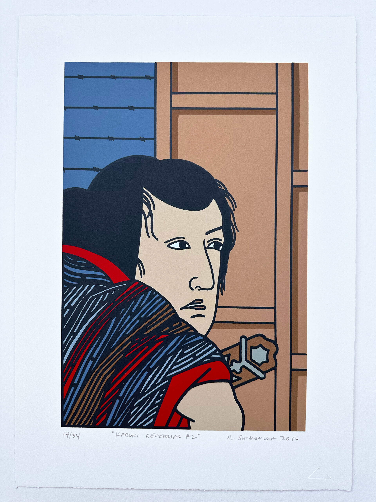
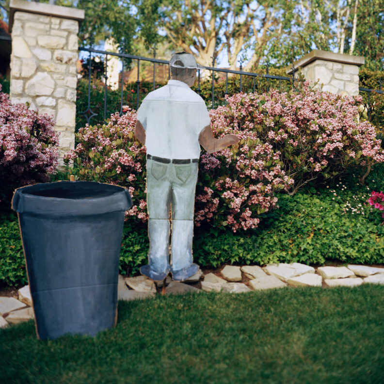
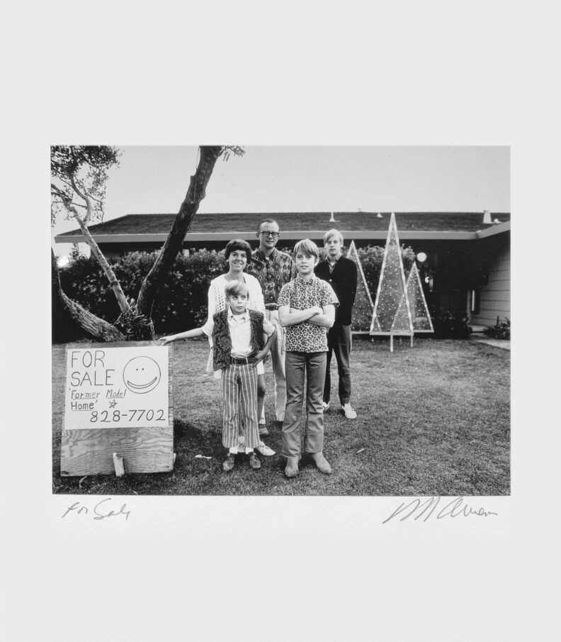
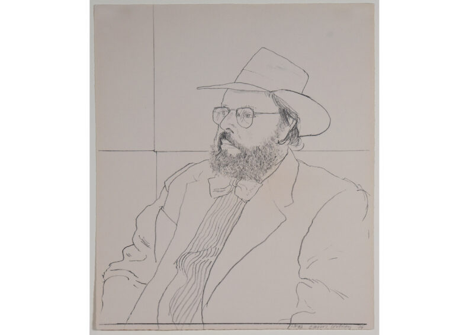
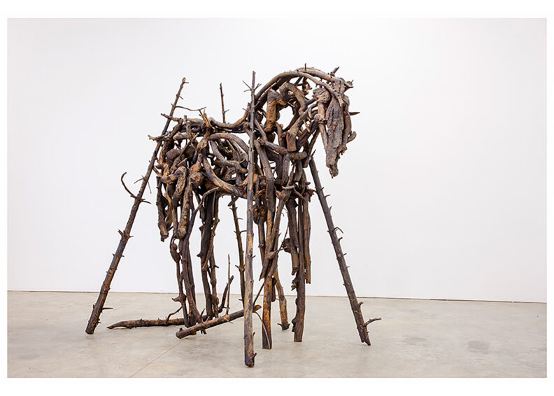
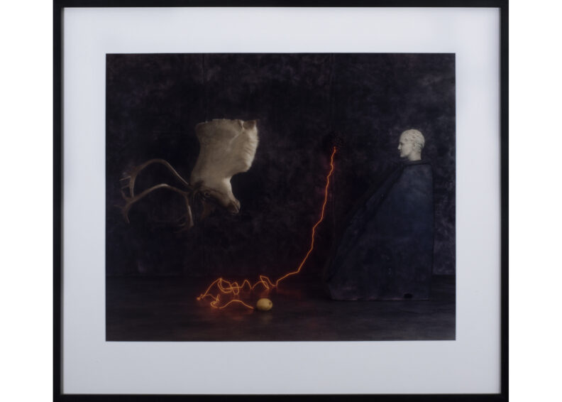

# Page Scan Report

| Field | Value |
|-------|-------|
| URL | https://museum.wsu.edu/collections/ |
| Redirected To | https://museum.wsu.edu/museum-collections/ |
| Title | Museum Collections | Jordan Schnitzer Museum of Art WSU | Washington State University |
| Status | ❌ 0 |
| HTML Size | 236.7 KB |
| Screenshots | 1 (2.7 MB) |
| Images | 12 (3.6 MB) |
| Images Missing Alt | 4 |
| JS Errors | 1 |
| JS Warnings | 0 |
| Auth | none |
| Captured | 2026-02-16T20:39:45.7467591Z |

## JavaScript Errors

- `Failed to load resource: the server responded with a status of 405 ()`

## Actions

- Screenshot #1: page-loaded (2.7 MB)
- Downloaded 12 images to /images/

## Screenshots

### 1. page-loaded

## Page Images (12)

| # | Image | Alt Text | Size |
|---|-------|----------|------|
| 1 | [JSMOAWSU-LOGO-DOUBLE-LINE-396x99-1.jpg](images/JSMOAWSU-LOGO-DOUBLE-LINE-396x99-1.jpg) | Jordan Schnitzer Museum of Art WSU | 10.2 KB |
| 2 | [Collection-Open-House-13-scaled.jpg](images/Collection-Open-House-13-scaled.jpg) | Visitors mingle and look at artwork i... | 925.8 KB |
| 3 | [DSC_1182-scaled.jpg](images/DSC_1182-scaled.jpg) | A student stands in front of a storag... | 691.6 KB |
| 4 | [041723_Trimpin_006-scaled.jpg](images/041723_Trimpin_006-scaled.jpg) | Two people work on an orange cylinder | 536.5 KB |
| 5 | [Online-Database-Jim-Dine.png](images/Online-Database-Jim-Dine.png) | A screengrab of the online database f... | 197.5 KB |
| 6 | [Hodges-Jim_On-the-Edge-II-1-792x650.jpg](images/Hodges-Jim_On-the-Edge-II-1-792x650.jpg) | *(none)* | 195.1 KB |
| 7 | [Shimomura_KABUKI-REHEARSAL-2_2012-scaled.jpg](images/Shimomura_KABUKI-REHEARSAL-2_2012-scaled.jpg) | *(none)* | 629.1 KB |
| 8 | [gomez_gardener-strada-corta-road-792x792.jpg](images/gomez_gardener-strada-corta-road-792x792.jpg) | *(none)* | 235.9 KB |
| 9 | [owens_for-sale-792x905.jpg](images/owens_for-sale-792x905.jpg) | *(none)* | 84.5 KB |
| 10 | [David-Hockney_Henry-Geldzhaler-w-Hat-792x566.jpg](images/David-Hockney_Henry-Geldzhaler-w-Hat-792x566.jpg) | A drawing of a man in a hat. | 42.8 KB |
| 11 | [butterfield_Red-Forest_4-1.jpg@0.75x-1-792x566.jpg](images/butterfield_Red-Forest_4-1.jpg@0.75x-1-792x566.jpg) | Sculpture of a horse made out of bran... | 78.7 KB |
| 12 | [Ann.Hamilton.Cordova-1-792x566.jpg](images/Ann.Hamilton.Cordova-1-792x566.jpg) | A framed surrealist print.  | 48.0 KB |

### Gallery

### ⚠️ Images Missing Alt Text (4)

- `Hodges-Jim_On-the-Edge-II-1-792x650.jpg` — https://wpcdn.web.wsu.edu/wp-museum/uploads/sites/3189/2025/08/Hodges-Jim_On-the-Edge-II-1-792x650.jpg
- `Shimomura_KABUKI-REHEARSAL-2_2012-scaled.jpg` — https://wpcdn.web.wsu.edu/wp-museum/uploads/sites/3189/2025/08/Shimomura_KABUKI-REHEARSAL-2_2012-scaled.jpg
- `gomez_gardener-strada-corta-road-792x792.jpg` — https://wpcdn.web.wsu.edu/wp-museum/uploads/sites/3189/2025/08/gomez_gardener-strada-corta-road-792x792.jpg
- `owens_for-sale-792x905.jpg` — https://wpcdn.web.wsu.edu/wp-museum/uploads/sites/3189/2025/08/owens_for-sale-792x905.jpg

## Files

- `01-page-loaded.png` — page-loaded (2.7 MB)
- `page.html` — rendered HTML content
- `metadata.json` — machine-readable scan data
- `errors.log` — JavaScript console errors
- `warnings.log` — JavaScript console warnings
- `info.log` — navigation and timing details
- `actions.log` — interactions performed on the page
- `images/` — 12 page images (3.6 MB)
