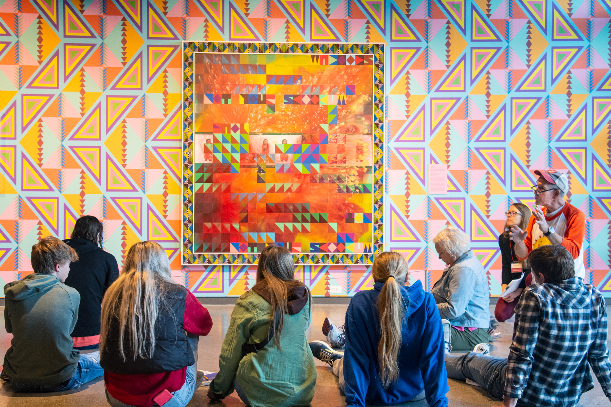
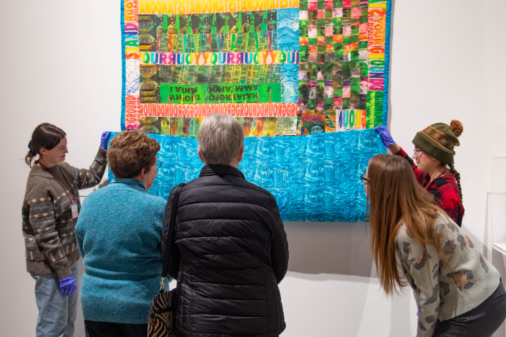
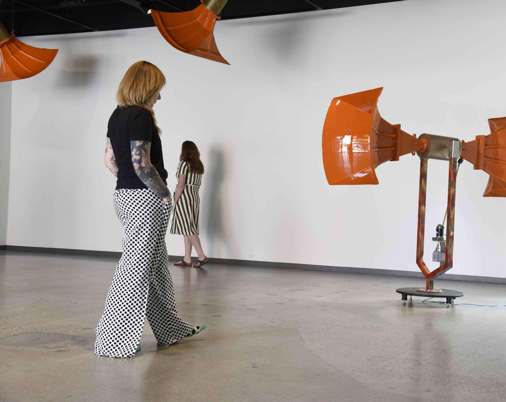
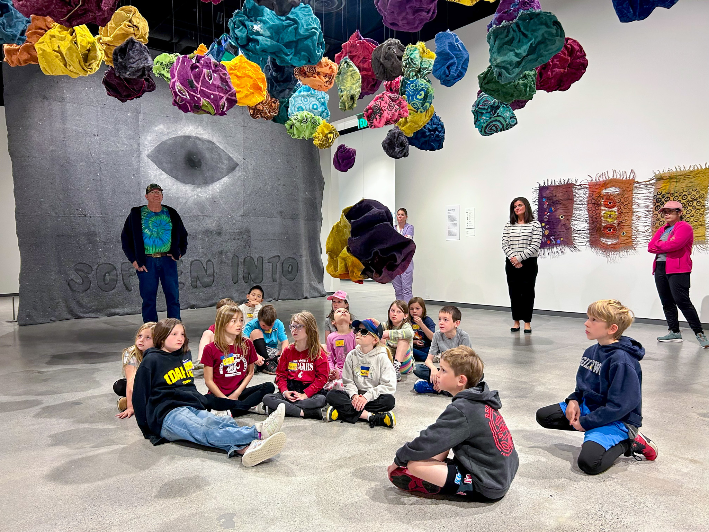

# Page Scan Report

| Field | Value |
|-------|-------|
| URL | https://museum.wsu.edu/education/ |
| Redirected To | https://museum.wsu.edu/education-highlights/ |
| Title | Education Highlights | Jordan Schnitzer Museum of Art WSU | Washington State University |
| Status | ✅ 200 |
| HTML Size | 233.4 KB |
| Screenshots | 1 (3.2 MB) |
| Images | 6 (4.2 MB) |
| Images Missing Alt | 0 |
| JS Errors | 1 |
| JS Warnings | 0 |
| Auth | none |
| Captured | 2026-02-16T20:40:14.1842368Z |

## JavaScript Errors

- `Failed to load resource: the server responded with a status of 405 ()`

## Actions

- Screenshot #1: page-loaded (3.2 MB)
- Downloaded 6 images to /images/

## Screenshots

### 1. page-loaded

## Page Images (6)

| # | Image | Alt Text | Size |
|---|-------|----------|------|
| 1 | [JSMOAWSU-LOGO-DOUBLE-LINE-396x99-1.jpg](images/JSMOAWSU-LOGO-DOUBLE-LINE-396x99-1.jpg) | Jordan Schnitzer Museum of Art WSU | 10.2 KB |
| 2 | [image-2.jpg](images/image-2.jpg) | A class of students listens to a teac... | 1.2 MB |
| 3 | [Quilt_Tour-8-scaled.jpg](images/Quilt_Tour-8-scaled.jpg) | Museum visitors observe a quilt held ... | 809.9 KB |
| 4 | [image-4.jpg](images/image-4.jpg) | A tour group listens to a museum cura... | 541.9 KB |
| 5 | [070722_Nitivia-Jones_WalkingMed_Art-Healing-_010_Crop-scaled.jpg](images/070722_Nitivia-Jones_WalkingMed_Art-Healing-_010_Crop-scaled.jpg) | People walking barefoot with the oran... | 488.6 KB |
| 6 | [MOA2_BAB-Page-2.jpg](images/MOA2_BAB-Page-2.jpg) | A group of elementary age children si... | 1.2 MB |

### Gallery

## Files

- `01-page-loaded.png` — page-loaded (3.2 MB)
- `page.html` — rendered HTML content
- `metadata.json` — machine-readable scan data
- `errors.log` — JavaScript console errors
- `warnings.log` — JavaScript console warnings
- `info.log` — navigation and timing details
- `actions.log` — interactions performed on the page
- `images/` — 6 page images (4.2 MB)
