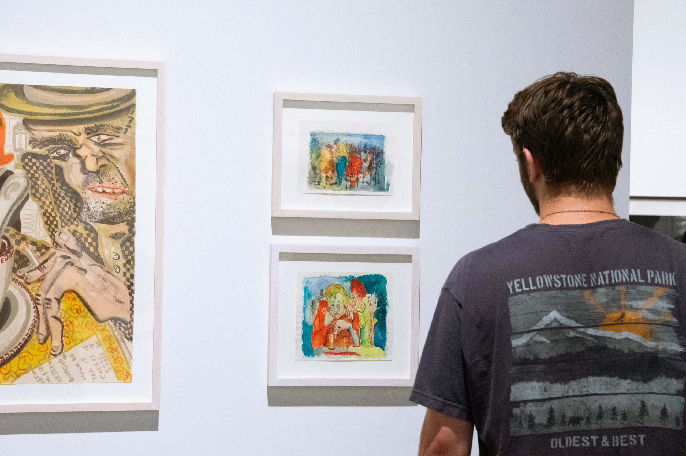
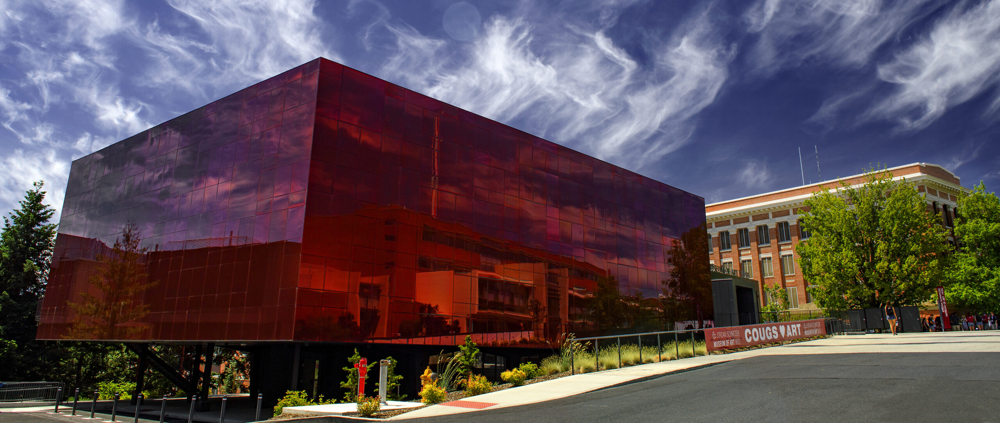
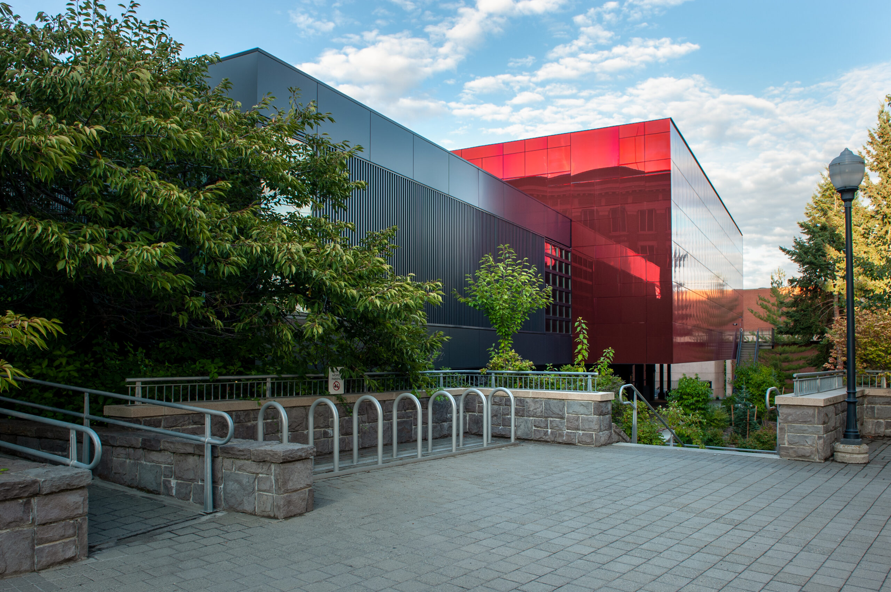
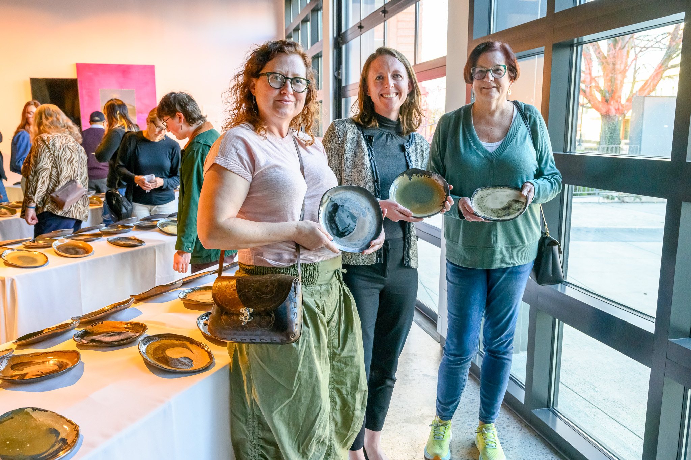
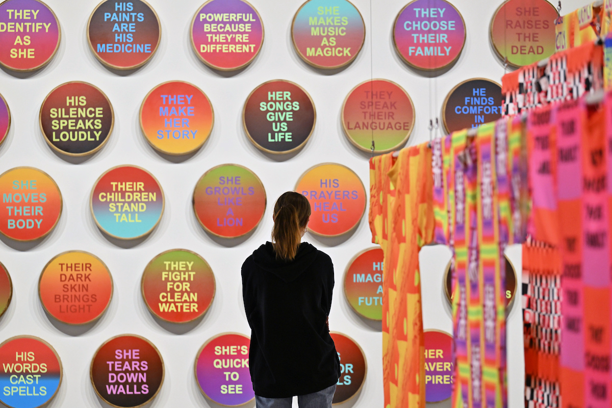
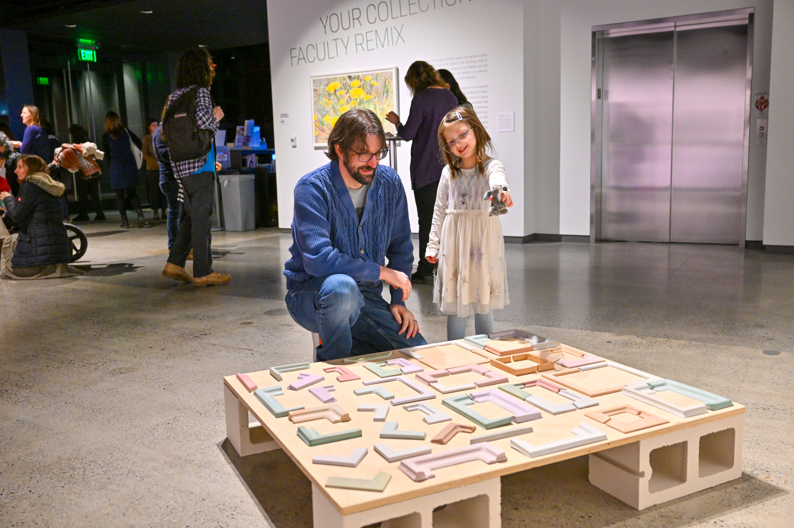

# 📄 Page Scan Report

> **URL:** https://museum.wsu.edu/exhibitions/  
> **Captured:** 2026-02-16 22:19:47 UTC  
> **Status:** ✅ 200  

---

## 📑 Contents

- [Summary](#-summary)
- [Screenshots](#-screenshots)
- [Page Images](#-page-images)
- [JavaScript Errors](#-javascript-errors)
- [Actions](#-actions)
- [Files](#-files)

---

## 📋 Summary

| Field | Value |
|-------|-------|
| URL | https://museum.wsu.edu/exhibitions/ |
| Redirected To | https://museum.wsu.edu/exhibitions-events/ |
| Title | Exhibitions & Programs | Jordan Schnitzer Museum of Art WSU | Washington State University |
| Status | ✅ 200 |
| HTML Size | 234.1 KB |
| Screenshots | 1 (1.2 MB) |
| Images | 7 (4.6 MB) |
| Images Missing Alt | ⚠️ 1 |
| JS Errors | 🔴 1 |
| JS Warnings | 0 |
| Auth | none |
| Captured | 2026-02-16T22:19:47.6148602Z |

## 🔴 JavaScript Errors

<details>
<summary><strong>1 error(s) detected</strong></summary>

```
Failed to load resource: the server responded with a status of 405 ()
```

</details>

## 🔧 Actions

<details>
<summary><strong>2 action(s) performed</strong></summary>

- Screenshot #1: page-loaded (1.2 MB)
- Downloaded 7 images to /images/

</details>

## 📸 Screenshots

<table>
<tr>
<td align="center" width="50%">
<a href="01-page-loaded.png">

</a>
<br /><strong>1. page-loaded</strong>
<br /><sub>1.2 MB</sub>
</td>
<td></td>
</tr>
</table>

## 🖼️ Page Images (7)

<details open>
<summary><strong>📋 Image Index</strong> — 7 images, 4.6 MB</summary>

| # | Image | Alt Text | Size |
|--:|-------|----------|-----:|
| 1 | [JSMOAWSU-LOGO-DOUBLE-LINE-396x99-1.jpg](images/JSMOAWSU-LOGO-DOUBLE-LINE-396x99-1.jpg) | Jordan Schnitzer Museum of Art WSU | 10.2 KB |
| 2 | [First-Year-Programs24-9_HeroBanner-_Exhib-scaled.jpg](images/First-Year-Programs24-9_HeroBanner-_Exhib-scaled.jpg) | A student observes two watercolor pai... | 569.6 KB |
| 3 | [Schnitzer-Museum-of-Art-Clouds_3446-cropped-scaled.jpg](images/Schnitzer-Museum-of-Art-Clouds_3446-cropped-scaled.jpg) | ⚠️ *(missing)* | 583.3 KB |
| 4 | [JSMA-Exterior-19-8.22-4-scaled.jpg](images/JSMA-Exterior-19-8.22-4-scaled.jpg) | An outdoor photo of the back of the a... | 1.0 MB |
| 5 | [Mount-St.-Helens-Ash-Plates-12_Program-Calendar.jpg](images/Mount-St.-Helens-Ash-Plates-12_Program-Calendar.jpg) | Three women smile and hold unique cer... | 976.6 KB |
| 6 | [DSC_4463_cc_Exhibition-Archive.jpg](images/DSC_4463_cc_Exhibition-Archive.jpg) | A visitor observes a colorful set of ... | 711.7 KB |
| 7 | [DSC_8835_Programs.Archive-1.jpg](images/DSC_8835_Programs.Archive-1.jpg) | A parent and child smile while lookin... | 778.5 KB |

</details>

<details open>
<summary><strong>🖼️ Gallery</strong></summary>

<table>
<tr>
<td align="center" width="33%">
<a href="images/JSMOAWSU-LOGO-DOUBLE-LINE-396x99-1.jpg">

</a>
<br /><sub>JSMOAWSU-LOGO-DOUBLE-LINE-396x99-1.jpg</sub>
</td>
<td align="center" width="33%">
<a href="images/First-Year-Programs24-9_HeroBanner-_Exhib-scaled.jpg">

</a>
<br /><sub>First-Year-Programs24-9_HeroBanner-_Exhib-scaled.jpg</sub>
</td>
<td align="center" width="33%">
<a href="images/Schnitzer-Museum-of-Art-Clouds_3446-cropped-scaled.jpg">

</a>
<br /><sub>Schnitzer-Museum-of-Art-Clouds_3446-cropped-scaled.jpg ⚠️</sub>
</td>
</tr>
<tr>
<td align="center" width="33%">
<a href="images/JSMA-Exterior-19-8.22-4-scaled.jpg">

</a>
<br /><sub>JSMA-Exterior-19-8.22-4-scaled.jpg</sub>
</td>
<td align="center" width="33%">
<a href="images/Mount-St.-Helens-Ash-Plates-12_Program-Calendar.jpg">

</a>
<br /><sub>Mount-St.-Helens-Ash-Plates-12_Program-Calendar.jpg</sub>
</td>
<td align="center" width="33%">
<a href="images/DSC_4463_cc_Exhibition-Archive.jpg">

</a>
<br /><sub>DSC_4463_cc_Exhibition-Archive.jpg</sub>
</td>
</tr>
<tr>
<td align="center" width="33%">
<a href="images/DSC_8835_Programs.Archive-1.jpg">

</a>
<br /><sub>DSC_8835_Programs.Archive-1.jpg</sub>
</td>
<td></td>
<td></td>
</tr>
</table>

</details>

<details>
<summary>⚠️ <strong>Images Missing Alt Text</strong> (1)</summary>

| Image | Source URL |
|-------|-----------|
| `Schnitzer-Museum-of-Art-Clouds_3446-cropped-scaled.jpg` | https://wpcdn.web.wsu.edu/wp-museum/uploads/sites/3189/2023/06/Schnitzer-Muse... |

</details>

## 📁 Files

| File | Description |
|------|-------------|
| `01-page-loaded.png` | page-loaded (1.2 MB) |
| `page.html` | Rendered HTML content |
| `metadata.json` | Machine-readable scan data |
| `errors.log` | JavaScript console errors |
| `warnings.log` | JavaScript console warnings |
| `info.log` | Navigation and timing details |
| `actions.log` | Interactions performed |
| `images/` | 7 page images (4.6 MB) |

---

*Generated by AccessibilityScanner (FreeTools) v1.0*
