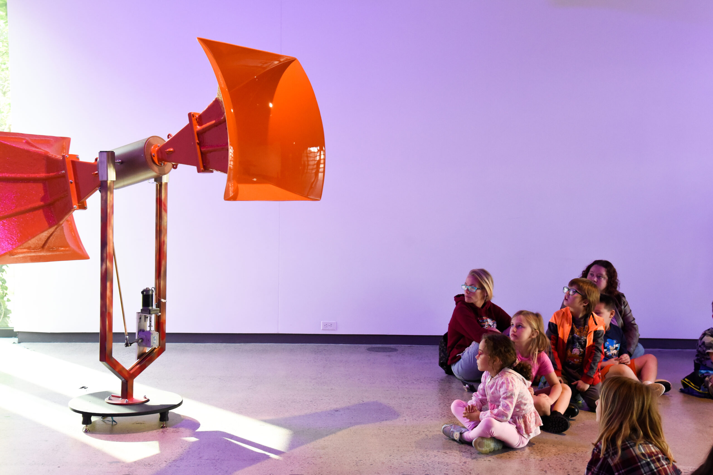

# Page Scan Report

| Field | Value |
|-------|-------|
| URL | https://museum.wsu.edu/support/ |
| Redirected To | https://museum.wsu.edu/support-the-museum/ |
| Title | Support the Museum | Jordan Schnitzer Museum of Art WSU | Washington State University |
| Status | ✅ 200 |
| HTML Size | 233.4 KB |
| Screenshots | 1 (2.1 MB) |
| Images | 5 (1.5 MB) |
| Images Missing Alt | 0 |
| JS Errors | 1 |
| JS Warnings | 0 |
| Auth | none |
| Captured | 2026-02-16T21:01:28.8237162Z |

## JavaScript Errors

- `Failed to load resource: the server responded with a status of 405 ()`

## Actions

- Screenshot #1: page-loaded (2.1 MB)
- Downloaded 5 images to /images/

## Screenshots

### 1. page-loaded

## Page Images (5)

| # | Image | Alt Text | Size |
|---|-------|----------|------|
| 1 | [JSMOAWSU-LOGO-DOUBLE-LINE-396x99-1.jpg](images/JSMOAWSU-LOGO-DOUBLE-LINE-396x99-1.jpg) | Jordan Schnitzer Museum of Art WSU | 10.2 KB |
| 2 | [JSMA-Exterior-19-8.22-13.new_-scaled.jpg](images/JSMA-Exterior-19-8.22-13.new_-scaled.jpg) | A group of WSU students gathered outs... | 345.4 KB |
| 3 | [DSC_3217-scaled.jpg](images/DSC_3217-scaled.jpg) | Two visitors observe two framed print... | 352.0 KB |
| 4 | [DSC6576-scaled.jpg](images/DSC6576-scaled.jpg) | An audience sits in a gallery during ... | 414.8 KB |
| 5 | [About-Us-Impact-Banner_DSC5646-1-scaled.jpg](images/About-Us-Impact-Banner_DSC5646-1-scaled.jpg) | Children sitting to the right of a la... | 441.6 KB |

### Gallery

## Files

- `01-page-loaded.png` — page-loaded (2.1 MB)
- `page.html` — rendered HTML content
- `metadata.json` — machine-readable scan data
- `errors.log` — JavaScript console errors
- `warnings.log` — JavaScript console warnings
- `info.log` — navigation and timing details
- `actions.log` — interactions performed on the page
- `images/` — 5 page images (1.5 MB)
