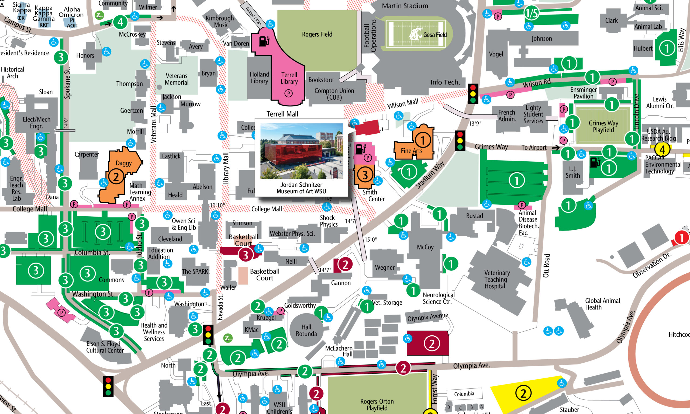

# 📄 Page Scan Report

> **URL:** https://museum.wsu.edu/visit/  
> **Captured:** 2026-02-16 22:19:40 UTC  
> **Status:** ✅ 200  

---

## 📑 Contents

- [Summary](#-summary)
- [Screenshots](#-screenshots)
- [Page Images](#-page-images)
- [JavaScript Errors](#-javascript-errors)
- [Actions](#-actions)
- [Files](#-files)

---

## 📋 Summary

| Field | Value |
|-------|-------|
| URL | https://museum.wsu.edu/visit/ |
| Title | Visit | Jordan Schnitzer Museum of Art WSU | Washington State University |
| Status | ✅ 200 |
| HTML Size | 247.8 KB |
| Screenshots | 1 (1.9 MB) |
| Images | 13 (2.1 MB) |
| Images Missing Alt | ✅ 0 |
| JS Errors | 🔴 1 |
| JS Warnings | 0 |
| Auth | none |
| Captured | 2026-02-16T22:19:40.0165201Z |

## 🔴 JavaScript Errors

<details>
<summary><strong>1 error(s) detected</strong></summary>

```
Failed to load resource: the server responded with a status of 405 ()
```

</details>

## 🔧 Actions

<details>
<summary><strong>2 action(s) performed</strong></summary>

- Screenshot #1: page-loaded (1.9 MB)
- Downloaded 13 images to /images/

</details>

## 📸 Screenshots

<table>
<tr>
<td align="center" width="50%">
<a href="01-page-loaded.png">

</a>
<br /><strong>1. page-loaded</strong>
<br /><sub>1.9 MB</sub>
</td>
<td></td>
</tr>
</table>

## 🖼️ Page Images (13)

<details open>
<summary><strong>📋 Image Index</strong> — 13 images, 2.1 MB</summary>

| # | Image | Alt Text | Size |
|--:|-------|----------|-----:|
| 1 | [JSMOAWSU-LOGO-DOUBLE-LINE-396x99-1.jpg](images/JSMOAWSU-LOGO-DOUBLE-LINE-396x99-1.jpg) | Jordan Schnitzer Museum of Art WSU | 10.2 KB |
| 2 | [733.017webcropped-scaled.jpg](images/733.017webcropped-scaled.jpg) | Outdoor view of Museum Entrance | 311.0 KB |
| 3 | [FINAL-WEB-PARKING-MAP-GRAPHIC-scaled.jpg](images/FINAL-WEB-PARKING-MAP-GRAPHIC-scaled.jpg) | Colorful Blocked aerial view of WSU C... | 742.3 KB |
| 4 | [th5.jpg](images/th5.jpg) | A black line drawing of framed imagery | 67.7 KB |
| 5 | [th6-3.jpg](images/th6-3.jpg) | A black line drawing of the ADA symbol | 25.7 KB |
| 6 | [th4-2.jpg](images/th4-2.jpg) | A black line drawing of a bench | 23.5 KB |
| 7 | [th13-1.jpg](images/th13-1.jpg) | A black line drawing of handwashing | 86.0 KB |
| 8 | [th8.jpg](images/th8.jpg) | A black line drawing of a drink and b... | 43.8 KB |
| 9 | [pngtree-school-backpack-icon-png-image_1713456.jpg](images/pngtree-school-backpack-icon-png-image_1713456.jpg) | A black line drawing of a backpack | 56.5 KB |
| 10 | [th17.jpg](images/th17.jpg) | A black line drawing of a service animal | 58.7 KB |
| 11 | [th15_more-whitespace-1.jpg](images/th15_more-whitespace-1.jpg) | A black line drawing of a camera | 71.6 KB |
| 12 | [th10_tall-2.jpg](images/th10_tall-2.jpg) | A black line drawing of a video camera. | 76.0 KB |
| 13 | [image-13.jpg](images/image-13.jpg) | A tour group listens to a museum cura... | 541.9 KB |

</details>

<details open>
<summary><strong>🖼️ Gallery</strong></summary>

<table>
<tr>
<td align="center" width="33%">
<a href="images/JSMOAWSU-LOGO-DOUBLE-LINE-396x99-1.jpg">

</a>
<br /><sub>JSMOAWSU-LOGO-DOUBLE-LINE-396x99-1.jpg</sub>
</td>
<td align="center" width="33%">
<a href="images/733.017webcropped-scaled.jpg">

</a>
<br /><sub>733.017webcropped-scaled.jpg</sub>
</td>
<td align="center" width="33%">
<a href="images/FINAL-WEB-PARKING-MAP-GRAPHIC-scaled.jpg">

</a>
<br /><sub>FINAL-WEB-PARKING-MAP-GRAPHIC-scaled.jpg</sub>
</td>
</tr>
<tr>
<td align="center" width="33%">
<a href="images/th5.jpg">

</a>
<br /><sub>th5.jpg</sub>
</td>
<td align="center" width="33%">
<a href="images/th6-3.jpg">

</a>
<br /><sub>th6-3.jpg</sub>
</td>
<td align="center" width="33%">
<a href="images/th4-2.jpg">

</a>
<br /><sub>th4-2.jpg</sub>
</td>
</tr>
<tr>
<td align="center" width="33%">
<a href="images/th13-1.jpg">

</a>
<br /><sub>th13-1.jpg</sub>
</td>
<td align="center" width="33%">
<a href="images/th8.jpg">

</a>
<br /><sub>th8.jpg</sub>
</td>
<td align="center" width="33%">
<a href="images/pngtree-school-backpack-icon-png-image_1713456.jpg">

</a>
<br /><sub>pngtree-school-backpack-icon-png-image_1713456.jpg</sub>
</td>
</tr>
<tr>
<td align="center" width="33%">
<a href="images/th17.jpg">

</a>
<br /><sub>th17.jpg</sub>
</td>
<td align="center" width="33%">
<a href="images/th15_more-whitespace-1.jpg">

</a>
<br /><sub>th15_more-whitespace-1.jpg</sub>
</td>
<td align="center" width="33%">
<a href="images/th10_tall-2.jpg">

</a>
<br /><sub>th10_tall-2.jpg</sub>
</td>
</tr>
<tr>
<td align="center" width="33%">
<a href="images/image-13.jpg">

</a>
<br /><sub>image-13.jpg</sub>
</td>
<td></td>
<td></td>
</tr>
</table>

</details>

## 📁 Files

| File | Description |
|------|-------------|
| `01-page-loaded.png` | page-loaded (1.9 MB) |
| `page.html` | Rendered HTML content |
| `metadata.json` | Machine-readable scan data |
| `errors.log` | JavaScript console errors |
| `warnings.log` | JavaScript console warnings |
| `info.log` | Navigation and timing details |
| `actions.log` | Interactions performed |
| `images/` | 13 page images (2.1 MB) |

---

*Generated by AccessibilityScanner (FreeTools) v1.0*
