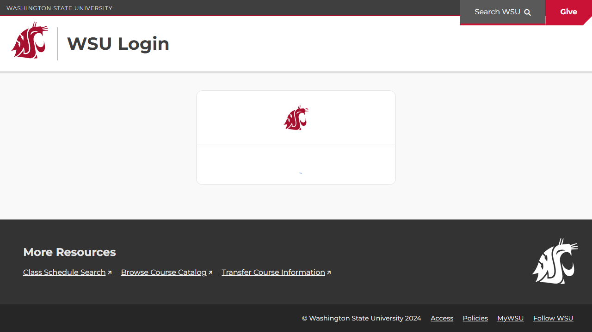

# Page Scan Report

| Field | Value |
|-------|-------|
| URL | https://my.wsu.edu/services/ |
| Redirected To | https://login.wsu.edu/oauth2/default/v1/authorize?client_id=0oah5m896h6SKyqkP2p7&redirect_uri=https%3A%2F%2Fmy.wsu.edu%2Foauth2%2Fidpresponse&response_type=code&scope=openid%20profile%20sis.prd.groups&state=rHbOb%2B7FRwtfRzYEamKvqeNge%2BLWyUqwiSXgMnNHABnocwPaHa2BUchu2O712TYExSbnfoZqyOn17T9oW917isuOZfso%2FJgCTtNarfVoWEJo3RP0%2BNM4HeLH4I7wNooAyV47WEd0VTi%2BVI4g6Oge%2FRbVhNQl%2BOsi%2ByqCTPgnU7R40sajB%2FiIEmZgpg8EnwPPZsw1AaG3d7bHxSp4JDp6G%2FAD4cqWVNYHOntg5ggP2wH3ocivCGNsxkM98WWomA%3D%3D |
| Title | WSU Authentication | Washington State University |
| Status | ❌ 0 |
| HTML Size | 70.8 KB |
| Screenshots | 1 (39.3 KB) |
| Images | 1 (7.7 KB) |
| Images Missing Alt | 0 |
| JS Errors | 1 |
| JS Warnings | 0 |
| Auth | none |
| Captured | 2026-02-16T20:59:56.3232826Z |

## JavaScript Errors

- `Something unexpected happened while we were checking url http://127.0.0.1:8769`

## Actions

- Screenshot #1: page-loaded (39.3 KB)
- Downloaded 1 images to /images/

## Screenshots

### 1. page-loaded

## Page Images (1)

| # | Image | Alt Text | Size |
|---|-------|----------|------|
| 1 | [fs015xh0tygNgGVxX2p8.img](images/fs015xh0tygNgGVxX2p8.img) | WSU logo | 7.7 KB |

### Gallery

## Files

- `01-page-loaded.png` — page-loaded (39.3 KB)
- `page.html` — rendered HTML content
- `metadata.json` — machine-readable scan data
- `errors.log` — JavaScript console errors
- `warnings.log` — JavaScript console warnings
- `info.log` — navigation and timing details
- `actions.log` — interactions performed on the page
- `images/` — 1 page images (7.7 KB)
