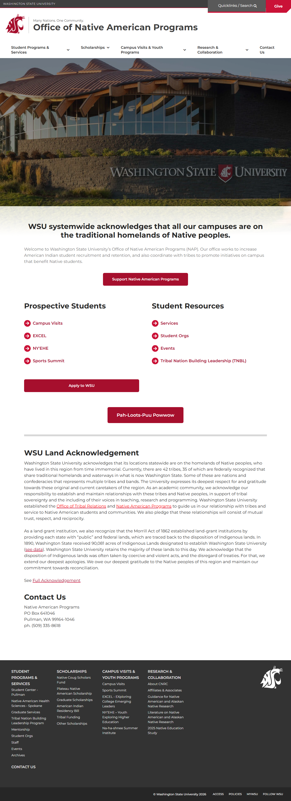
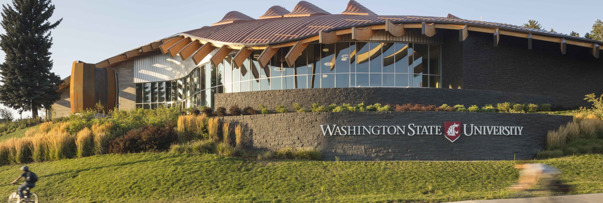

# Page Scan Report

| Field | Value |
|-------|-------|
| URL | https://native.wsu.edu/ |
| Title | Office of Native American Programs | Washington State University |
| Status | ❌ 0 |
| HTML Size | 212.3 KB |
| Screenshots | 1 (1.4 MB) |
| Images | 1 (493.3 KB) |
| Images Missing Alt | 0 |
| JS Errors | 4 |
| JS Warnings | 0 |
| Auth | none |
| Captured | 2026-02-16T20:37:05.1343661Z |

## JavaScript Errors

- `Failed to load resource: net::ERR_SOCKET_NOT_CONNECTED`
- `Failed to load resource: net::ERR_SOCKET_NOT_CONNECTED`
- `Failed to load resource: net::ERR_SOCKET_NOT_CONNECTED`
- `Failed to load resource: net::ERR_SOCKET_NOT_CONNECTED`

## Actions

- Screenshot #1: page-loaded (1.4 MB)
- Downloaded 1 images to /images/

## Screenshots

### 1. page-loaded

## Page Images (1)

| # | Image | Alt Text | Size |
|---|-------|----------|------|
| 1 | [cultural-center-exterior-scaled.jpg](images/cultural-center-exterior-scaled.jpg) | Photo of ESFCC | 493.3 KB |

### Gallery

## Files

- `01-page-loaded.png` — page-loaded (1.4 MB)
- `page.html` — rendered HTML content
- `metadata.json` — machine-readable scan data
- `errors.log` — JavaScript console errors
- `warnings.log` — JavaScript console warnings
- `info.log` — navigation and timing details
- `actions.log` — interactions performed on the page
- `images/` — 1 page images (493.3 KB)
