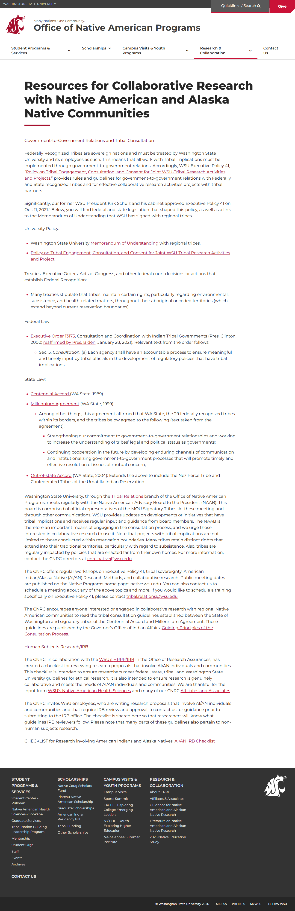

# 🌐 Site Report: https://native.wsu.edu/

> **Status:** ✅ 3/3 pages OK  
> **Folder:** `native-wsu-edu/`  

---

## 📋 Summary

```
Success Rate:  [██████████████████████████████] 100%
```

| Metric | Value |
|--------|-------|
| Pages Scanned | 3 |
| Pages Passed | ✅ 3 |
| Pages Failed | 0 |
| Total JS Errors | 0 |
| Total JS Warnings | 0 |
| Total Images | 11 (5.1 MB) |
| Images Missing Alt | ⚠️ 7 |
| Total HTML | 674.6 KB |
| Total Screenshots | 3.0 MB |

## 📑 Pages

| Status | Page | HTTP | Title | JS Errors | Images | Missing Alt |
|:------:|------|:----:|-------|:---------:|:------:|:-----------:|
| ✅ | [/](_root/report.md) | 200 | Office of Native American Programs \|... | 0 | 1 | 0 |
| ✅ | [/contact/](contact/report.md) | 200 | Contact Us \| Office of Native Americ... | 0 | 10 | ⚠️ 7 |
| ✅ | [/resources/](resources/report.md) | 200 | Resources for Collaborative Research ... | 0 | 0 | 0 |

## 📸 Page Screenshots

Click any thumbnail to view the full page report.

<table>
<tr>
<td align="center" width="33%">
<a href="_root/report.md">

</a>
<br />✅ <code>/</code>
</td>
<td align="center" width="33%">
<a href="contact/report.md">

</a>
<br />✅ <code>/contact/</code>
</td>
<td align="center" width="33%">
<a href="resources/report.md">

</a>
<br />✅ <code>/resources/</code>
</td>
</tr>
</table>

---

*Generated by AccessibilityScanner (FreeTools) v1.0*
