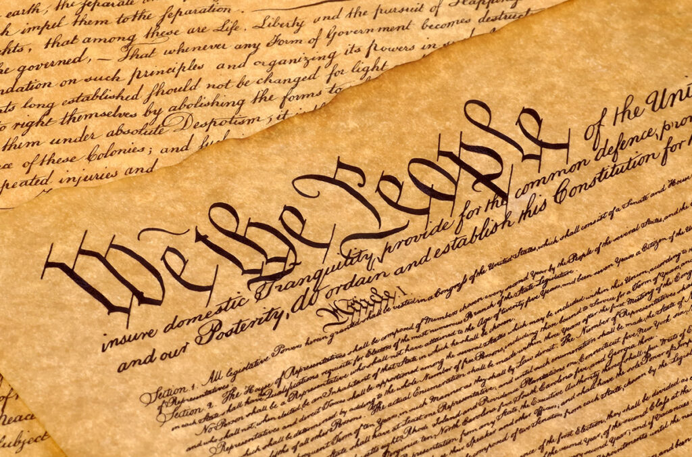
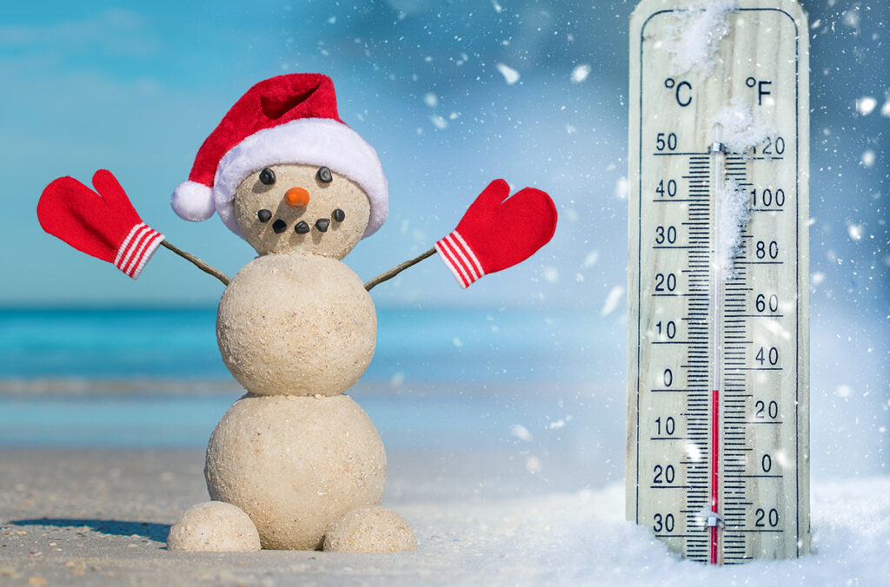
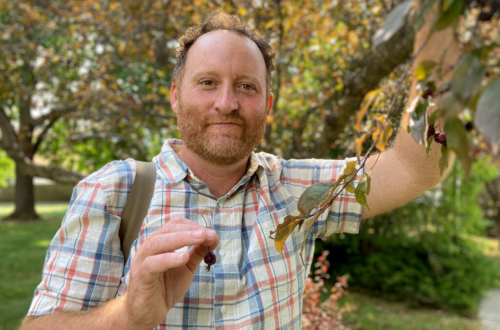

# Page Scan Report

| Field | Value |
|-------|-------|
| URL | https://news.wsu.edu/news/ |
| Title | News Articles | WSU Insider | Washington State University |
| Status | ❌ 0 |
| HTML Size | 267.8 KB |
| Screenshots | 1 (830.3 KB) |
| Images | 11 (1.4 MB) |
| Images Missing Alt | 0 |
| JS Errors | 0 |
| JS Warnings | 0 |
| Auth | none |
| Captured | 2026-02-16T20:38:33.7901411Z |

## Actions

- Screenshot #1: page-loaded (830.3 KB)
- Downloaded 11 images to /images/

## Screenshots

### 1. page-loaded

## Page Images (11)

| # | Image | Alt Text | Size |
|---|-------|----------|------|
| 1 | [generic-system-logo-crimson-bkgrd-1024x676.jpg](images/generic-system-logo-crimson-bkgrd-1024x676.jpg) | Washington State University logo. | 50.5 KB |
| 2 | [Angelica-Bautista-1024x676.jpg](images/Angelica-Bautista-1024x676.jpg) | Closeup of Anjelica Bautista holding ... | 84.3 KB |
| 3 | [generic-system-logo-crimson-song-lyrics-1024x676.jpg](images/generic-system-logo-crimson-song-lyrics-1024x676.jpg) | Washington State University logo. | 91.5 KB |
| 4 | [Constitution-of-the-United-States-1024x676.jpg](images/Constitution-of-the-United-States-1024x676.jpg) | Closeup of the Constitution of the Un... | 263.1 KB |
| 5 | [image-5.jpg](images/image-5.jpg) | An aerial view of football fans watch... | 242.1 KB |
| 6 | [snowman-made-of-sand-and-weather-thermometer-1024x676.jpg](images/snowman-made-of-sand-and-weather-thermometer-1024x676.jpg) | Composite featuring a snowman made of... | 133.2 KB |
| 7 | [GRID-PHOTO-1024x676.jpg](images/GRID-PHOTO-1024x676.jpg) | Power lines spanning farm fields in W... | 157.6 KB |
| 8 | [James-Record-1024x676.jpg](images/James-Record-1024x676.jpg) | Closeup of Dr. James Record. | 123.4 KB |
| 9 | [Jeff-Wall-and-crabapple-tree-1024x676.jpg](images/Jeff-Wall-and-crabapple-tree-1024x676.jpg) | Jeff Wall holding the fruit from a cr... | 168.7 KB |
| 10 | [Roger-Nyhus-and-American-flag-1024x676.jpg](images/Roger-Nyhus-and-American-flag-1024x676.jpg) | Closeup of Roger Nyhus and an America... | 79.6 KB |
| 11 | [podcast-icon.png](images/podcast-icon.png) | A microphone and a pair of headphones. | 19.6 KB |

### Gallery

## Files

- `01-page-loaded.png` — page-loaded (830.3 KB)
- `page.html` — rendered HTML content
- `metadata.json` — machine-readable scan data
- `errors.log` — JavaScript console errors
- `warnings.log` — JavaScript console warnings
- `info.log` — navigation and timing details
- `actions.log` — interactions performed on the page
- `images/` — 11 page images (1.4 MB)
