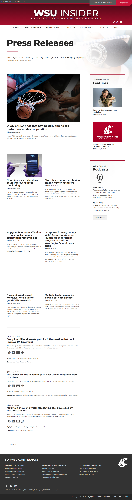
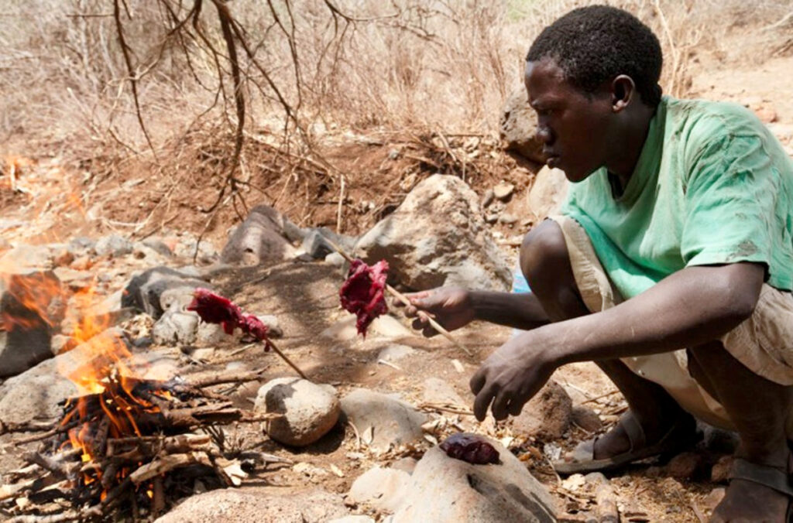
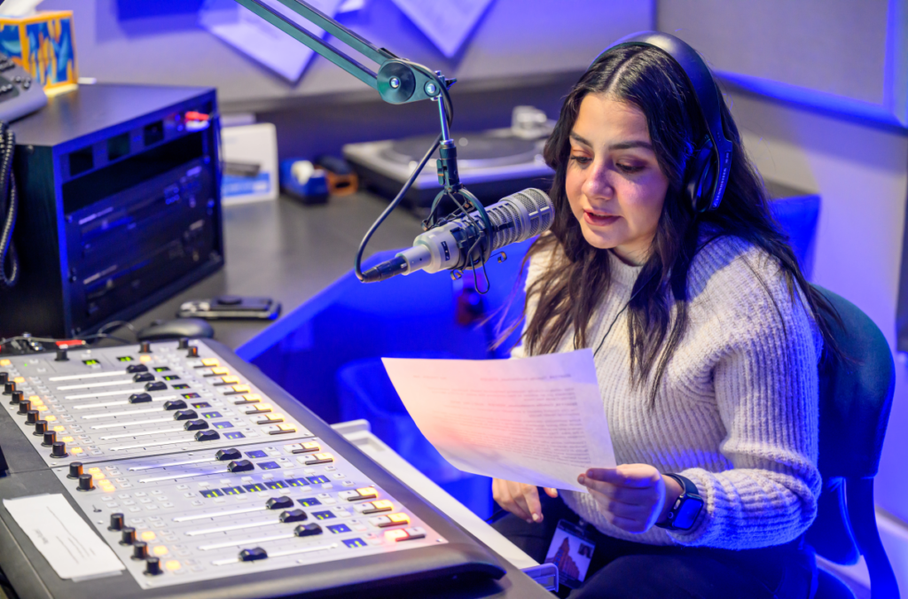
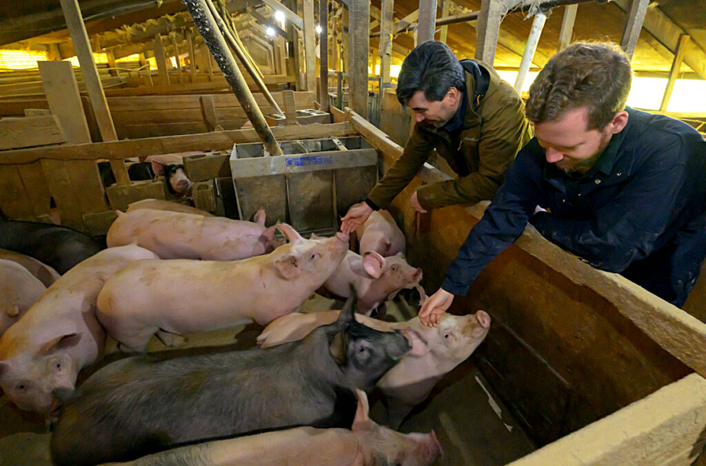
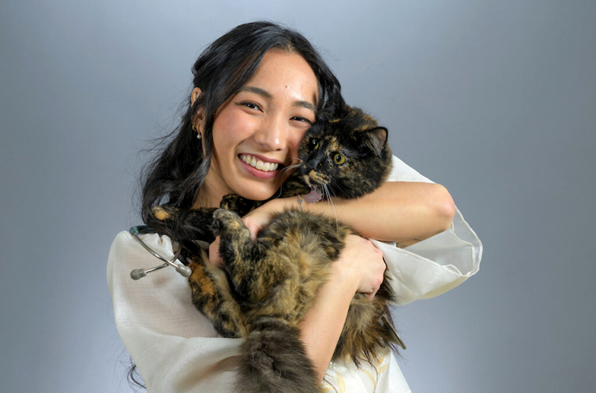

# 📄 Page Scan Report

> **URL:** https://news.wsu.edu/press-releases/  
> **Captured:** 2026-02-16 22:20:04 UTC  
> **Status:** ✅ 200  

---

## 📑 Contents

- [Summary](#-summary)
- [Screenshots](#-screenshots)
- [Page Images](#-page-images)
- [Actions](#-actions)
- [Files](#-files)

---

## 📋 Summary

| Field | Value |
|-------|-------|
| URL | https://news.wsu.edu/press-releases/ |
| Title | Press Releases | WSU Insider | Washington State University |
| Status | ✅ 200 |
| HTML Size | 249.7 KB |
| Screenshots | 1 (1.2 MB) |
| Images | 11 (1.9 MB) |
| Images Missing Alt | ✅ 0 |
| JS Errors | ✅ 0 |
| JS Warnings | 0 |
| Auth | none |
| Captured | 2026-02-16T22:20:04.3212870Z |

## 🔧 Actions

<strong>2 action(s) performed</strong>

- Screenshot #1: page-loaded (1.2 MB)
- Downloaded 11 images to /images/

## 📸 Screenshots

<table>
<tr>
<td align="center" width="50%">

 <strong>1. page-loaded</strong>
 1.2 MB
</td>
<td></td>
</tr>
</table>

## 🖼️ Page Images (11)

<strong>📋 Image Index</strong> — 11 images, 1.9 MB

| # | Image | Alt Text | Size |
|--:|-------|----------|-----:|
| 1 | [press-releases-hero-img2.jpg](images/press-releases-hero-img2.jpg) | A reporter writing notes in a notepad... | 102.0 KB |
| 2 | [basketball-hoop-ball-and-hands-in-huddle-1024x676.jpg](images/basketball-hoop-ball-and-hands-in-huddle-1024x676.jpg) | Composite featuring a basketball goin... | 104.1 KB |
| 3 | [gloves-holding-smartphone-and-glucose-monitor-1024x676.jpg](images/gloves-holding-smartphone-and-glucose-monitor-1024x676.jpg) | Gloved hands holding a smartphone and... | 78.7 KB |
| 4 | [Hadza-man-cooking-over-fire-in-Tanzania-1024x676.jpg](images/Hadza-man-cooking-over-fire-in-Tanzania-1024x676.jpg) | A Hadza man in Tanzania cooks over an... | 177.5 KB |
| 5 | [couple-in-warm-embrace-1024x676.jpg](images/couple-in-warm-embrace-1024x676.jpg) | Silhouette of a couple in a romantic ... | 53.9 KB |
| 6 | [Monica-Carrillo-Casas_SPR.jpg-1024x676.png](images/Monica-Carrillo-Casas_SPR.jpg-1024x676.png) | Murrow fellow Monica Carrillo-Casas r... | 969.9 KB |
| 7 | [Ryan-Driskell-and-Sean-Thompson-with-pigs-1024x676.jpg](images/Ryan-Driskell-and-Sean-Thompson-with-pigs-1024x676.jpg) | Two WSU researchers petting piglets i... | 160.0 KB |
| 8 | [bull-elk-in-snow-1024x676.jpg](images/bull-elk-in-snow-1024x676.jpg) | A pair of bull elk standing in the snow. | 189.0 KB |
| 9 | [Angelica-Bautista-1024x676.jpg](images/Angelica-Bautista-1024x676.jpg) | Closeup of Anjelica Bautista holding ... | 84.3 KB |
| 10 | [generic-system-logo-crimson-bkgrd-1024x676.jpg](images/generic-system-logo-crimson-bkgrd-1024x676.jpg) | Washington State University logo. | 50.5 KB |
| 11 | [podcast-icon.png](images/podcast-icon.png) | A microphone and a pair of headphones. | 19.6 KB |

<strong>🖼️ Gallery</strong>

<table>
<tr>
<td align="center" width="33%">

 press-releases-hero-img2.jpg
</td>
<td align="center" width="33%">

 basketball-hoop-ball-and-hands-in-huddle-1024x676.jpg
</td>
<td align="center" width="33%">

 gloves-holding-smartphone-and-glucose-monitor-1024x676.jpg
</td>
</tr>
<tr>
<td align="center" width="33%">

 Hadza-man-cooking-over-fire-in-Tanzania-1024x676.jpg
</td>
<td align="center" width="33%">

 couple-in-warm-embrace-1024x676.jpg
</td>
<td align="center" width="33%">

 Monica-Carrillo-Casas_SPR.jpg-1024x676.png
</td>
</tr>
<tr>
<td align="center" width="33%">

 Ryan-Driskell-and-Sean-Thompson-with-pigs-1024x676.jpg
</td>
<td align="center" width="33%">

 bull-elk-in-snow-1024x676.jpg
</td>
<td align="center" width="33%">

 Angelica-Bautista-1024x676.jpg
</td>
</tr>
<tr>
<td align="center" width="33%">

 generic-system-logo-crimson-bkgrd-1024x676.jpg
</td>
<td align="center" width="33%">

 podcast-icon.png
</td>
<td></td>
</tr>
</table>

## 📁 Files

| File | Description |
|------|-------------|
| `01-page-loaded.png` | page-loaded (1.2 MB) |
| `page.html` | Rendered HTML content |
| `metadata.json` | Machine-readable scan data |
| `errors.log` | JavaScript console errors |
| `warnings.log` | JavaScript console warnings |
| `info.log` | Navigation and timing details |
| `actions.log` | Interactions performed |
| `images/` | 11 page images (1.9 MB) |

---

*Generated by AccessibilityScanner (FreeTools) v1.0*
