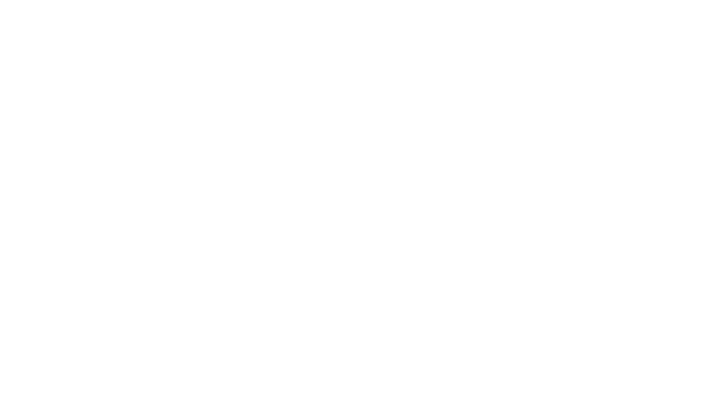

# 📄 Page Scan Report

> **URL:** https://nform.em.wsu.edu/  
> **Captured:** 2026-02-18 18:43:59 UTC  
> **Status:** ✅ 200  

---

## 📑 Contents

- [Summary](#-summary)
- [Screenshots](#-screenshots)
- [Page Images](#-page-images)
- [JavaScript Errors](#-javascript-errors)
- [Accessibility](#-accessibility)
- [Actions](#-actions)
- [Files](#-files)

---

## 📋 Summary

| Field | Value |
|-------|-------|
| URL | https://nform.em.wsu.edu/ |
| Title |  |
| Status | ✅ 200 |
| HTML Size | 201.8 KB |
| Screenshots | 1 (6.0 KB) |
| Images | 0 (referenced by URL) |
| Images Missing Alt | ✅ 0 |
| JS Errors | 🔴 28 |
| JS Warnings | 0 |
| A11y Violations | ⚠️ 4 |
| 🔴 Critical | 0 |
| 🟠 Serious | 1 |
| 🟡 Moderate | 2 |
| 🔵 Minor | 1 |
| Tools Run | axe, htmlcheck |
| Auth | none |
| Captured | 2026-02-18T18:43:59.4718860Z |

## 🔴 JavaScript Errors

<details>
<summary><strong>28 error(s) detected</strong></summary>

```
Fetch API cannot load https://nform.em.wsu.edu/_framework/dotnet.native.d2w7colv7e.wasm. 
Failed to load resource: net::ERR_CONNECTION_RESET
MONO_WASM: instantiate_wasm_module() failed Error: download 'https://nform.em.wsu.edu/_framework/dotnet.native.d2w7colv7e.wasm' for dotnet.native.d2w7colv7e.wasm failed 0 TypeError: Failed to fetch
Error in mono_download_assets: Error: download 'https://nform.em.wsu.edu/_framework/dotnet.native.d2w7colv7e.wasm' for dotnet.native.d2w7colv7e.wasm failed 0 TypeError: Failed to fetch
Error in mono_download_assets: Error: download 'https://nform.em.wsu.edu/_framework/dotnet.native.d2w7colv7e.wasm' for dotnet.native.d2w7colv7e.wasm failed 0 TypeError: Failed to fetch
Fetch API cannot load https://nform.em.wsu.edu/_framework/System.Private.CoreLib.tn7ijpxcub.wasm. 
Failed to load resource: net::ERR_CONNECTION_RESET
Error in mono_download_assets: Error: download 'https://nform.em.wsu.edu/_framework/System.Private.CoreLib.tn7ijpxcub.wasm' for System.Private.CoreLib.tn7ijpxcub.wasm failed 0 TypeError: Failed to fet...
Fetch API cannot load https://nform.em.wsu.edu/_framework/AngleSharp.kuoqn6mq72.wasm. 
Failed to load resource: net::ERR_CONNECTION_RESET
Fetch API cannot load https://nform.em.wsu.edu/_framework/Basic.Reference.Assemblies.Net90.ax3achsd86.wasm. 
Failed to load resource: net::ERR_CONNECTION_RESET
Fetch API cannot load https://nform.em.wsu.edu/_framework/Microsoft.CodeAnalysis.CSharp.spyk6zagzf.wasm. 
Failed to load resource: net::ERR_CONNECTION_RESET
Fetch API cannot load https://nform.em.wsu.edu/_framework/Microsoft.VisualBasic.Core.996jw09otz.wasm. 
Failed to load resource: net::ERR_CONNECTION_RESET
Fetch API cannot load https://nform.em.wsu.edu/_framework/MudBlazor.845kbj1w9a.wasm. 
Failed to load resource: net::ERR_CONNECTION_RESET
Fetch API cannot load https://nform.em.wsu.edu/_framework/PuppeteerSharp.se4d76nnaf.wasm. 
Failed to load resource: net::ERR_CONNECTION_RESET
... and 8 more (see errors.log)
```

</details>

## 🔧 Actions

<details>
<summary><strong>4 action(s) performed</strong></summary>

- Screenshot #1: page-loaded (6.0 KB)
- No images found on page
- axe-core: 1 violations (137ms)
- htmlcheck: 3 violations (0ms)

</details>

## 📸 Screenshots

<table>
<tr>
<td align="center" width="50%">
<a href="01-page-loaded.jpg">

</a>
<br /><strong>1. page-loaded</strong>
<br /><sub>6.0 KB</sub>
</td>
<td></td>
</tr>
</table>

## 🖼️ Page Images (0)

*No images found on page.*

## ♿ Accessibility

### Summary

| Severity | axe | htmlcheck |
|----------|:---:|:---:|
| 🔴 critical | 0 | 0 |
| 🟠 serious | 1 | 0 |
| 🟡 moderate | 0 | 2 |
| 🔵 minor | 0 | 1 |
| **Total** | **1** | **3** |

### Violations by Confidence

<details open>
<summary><strong>4 rule(s) violated</strong></summary>

| # | Rule | Sev | Confidence | axe | htmlcheck | Example |
|--:|------|:---:|:----------:|:---:|:---:|---------|
| 1 | document-title | 🟠 | 🟡 1/2 | ⚠️ | ✅ | `<html lang="en" style="--blazor-load-percentage: 94.80519...` |
| 2 | skip-link | 🟡 | 🟡 1/2 | ✅ | ⚠️ |  |
| 3 | landmark-one-main | 🟡 | 🟡 1/2 | ✅ | ⚠️ |  |
| 4 | landmark-nav | 🔵 | 🟡 1/2 | ✅ | ⚠️ |  |

</details>

> **Note:** Automated scanning catches ~30-60% of WCAG issues. Manual keyboard and screen reader testing is still required for full compliance.

## 📁 Files

| File | Description |
|------|-------------|
| `01-page-loaded.jpg` | page-loaded (6.0 KB) |
| `page.html` | Rendered HTML content |
| `metadata.json` | Machine-readable scan data |
| `errors.log` | JavaScript console errors |
| `warnings.log` | JavaScript console warnings |
| `info.log` | Navigation and timing details |
| `actions.log` | Interactions performed |
| `a11y-axe.json` | axe accessibility results |
| `a11y-htmlcheck.json` | htmlcheck accessibility results |
| `a11y-summary.json` | Merged cross-tool accessibility summary |

---

*Generated by AccessibilityScanner (FreeTools) v1.0*
